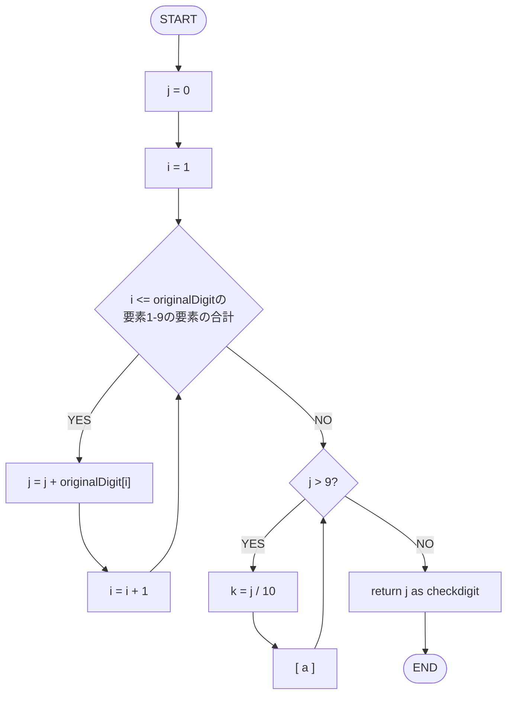

:::note warn
覚える内容が少ない18日分もここに追記します
:::

# ポイントおさらい
データベース（MS=管理システム）
管理システムの例としては、表計算ソフト。データベースはデータが入ったファイルそのものを指す
本来はSQLという言語を使って処理を書くが、表計算ソフトを使って解説する

## 覚えよう!
- 表：テーブル
- 列：フィールド＝分野
- 行：レコード＝記録

## 試験によく出る
- 選択
- 射影
- 結合
- 集合
  - 和：データが増える
  - 差：データが減る。ダブってないものを探す
  - 積：データが減る。ダブりを探す

・データクレンジング（データサイエンティスト用語）
後でデータをまとめる時に名前が変わったり書き方が変わったりすると困るので、統一できるルールにする
たとえば、社員表と部署表で言えば部署名が変わっても問題なくデータを取れるように部署コードで管理できるようにする

## データベースをシステム開発者目線で考える
データベース設計を考える

- 主キーと外部キーのつながりを可視化するER図

データベースを決めるのは業務者、データベースを作るのは開発者。
ER図とは、業務者ー開発者間で円滑なコミュニケーションを取るためのツール

1-1〜多-多の考え方は、P251 確認問題5が例題としてとても良い

正規化は順番がある。
慣れると第二と第三は一緒くたにできてしまう（講義中にデモした通り）ので、順番を問われた場合は要注意

## 過去問
https://www3.jitec.ipa.go.jp/JitesCbt/html/openinfo/questions.html

---

## 11/18: 問題文を読んでフローチャートに直す
``` プログラム（擬似言語）にコメント追加.txt
関数名 checkdigit（整数型の配列: originalDigit）{
    整数型 i, j, k
    j = 0
    
    // ここから手順１
    for(iを1からoriginalDigitの要素数まで１ずつ増やす）
      j = j + originalDigit[i]
    endfor
    
    // ここから手順２
    while(jが9より大きい）
      k = j /10の商
      [ a ] 
    endwhile

    // 手順3
    return j
}
```




### [ a ]の選択肢
まず、jとkが何かを特定しないと選択肢を読めない

- jが（変数宣言時を除き）初めて出てくるタイミングは手順1で、整数型であることがわかっている
  - jは手順1でoriginDigitの要素の十進9桁の整数の合計を持っている
  - jは手順2でも同じ役割を担っていると思われる
- kが（変数宣言時を除き）初めて出てくるタイミングは手順2で、整数型であることがわかっている

kを使わない言葉に変換してみる

```math
\begin{array}{rcl}
\ k &=& k = j /10の商 \\
&& \text{jを10で割った答え} \\
&& \text{jの10の位} \\
\end{array}
```

以下、kを読み替える

- j = j - 10 * k
  - jは(jの10の位)に10を掛けてから引いたもの
    - つまり、jは１の位だけが残っている
- j = k + (j - 10 * k)
  - jは↑に(jの10の位)を足したもの
    - つまり、jは1の位と10の位を足した結果
- j = k + (j - 10) * k
  - jはjから10を引いたものに(jの10の位)を掛けて、
    その上で(jの10の位)を足したもの
    - つまり、jは何がやりたいのだろうか？
- j=k+j
  - jは(jの10の位)を足したもの
    - つまり、jは（おそらく1の位だと思っていて）10の位と足し合わせたもの
      これを実現したい場合、`j = j - k * 10`の結果を格納しなければならない


いったん、自分がかいた数式を日本語に直してみる
そして、計算式の目的を明確にしてみる

というのが理想だが、ここではそこまで難しく考えなくてよい。
なぜなら「フローチャートを読んで足りないものが何か」を探せば良いからである。
