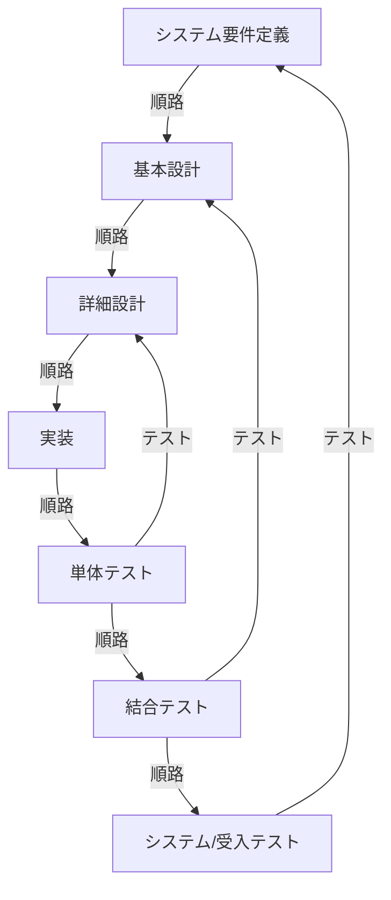
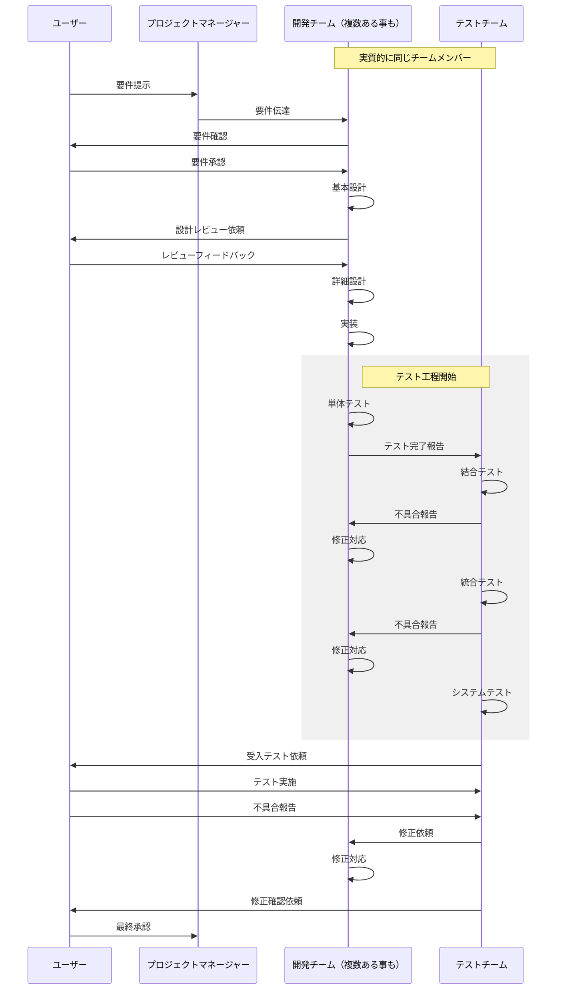

:::note warn
## キーワード
- 覚える
  - レベル１：その場で話ができればOK。すぐ忘れよう（＝理解したレベルに落とそう）
  - レベル２：忘れてもいいようにするが、できればレベル3にしたい。後で見直ししやすくしよう
  - レベル３：忘れないようにしよう
- 覚えない（忘れる）
  - 覚える・レベル１（その授業時間が終わったらここへ）
  - 理解する
    - 後で見て思い出せるレベルを目指す
    - 覚える（に越したことはない）必要はないが、忘れたとしても何を言っているかは分かっている状態
  - 知る
    - 「よくわからないけど、なにか言ってたな」程度を目指す
    - 【知らない】からの卒業が目的
    - この時間中に理解が難しいものでも、一旦は「知らない」という状態にはならないようにしたい
:::

回を重ねるごとに実務的な重要度が高まっており、内容が複雑化している。
そのため、本稿より知っておく程度で良いものについての解説を省略していく。

## 覚えておくと良いもの
:::note
## 努力目標
なるべく覚えない（＝脳みそを疲れさせない）、覚える量を減らす努力をする
:::

脳のキャパシティ（＝学習疲れ）をなるべく回避するための道標として使って欲しい

## 理解しておきたいもの
:::note warn
めちゃくちゃ多いので、読んですぐ理解できなければ聞いてしまおう
今日学んで明日までに忘れることが目標
:::

脳のキャパシティ（＝学習疲れ）をなるべく回避するための道標として使って欲しい

:::note alert
本章においては、未体験では想像＝イメージが難しい話が多分に含まれており、また複雑性・不確実性が特に高いため、いったんは試験を想定してまとめている
試験対策学習の観点では良いのだが、実務を想定したものではないことに留意しておき、学びの進め方として適切でない事を認識されたい。
:::

### ソフトウェアライフサイクルプロセス
システムが使われる全期間。
マーケティング講義をやっているので補足。P463「魔の川、死の谷、ダーウィンの海」も参照
開発フェーズ（魔の川、死の谷）における詳細は後述

### 企画プロセス
共通フレーム（ガイドライン。ルールではない。利用者と開発者のズレをなくす＝日本語なのに会話が通じない問題を回避）を策定し、

- ビジネス知見から、**システム化構造**
- ビジネスを**システム化**するための**計画**

とはいえ、システム開発はリリースするまでは絶対赤字、
リリースした後もトントンでは赤字。

### ウォーターフォールモデルで見る、前段階で想定しておくべきシステム開発フロー

これをシーケンス図で流れを役割ごとにかき分けてみる

### 開発フェーズの勘所
- 企画
  - 重要語句：ROI。100分率で求めるため100をかける
- 要件定義（ここから開発プロセス）
  - システム
    - 機能要件
    - 非機能要件
  - ソフトウェア
    - インターフェース定義
    - データ定義
- 設計
  - システム設計（ハードを含む）
  - ソフトウェア設計
- 実装
  - いわゆるプログラミング
- テスト：様々な表現をされるが、主に以下のフェーズに該当する
  - 単体
  - 結合
  - 統合
  - システムテスト
  - 運用テスト
  - 受入テスト
- 運用

:::note
以下、ウォーターフォールの流れをアジャイルでも踏襲した上で、運用で工夫していく
:::

### ソフトウェア開発手法
ウォーターフォールを高速に回すのがアジャイル開発。
試験対策としてみるとアジャイル開発は良さが目立つが、予算の都合で打ち切られたり、ウォーターフォールのように終了時期が決まっていないので長期化したりする。
↑これを計算する仕組みとして「人月計算」が用いられる。

:::note warn
出題傾向で見ると、アジャイルがどういうものか知っていて、その中でアジャイルの考え方を使って様々な開発手法を編み出しており、その内容や目的について出題されている
:::

### プロジェクトマネジメントの領域
ステークホルダーが誰なのか（どういう役割なのか）とか、規模が大きくなるとベンダーマネジメントが成否に直結しやすい
特にスケジュール管理が難しく、WBSをしっかり引いても仕様変更（または、後から仕様漏れに気付いて追加）がある。
そのたびにガントチャートを書き直す事になる。

そのため、臨機応変なタイムマネジメントが求められる。
試験としてはクリティカルパスの計算（アローダイアグラムを使用）が頻出。
クリティカルパスの計算の内訳はアルゴリズムに近いが、よりルールが厳格で回答も一意に定まるため、比較的練習として解きやすいので肩慣らしにおすすめ

:::note
- クリティカルパスの計算は試験前までにできればよい
- 細かいことよりも、クリティカルパスの目的が「これ以上どう頑張っても早くなりようがない作業」を全部洗い出すことを理解する
  - つまり「絶対に遅らせてはいけない作業」を分析し、これらの進捗を少しでも早められる事がプロジェクト全体の期間に影響する
:::

クリティカルパスの計算をする前に、WBSを書いてタスクの棚下ろしをしないと全体的な見積りも立てられず、ガントチャートもアローダイアグラムも描けない事を認識しておこう。

### インシデント
:::note warn
サービスマネジメントと監査は高頻出の領域のため、テキスト（の内容以外からも出題されるが）丸暗記でも良い
主に過去問を使って学習しよう
:::

インシデント＝トラブル。
サービスデスクはトラブルシューティング（問題解決）のためにユーザーからいち早く情報を集め、できれば解決に向かわせるための仕組みでしかない。
綺麗にいえば「障害発生時で落ちるITサービスの品質（運用）をなるべく損なわない」ための専門部隊である

### 対応フローと考え方
1. システムが止まると業務も止まる。業務が止まっても給与は発生する
1. まずはシステムを動かす。原因究明できれば理想だが、優先度は低い
1. システムが動いたら原因究明に乗り出す
1. できれば根本解決を目指す
1. 合わせて再発防止や手順化を検討することもある（ファシリティマネジメントも考慮）

### システム監査
（外部）監査なので不正があってはいけない、という考え方に基づくもの
監査の目的は「社内で使用しているシステムを第三者が客観的な立場で調査し、また改善を促すこと」であるため「ウチはルール守ってます」と対外的に言えるかどうか（ISO基準認定など）にも影響してくる。

これを念頭に置いて用語を拾っていけば違和感はないはず。
