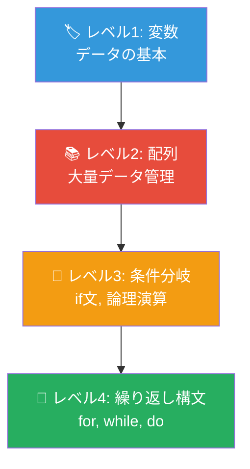
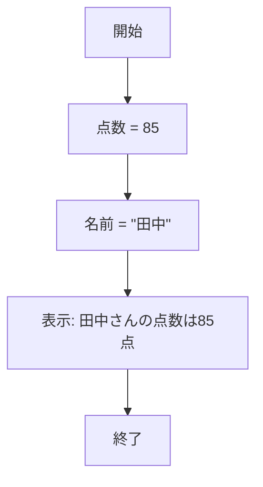
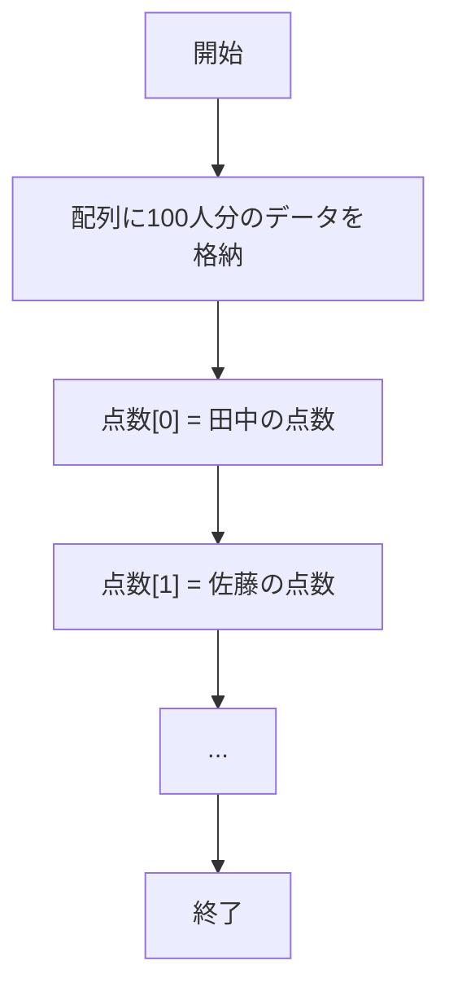
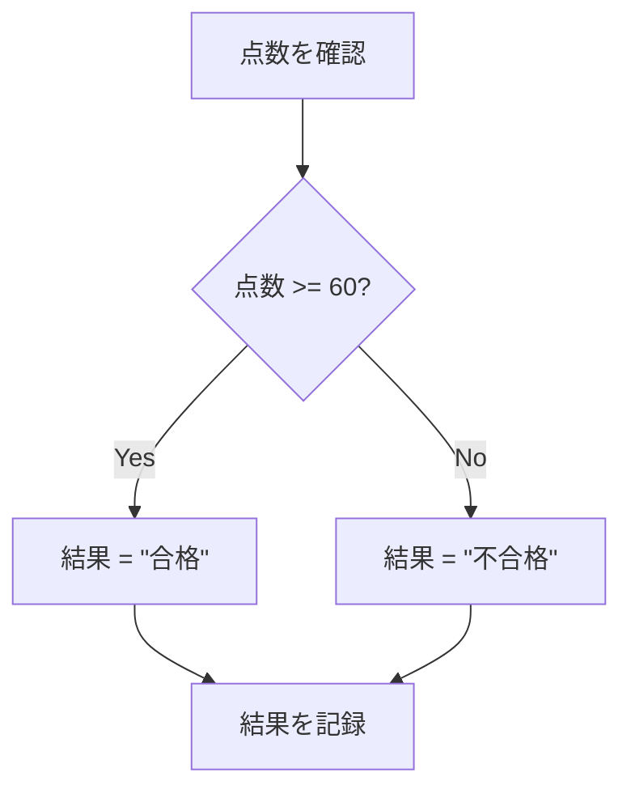
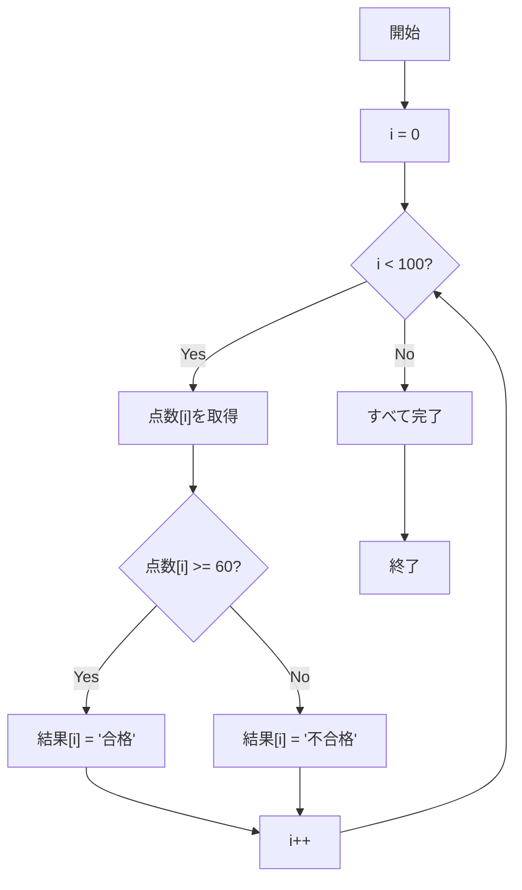
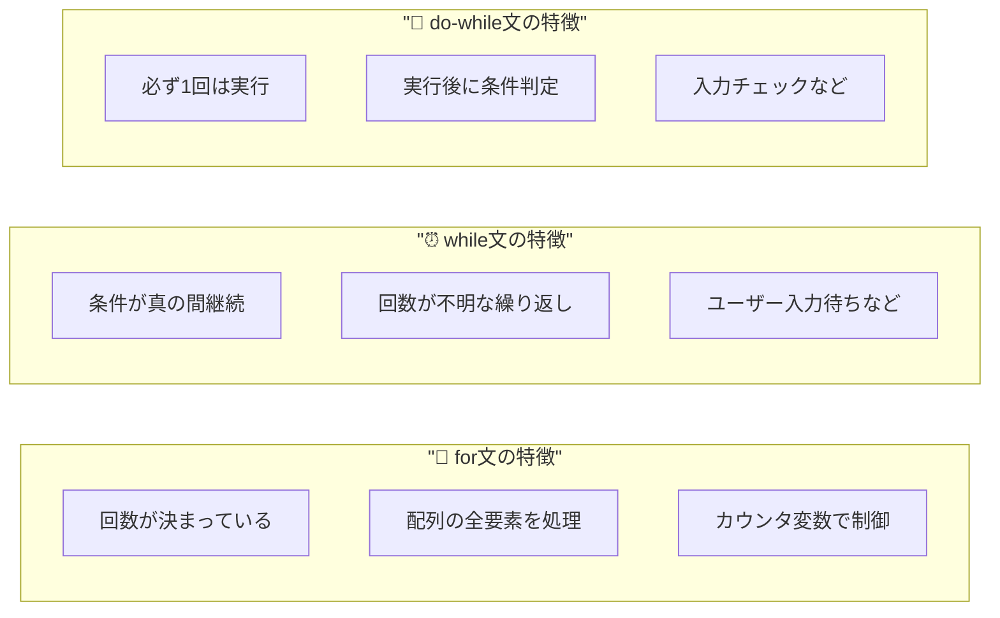
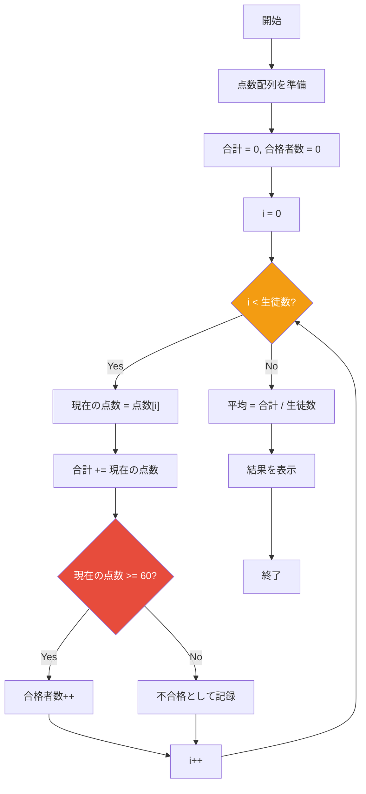
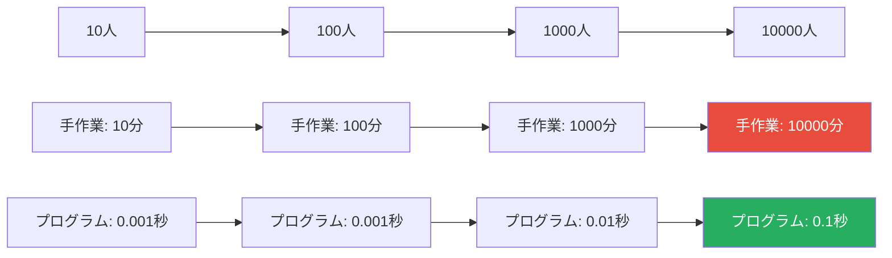

<!-- タイトル：文系・非エンジニアのためのITパスポートアルゴリズム -->

:::note warn
繰り返し構文を学ぶ際に、

- 配列
  - 変数
- 選択構造
  - 順次構造
  - ベン図・真理値表

の２つを同時に理解しておかないと何を言っているか分かりにくい部分があるため、先にそちらを押さえておきたい。
:::

## 前提知識

---

<details><summary>変数とは</summary>

<p class="codepen" data-height="300" data-default-tab="result" data-slug-hash="JoYVMJm" data-pen-title="🏷️ 変数とは何か？" data-preview="true" data-user="nomuraya" style="height: 300px; box-sizing: border-box; display: flex; align-items: center; justify-content: center; border: 2px solid; margin: 1em 0; padding: 1em;">
  <span>See the Pen <a href="https://codepen.io/nomuraya/full/JoYVMJm">
  🏷️ 変数とは何か？</a> by nomura (<a href="https://codepen.io/nomuraya">@nomuraya</a>)
  on <a href="https://codepen.io">CodePen</a>.</span>
</p>
<script async src="https://public.codepenassets.com/embed/index.js"></script>

</details>

---

<details><summary>変数理解度チェック　</summary>

<p class="codepen" data-height="300" data-slug-hash="pvjBpWw" data-pen-title="Untitled" data-user="nomuraya" style="height: 300px; box-sizing: border-box; display: flex; align-items: center; justify-content: center; border: 2px solid; margin: 1em 0; padding: 1em;">
  <span>See the Pen <a href="https://codepen.io/nomuraya/full/pvjBpWw">
  Untitled</a> by nomura (<a href="https://codepen.io/nomuraya">@nomuraya</a>)
  on <a href="https://codepen.io">CodePen</a>.</span>
</p>
<script async src="https://public.codepenassets.com/embed/index.js"></script>

</details>

---

<details><summary>変数のフローチャート（読む）</summary>

<p class="codepen" data-height="300" data-slug-hash="gbayoKa" data-pen-title="フローチャートを読む問題（変数・順次構造のみ）" data-user="nomuraya" style="height: 300px; box-sizing: border-box; display: flex; align-items: center; justify-content: center; border: 2px solid; margin: 1em 0; padding: 1em;">
  <span>See the Pen <a href="https://codepen.io/nomuraya/full/gbayoKa">
  フローチャートを読む問題（変数・順次構造のみ）</a> by nomura (<a href="https://codepen.io/nomuraya">@nomuraya</a>)
  on <a href="https://codepen.io">CodePen</a>.</span>
</p>
<script async src="https://public.codepenassets.com/embed/index.js"></script>

</details>

---

<details><summary>変数のフローチャート（書く）</summary>

<p class="codepen" data-height="300" data-slug-hash="empoyKM" data-pen-title="Untitled" data-user="nomuraya" style="height: 300px; box-sizing: border-box; display: flex; align-items: center; justify-content: center; border: 2px solid; margin: 1em 0; padding: 1em;">
  <span>See the Pen <a href="https://codepen.io/nomuraya/full/empoyKM">
  Untitled</a> by nomura (<a href="https://codepen.io/nomuraya">@nomuraya</a>)
  on <a href="https://codepen.io">CodePen</a>.</span>
</p>
<script async src="https://public.codepenassets.com/embed/index.js"></script>

</details>

---

<details><summary>変数の擬似言語（読む）</summary>

<p class="codepen" data-height="300" data-slug-hash="NPGmXBd" data-pen-title="Untitled" data-user="nomuraya" style="height: 300px; box-sizing: border-box; display: flex; align-items: center; justify-content: center; border: 2px solid; margin: 1em 0; padding: 1em;">
  <span>See the Pen <a href="https://codepen.io/nomuraya/full/NPGmXBd">
  Untitled</a> by nomura (<a href="https://codepen.io/nomuraya">@nomuraya</a>)
  on <a href="https://codepen.io">CodePen</a>.</span>
</p>
<script async src="https://public.codepenassets.com/embed/index.js"></script>

</details>

---

<details><summary>変数の擬似言語（書く）</summary>

<p class="codepen" data-height="300" data-slug-hash="pvjBpOd" data-pen-title="✏️ 擬似言語を書く問題" data-user="nomuraya" style="height: 300px; box-sizing: border-box; display: flex; align-items: center; justify-content: center; border: 2px solid; margin: 1em 0; padding: 1em;">
  <span>See the Pen <a href="https://codepen.io/nomuraya/full/pvjBpOd">
  ✏️ 擬似言語を書く問題</a> by nomura (<a href="https://codepen.io/nomuraya">@nomuraya</a>)
  on <a href="https://codepen.io">CodePen</a>.</span>
</p>
<script async src="https://public.codepenassets.com/embed/index.js"></script>

</details>

---

<details><summary>配列とは何か？</summary>

<p class="codepen" data-height="300" data-slug-hash="NPGmXOp" data-pen-title="配列とは何か？" data-user="nomuraya" style="height: 300px; box-sizing: border-box; display: flex; align-items: center; justify-content: center; border: 2px solid; margin: 1em 0; padding: 1em;">
  <span>See the Pen <a href="https://codepen.io/nomuraya/full/NPGmXOp">
  配列とは何か？</a> by nomura (<a href="https://codepen.io/nomuraya">@nomuraya</a>)
  on <a href="https://codepen.io">CodePen</a>.</span>
</p>
<script async src="https://public.codepenassets.com/embed/index.js"></script>

</details>

---

# （教材）繰り返し構文を理解するためのロードマップ
## 🔄 フローチャート・疑似言語で学ぶプログラミングの威力

---

## 📊 今日解決したい問題

**シナリオ：100人の生徒の成績処理**

- 合計点・平均点の計算
- 合格・不合格の判定（60点以上で合格）
- 統計情報の集計

**現状：手作業での処理**
- 時間がかかる（1人1分 × 100人 = 100分）
- ミスが発生しやすい
- データが増えるともっと大変...

**目標：プログラムで自動化**
- 数秒で完了
- ミスなし
- データが1000人でも同じコード

---

## 🎯 学習のゴール

### 手作業 vs プログラム自動化

| 手作業 | プログラム |
|--------|------------|
| 100人 → 100分 | 100人 → 数秒 |
| ミスが発生 | ミスなし |
| 疲れる | 疲れない |
| 退屈 | 楽しい |

**この威力の差を生み出すのが「繰り返し構文」です！**

---

## 🏗️ 学習ロードマップ（ピラミッド構造）



**下から順番に積み上げる！**

---

## 🏷️ レベル1: 変数 - データの基本

### 手作業の場合
「田中さんの点数は85点」
→ 頭で覚える（忘れやすい）

### プログラムの場合
```
点数 = 85
名前 = "田中"
```

### フローチャート


**ポイント：データに名前をつけて管理**

---

## 📚 レベル2: 配列 - 大量データ管理

### 手作業の場合
```
田中: 85点、佐藤: 92点、鈴木: 78点...
→ 100人分をメモ帳に書く
```

### プログラムの場合
```
点数 = [85, 92, 78, 96, 88, 75, ...]
名前 = ["田中", "佐藤", "鈴木", "高橋", ...]
```

### フローチャート


**ポイント：大量データを効率的に管理**

---

## 🚦 レベル3: 条件分岐 - データに応じた処理

### 手作業の場合
```
田中85点 → 60以上だから合格
佐藤92点 → 60以上だから合格
鈴木55点 → 60未満だから不合格
...100人分を1人ずつ判定
```

### プログラムの場合
```
if (点数 >= 60) {
    結果 = "合格"
} else {
    結果 = "不合格"
}
```

### フローチャート


**ポイント：条件によって処理を自動分岐**

---

## 🔄 レベル4: 繰り返し構文 - 自動化の完成

### 手作業の場合（100回の繰り返し）
```
1. 田中の点数を見る → 判定する → 記録する
2. 佐藤の点数を見る → 判定する → 記録する
3. 鈴木の点数を見る → 判定する → 記録する
...
100. 最後の生徒の処理
```

### プログラムの場合（自動実行）
```
for (i = 0; i < 100; i++) {
    if (点数[i] >= 60) {
        結果[i] = "合格"
    } else {
        結果[i] = "不合格"
    }
}
```

---

## 🔄 for文のフローチャート



**100回の処理が自動実行される！**

---

## 💪 繰り返し構文の威力比較

### 手作業での処理時間
- 1人あたり1分の処理
- 100人 → 100分（1時間40分）
- 1000人 → 1000分（16時間40分）

### プログラムでの処理時間
- for文で自動処理
- 100人 → 0.001秒
- 1000人 → 0.01秒
- 10万人 → 1秒

**これがプログラミングの真価！**

---

## 🔄 while文 vs for文 の使い分け

### for文：回数が決まっている


---

## 🎯 実践：成績処理プログラム

### 完成版フローチャート


---

## 💻 実際のコード例

```javascript
// 成績処理の完全自動化
const 点数 = [85, 92, 78, 96, 88, 75, 89, 65, 58, 94];
let 合計 = 0;
let 合格者数 = 0;

for (let i = 0; i < 点数.length; i++) {
    合計 += 点数[i];
    
    if (点数[i] >= 60) {
        合格者数++;
        console.log(`${i+1}番: ${点数[i]}点 → 合格`);
    } else {
        console.log(`${i+1}番: ${点数[i]}点 → 不合格`);
    }
}

const 平均 = 合計 / 点数.length;
console.log(`平均点: ${平均}点`);
console.log(`合格者: ${合格者数}名`);
```

**10行程度のコードで100人分の処理が完了！**

---

## 🚀 なぜ配列と繰り返しがセットなのか？

### 配列なし → 繰り返しの意味がない
```
点数1 = 85
点数2 = 92
点数3 = 78
...
点数100 = 94

// 100個の変数を100回処理？
// 結局手作業と同じ...
```

### 配列あり → 繰り返しの威力発揮
```
点数 = [85, 92, 78, ..., 94]

for (i = 0; i < 点数.length; i++) {
    // 同じコードで全データを処理
}
```

**配列と繰り返しは最強コンビ！**

---

## 📈 データ量による効果の違い



**データが増えるほど自動化の価値が増大**

---

## 🎯 学習の振り返り

### 身についたスキル
1. **変数**: データを名前で管理
2. **配列**: 大量データを効率管理
3. **条件分岐**: データに応じた処理分け
4. **繰り返し**: 配列の全要素を自動処理

### 理解できた概念
- なぜプログラミングが威力を発揮するのか
- 手作業 vs 自動化の圧倒的な差
- 配列と繰り返しが最強コンビな理由
- フローチャートと実際のコードの関係

---

## 🚀 次のステップ

### さらに学ぶべき内容
1. **ネストしたループ**: 2次元配列の処理
2. **関数**: 繰り返し処理の部品化
3. **エラーハンドリング**: 異常データへの対応
4. **アルゴリズム**: より効率的な処理方法

### 実践課題
- 異なるデータサイズでの処理時間比較
- 複数条件での分岐処理
- 統計情報の自動計算

**プログラミングの世界へようこそ！**

---

## 📝 まとめ

**繰り返し構文の本質**
- 人間の作業を機械に代替させる仕組み
- 大量データ処理の自動化
- ミスのない高速処理の実現

**学習のポイント**
- 積み上げ式の理解（変数→配列→条件分岐→繰り返し）
- 手作業との比較で威力を実感
- フローチャートで論理構造を可視化

**これがプログラミングの醍醐味です！**

---

### 総復習

<p class="codepen" data-height="300" data-default-tab="result" data-slug-hash="MYaRrJv" data-pen-title="プログラミング概念体験" data-user="nomuraya" style="height: 300px; box-sizing: border-box; display: flex; align-items: center; justify-content: center; border: 2px solid; margin: 1em 0; padding: 1em;">
  <span>See the Pen <a href="https://codepen.io/nomuraya/full/MYaRrJv">
  プログラミング概念体験</a> by nomura (<a href="https://codepen.io/nomuraya">@nomuraya</a>)
  on <a href="https://codepen.io">CodePen</a>.</span>
</p>
<script async src="https://public.codepenassets.com/embed/index.js"></script>
