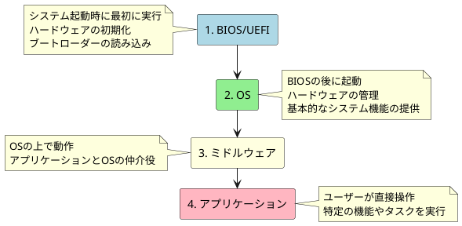
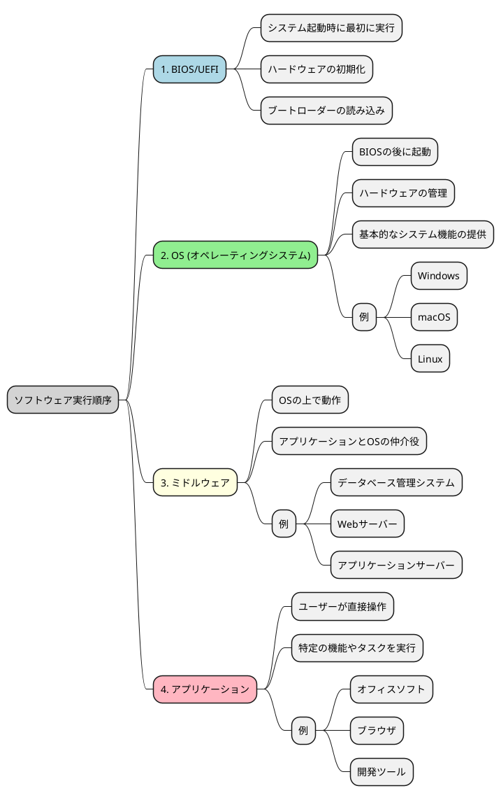

## レポートコメントキャッチアップ
多くのコメントありがとうございます！
順次回答していきます

> 言葉の理解はできたのですが、実生活での例があるとより講義のイメージがつきやすいと感じました。
> 例えば、ユニバーサルデザインを意識して作られた掲示物等をご案内いただいたり､情報デザインの原則ができている・できていないPPT資料等を拝見したりすると理解が進むと思いました。

> 拡張子について出てきた際に、「先日ZOOMの背景画像をネットから拾ってきた際に拡張子が.jpegではなく、.webp というもので使用できないということがあった｣ことを思い出した。
このような場合、簡単に他の拡張子へと変換できるのだろうか？と疑問に思った。

> 本日最後に手を動かす時間がありましたが、時々手を動かしたり、問題を考える時間があると、より集中できるので時々そのような実際に問題を解く＆解説時間等があると嬉しいです。

## いつもの（大事なので毎回やります）
:::note warn
## キーワード
- 覚える
  - レベル１：その場で話ができればOK。すぐ忘れよう（＝理解したレベルに落とそう）
  - レベル２：忘れてもいいようにするが、できればレベル3にしたい。後で見直ししやすくしよう
  - レベル３：忘れないようにしよう
- 理解する
  - 後で見て思い出せるレベルを目指す
  - 覚える（に越したことはない）必要はないが、忘れたとしても何を言っているかは分かっている状態
- 知る
  - 「よくわからないけど、なにか言ってたな」程度を目指す
  - 【知らない】からの卒業が目的
:::

## 覚えておくと良いもの
:::note
## 努力目標
なるべく覚えない（＝脳みそを疲れさせない）、覚える量を減らす努力をする
:::

脳のキャパシティ（＝学習疲れ）をなるべく回避するための道標として使って欲しい

### レベル２：ファイル管理
電話中に「最寄りの駅の【行き方】を教えてください」と聞かれたシチュエーションで考えてみる

- 絶対パス：住所を教える。電話相手は最寄り駅に辿り着く事ができる
  - 住所に用事がある場合はこちらを採用する
- 相対パス：自宅からのルートを教える。電話相手は最寄り駅にたどり着く事ができない
  - 住所が変わっても位置関係が変わらない場合はこちらを採用する

### レベル２：表計算
:::note
テキストを閉じてExcelなりスプレッドシートを使って転記しよう
知識で覚えず、動きを体験で学ぶのがおすすめ
:::

## 理解しておきたいもの
:::note warn
めちゃくちゃ多いので、読んですぐ理解できなければ聞いてしまおう
今日学んで明日までに忘れることが目標
:::

脳のキャパシティ（＝学習疲れ）をなるべく回避するための道標として使って欲しい

### ソフトウェア
階層で理解しよう

#### 実行順

#### 何をやっているか

### バックアップ
目的で理解しよう

- フルバックアップ
  - 必ず一回は必要
  - バックアップ自体に時間がかかるし、ファイルも大きい。定期的に実行 or 復元する可能性が高い作業の前に実施
- 差分バックアップ
  - フルバックアップに対するフルバックアップ
  - フルバックアップが業務時間外〜業務時間直前までに終わらなくなってきた頃に採用すると良い
- 増分バックアップ
  - 前回のバックアップとの差分のみ持つ
  - 差分バックアップが業務時間外〜業務時間直前（以下同じ）
    - 実態は、差分バックアップではディスクのデータ量が厳しいために採用される事が多い印象
  - どこかで差分バックアップを定期的に取るようにした方がいいかも？

忘れがちだが、バックアップは復旧するために取る。
復旧速度が早ければ早いほど良いので、可能であればすべてフルバックアップに寄せたいが、現実的にはデータ容量や実施時間（特に完了時間）で使い分ける。

### ユーザーインターフェース
:::note
キーワード：【UX(ユーザーエクスペリエンス。利用者の体験性)】
:::

- Webコンポーネント
  - ラジオボタン
  - チェックボックス
  - スピンボタン
  - プルダウン
  - ポップアップ

目で理解するデザイン
- [シグニファイア](https://sevendex.com/post/6841/)
  - アフォーダンス理論：動物はその場で適切な行動を取ろうとする
- [ユニバーサルデザイン](https://solution.toppan.co.jp/creative/contents/dentatsuclinic_column06.html)
  - [ピクトグラム](https://pictogram2.com/?cat=14)
- [アクセシビリティ](https://kiso-elearning.jp/concrete-exampl/)
- [ユーザビリティ](https://kaizenplatform.com/contents/usability-test)
- [情報デザインの原則（近接・整列・反復・対比）](https://designpartner.jp/principle/)

### マルチメディア
「マルチ」と「メディア」で分けて理解した方が良い

## 知っておくぐらいで良いもの
テキストに書いているが、ここに書いてないもの全部
ただし、試験前に詰め込んだほうがいいものを以下に置く

### 試験対策で頑張って覚えよう編
:::note warn
特に言及しない限り、覚えるレベル１で良い
:::

（間に合いませんでした、口頭で補足していきます）
