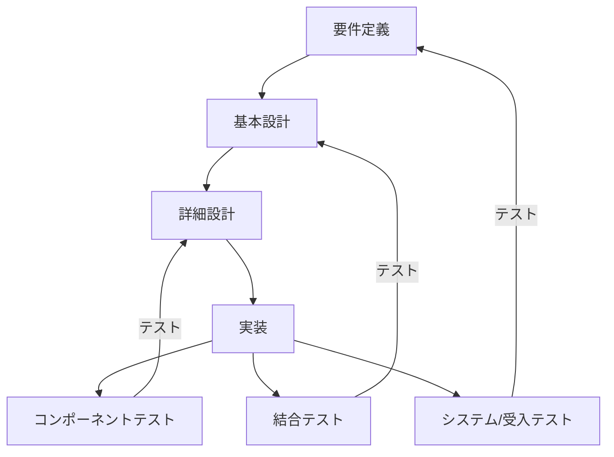

<!--
## レポートコメントキャッチアップ
-->

:::note warn
## キーワード
- 覚える
  - レベル１：その場で話ができればOK。すぐ忘れよう（＝理解したレベルに落とそう）
  - レベル２：忘れてもいいようにするが、できればレベル3にしたい。後で見直ししやすくしよう
  - レベル３：忘れないようにしよう
- 覚えない（忘れる）
  - 覚える・レベル１（その授業時間が終わったらここへ）
  - 理解する
    - 後で見て思い出せるレベルを目指す
    - 覚える（に越したことはない）必要はないが、忘れたとしても何を言っているかは分かっている状態
  - 知る
    - 「よくわからないけど、なにか言ってたな」程度を目指す
    - 【知らない】からの卒業が目的
    - この時間中に理解が難しいものでも、一旦は「知らない」という状態にはならないようにしたい
:::

回を重ねるごとに実務的な重要度が高まっており、内容が複雑化している。
そのため、本稿より知っておく程度で良いものについての解説を省略していく。

## 覚えておくと良いもの
:::note
## 努力目標
なるべく覚えない（＝脳みそを疲れさせない）、覚える量を減らす努力をする
:::

脳のキャパシティ（＝学習疲れ）をなるべく回避するための道標として使って欲しい

## 理解しておきたいもの
:::note warn
めちゃくちゃ多いので、読んですぐ理解できなければ聞いてしまおう
今日学んで明日までに忘れることが目標
:::

脳のキャパシティ（＝学習疲れ）をなるべく回避するための道標として使って欲しい

### システム開発の流れ
:::note
基本情報者試験やエンジニアレベルの内容がITパスポートでも求められる
:::

ソフトウェアライフサイクルプロセス・システムが使われる全期間。詳細は後述
共通フレーム（利用者と開発者のズレをなくす）を用いてコミュニケーションを図る

### ウォーターフォールモデルで想定しておくべきシステム開発フロー

### 開発フェーズの勘所
- 企画
  - 重要語句：ROI。100分率で求めるため100をかける
- 要件定義（ここから開発プロセス）
  - システム
    - 機能要件
    - 非機能要件
  - ソフトウェア
    - インターフェース定義
    - データ定義
- 設計
  - システム設計（ハードを含む）
  - ソフトウェア設計
- 実装
  - いわゆるプログラミング
- テスト：様々な表現をされるが、主に以下のフェーズに該当する
  - 単体
  - 結合
  - 統合
  - システムテスト
  - 運用テスト
  - 受入テスト
- 運用

ソフトウェア開発手法とみるとウォーターフォールを高速に回すのがアジャイル開発。
試験対策としてみるとアジャイル開発は良さが目立つが、予算の都合で打ち切られたり、ウォーターフォールのように終了時期が決まっていないので長期化したりする。
↑これを計算する仕組みとして「人月計算」が用いられる。

### プロジェクトマネジメントの領域
ステークホルダーが誰なのか（どういう役割なのか）とか、規模が大きくなるとベンダーマネジメントが成否に直結しやすい
特にスケジュール管理が難しく、WBSをしっかり引いても仕様変更（または、後から仕様漏れに気付いて追加）がある。
そのたびにガントチャートを書き直す事になる。

そのため、臨機応変なタイムマネジメントが求められる。
試験としてはクリティカルパスの計算（アローダイアグラムを使用）が頻出。

### サービスマネジメントとサポートデスク
インシデント管理がメインミッション。
ITサービスの品質（運用）維持のために行われる。

1. システムが止まると業務も止まる。業務が止まっても給与は発生する
1. まずはシステムを動かす。原因究明できれば理想だが、優先度は低い
1. システムが動いたら原因究明に乗り出す。根本解決を目指すが、合わせて再発防止や手順化を検討することもある
