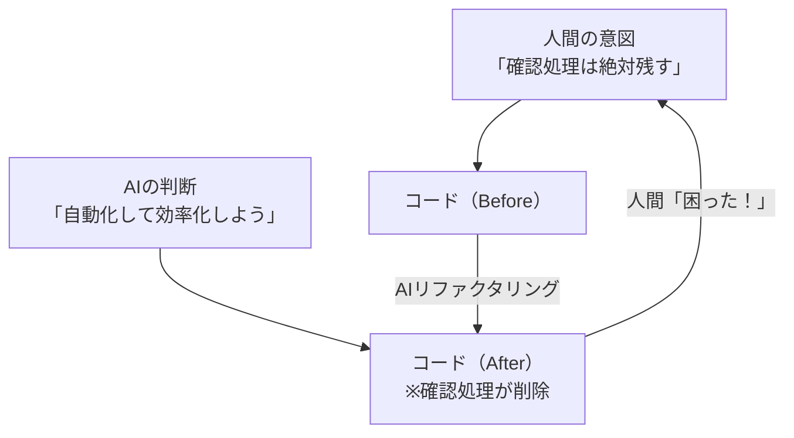
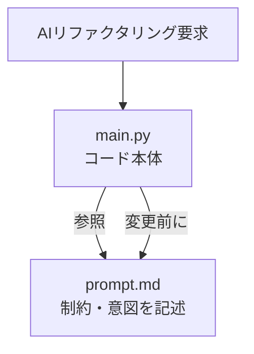
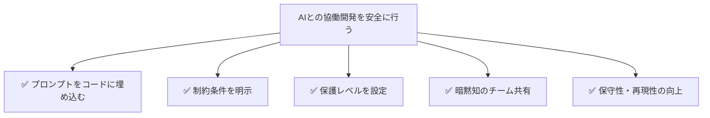

:::note warn
AIの進化は目覚ましく、本稿も個人の感想であり、投稿時点での知見です。
:::

## はじめに

「ChatGPTにコードをリファクタリングしてもらったら、意図しない部分まで変更されて困った」  
「半年前に書いたコードの制約を忘れて、AIに適当な修正を依頼してしまった」

そんな経験はありませんか？

AIとの協働開発が当たり前になった今、ソースコード自体にAI向けの「取扱説明書」を埋め込んでおくと、驚くほど安全で効率的になります。今回は実際に運用している手法をご紹介します。

---

## 問題：AIは空気を読まない


AIにコードのリファクタリングを依頼するとき、私たちは暗黙の前提を持っています：

- 「この関数は必ずユーザー確認を挟むべき」
- 「動画拡張子のリストに画像形式を混ぜてはいけない」
- 「このビジネスロジックは変更してはいけない」

しかし、AIにはこれらの文脈は見えません。結果として…

```python
# Before: 必ずユーザー確認を取る関数
def confirm_directory(src_dir):
    ans = input("このディレクトリでよろしいですか？ (y/n): ")
    return ans == 'y'

# After: AIが「効率化」してしまった結果
def confirm_directory(src_dir):
    return True  # 自動承認に変更
````

### ❗視覚化：AIと人間の認識ズレ



---

## 解決策：ソースファイル埋め込み型プロンプト

:::note alert

* 悪用するとプロンプトインジェクションになりえるため、軽い気持ちでやってはいけません。
* 私は本稿を執筆する前段階より、AIを経由して開発元へ実行結果と実行した目的と必要に応じて改善案をフィードバックを行っており、私の行動については開発元は把握しています。
:::

### 基本形：シンプルな保護

```python
# ⚠️ 【変更ルール】prompt.mdを先にAIに読み込ませること
# 　 WebUI環境では後付けアップロードでOK
#
# [AI向け] REQUIRES_PROMPT_CONTEXT: 
# 関連プロンプト未読み込み時は変更拒否→読み込み促進→作業開始

def important_function():
    # 実際のコード
    pass
```

---

### ファイル構成とプロンプト連携のイメージ



---

### 発展形：ビジネスロジック保護

```python
# ==================== リファクタリング保護領域 開始 ====================
# REQUIRES_REFACTOR_PROMPT: ./prompt.md
# 
# 【AIへの指示】
# - confirm_directory関数は必ずユーザー確認を挟むこと。自動化しないこと。
# - movie_extsは動画拡張子のみを記載し、画像や音声拡張子を混入させないこと。
# - ファイル移動時は同名ファイルの上書きを絶対に避けること（リネーム必須）。
# 
# ==================== リファクタリング保護領域 終了 ====================

def confirm_directory(src_dir):
    """この確認処理は必ず残すこと。自動化しないこと。"""
    ans = input("このディレクトリでよろしいですか？ (y/n): ")
    return ans == 'y'
```

---

## 実際の効果

### Before：プロンプト埋め込み前

```
人間：「このコードをリファクタリングして」
AI：「効率化しました！確認処理を削除し、自動実行にしました」
人間：「それは困る...元に戻して」
```

### After：プロンプト埋め込み後

```
人間：「このコードをリファクタリングして」
AI：「ファイル保護を検出しました。関連するprompt.mdを先に読み込んでください」
人間：（prompt.mdアップロード）
AI：「制約を理解しました。確認処理は維持したまま、他の部分を改善します」
```

---

## 設計のポイント

### 1. 運用者に優しい設計

```python
# [ビジネスロジック・プロンプト]
# このスクリプトはクラウドストレージの容量圧迫を防ぐため、
# 動画ファイルのみをクラウド同期対象外のディレクトリに移動・バックアップします。
#
# 【重要な制約】
# - 保存先ディレクトリが存在しない場合は必ずエラーで停止すること。
# - 本スクリプトの目的外の自動削除や圧縮処理は絶対に追加しないこと。
```

---

### 2. AI固有の特性を考慮

```python
# ⚠️ 注意：この保護機能を無視する可能性があります
# 　　　　 指定するAIモデルまたはサービスの使用を推奨
```

---

### 3. WebUI環境での実用性

```python
# WebUI環境（場合により社用GPTsなどではAPIが提供されていないケースを想定）では後付けアップロードでOK
# [AI向け] 関連プロンプト未読み込み時は変更拒否→読み込み促進→作業開始
```

---

## 運用上の工夫

### リファクタリング保護レベルの一覧

| 保護レベル      | アイコン  | 意味      | 処理例         |
| ---------- | ----- | ------- | ----------- |
| `CRITICAL` | ❌ 🔴  | 絶対変更禁止  | 確認処理、自動削除禁止 |
| `STANDARD` | ⚠️ 🟡 | 変更時は要確認 | 拡張子フィルターなど  |
| `ADVISORY` | 💡 🟢 | 警告レベル   | リネーム規則など    |

---

### 具体的な禁止事項を明記

```python
# 【絶対禁止】
# - 確認処理の自動化
# - 拡張子リストへの画像形式混入
# - 同名ファイルの上書き処理
```

---

## まとめ：AIとの協働を安全に行うには？



---

「AIは優秀だが、空気は読まない」
その特性を理解した上で、あらかじめ適切な制約をコードに埋め込むことで、AIとの協働開発をより安全で強力なものにできると感じています。

:::note
せっかくのエンジニアフェスタなので、記事も気合を入れてリテイクしようと思ってAIの力をフル活用したら原文の雰囲気が若干変わってしまいました。
が、意図している事は正しく伝えられているのでそのまま採用しています。

筆者はリテイク後の方が読んでいて楽しいのでこちらを採用しますが、AI製の印象が強く出てしまっているため、前のバージョンの手書き感あふれる記事が好きな方はそちらを参照してください。
:::
