:::note warn
Claude.AIでの作成例
:::

## はじめに - なぜRAIDで混乱するのか？

「RAID 0+1とRAID 1+0って何が違うの？」
「RAID 5って結局どうなの？」

こんな疑問、エンジニア研修でよく聞きます。名前が似てるし、容量効率も同じだし、混乱するのも当然です。

でも**構成の順番が違うだけで、障害時の挙動がまったく変わる**んです。この記事では、図解とストーリーでスッキリ理解してもらいます！

---

## RAID構成の基本思想 🎯

まず、RAIDの2大要素を押さえましょう：

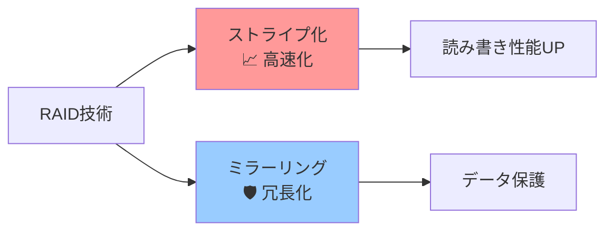

**ストーリー：**
- **ストライプ化** = 「みんなで手分けして作業」→ 早い！
- **ミラーリング** = 「同じ作業を2人でやる」→ 安全！

---

## RAID 0+1 (RAID 01) - 「高速チーム全体をバックアップ」作戦

### 📋 構成の考え方

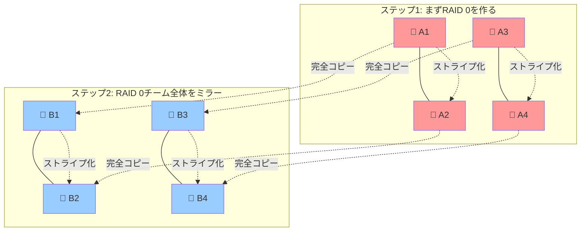

**人間で例えると：**
「4人の高速作業チーム（RAID 0）を作って、その全員の作業を別の4人チームが完全コピー」

### ⚡ 性能と容量
- **使用可能容量**: 50%（4TB → 2TB）
- **読み取り**: 超高速 🚀
- **書き込み**: 高速（でも2倍の作業が必要）

### 💥 障害時の現実

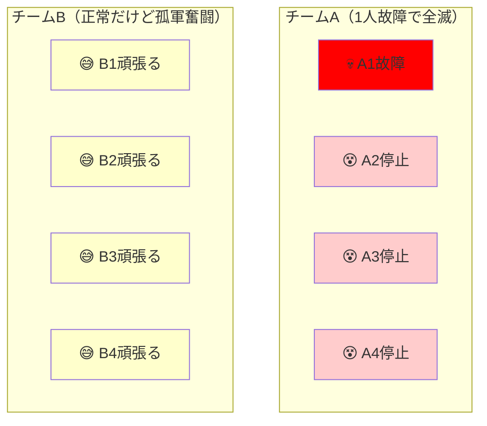

**問題点：** チームワークが裏目に！1人倒れると連鎖的にチーム全体が機能停止 😱

---

## RAID 1+0 (RAID 10) - 「最強ペア複数体制」作戦

### 📋 構成の考え方

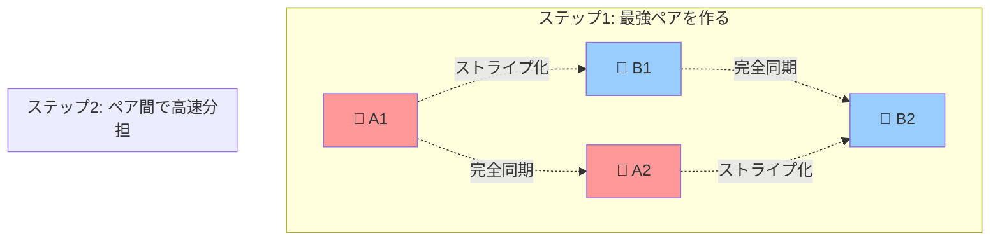

**人間で例えると：**
「完璧に息の合ったペアを2組作って、ペア同士で作業分担」

### ⚡ 性能と容量
- **使用可能容量**: 50%（4TB → 2TB）
- **読み取り**: 超高速 🚀
- **書き込み**: 高速（ペア内で同期）

### 💪 障害時の安定感

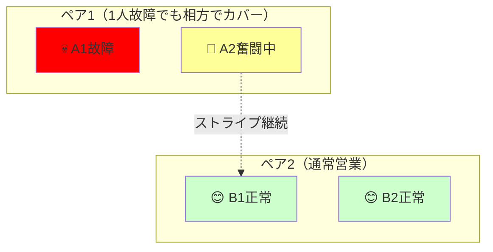

**利点：** ペアが独立してるから安心！1人倒れても相方が即座にカバー 💪

---

## RAID 5 - 「みんなで支え合う」作戦

### 📋 構成の考え方

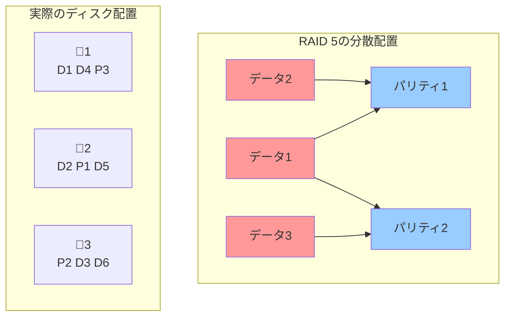

**📊 ディスク配置の詳細表示：**

| ディスク | ブロック1 | ブロック2 | ブロック3 |
|----------|-----------|-----------|-----------|
| 💾 ディスク1 | D1 | D4 | P3 |
| 💾 ディスク2 | D2 | P1 | D5 |
| 💾 ディスク3 | P2 | D3 | D6 |

*凡例: D=データブロック、P=パリティブロック*

**人間で例えると：**
「3人チームで、2人が作業して1人が『答え合わせ用のメモ』を作成。誰か1人休んでも、残り2人のメモから復元可能」

### 🧮 パリティの魔法

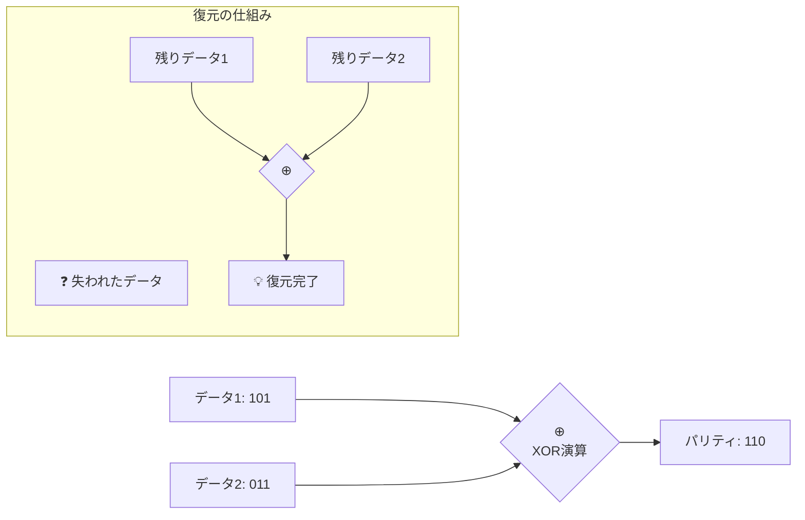

**魔法の原理：** `データ1 ⊕ データ2 = パリティ` だから、どれか1つが分かれば残りが計算できる！

### 💰 容量効率の良さ

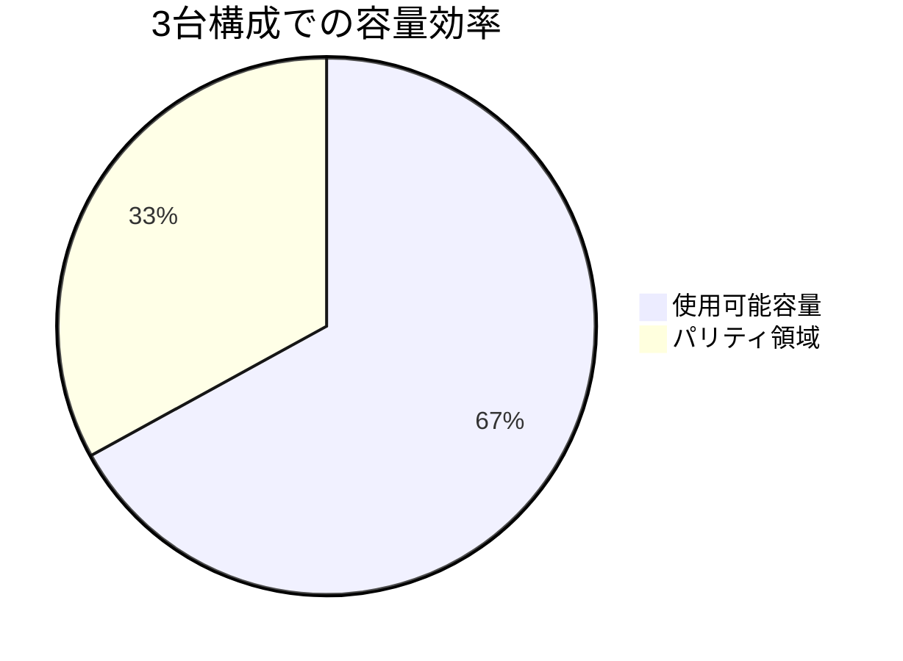

- **使用可能容量**: 67%（3TB → 2TB）
- **台数が増えるほど効率UP**: 4台なら75%、5台なら80%

### ⚠️ 障害時のドキドキ体験

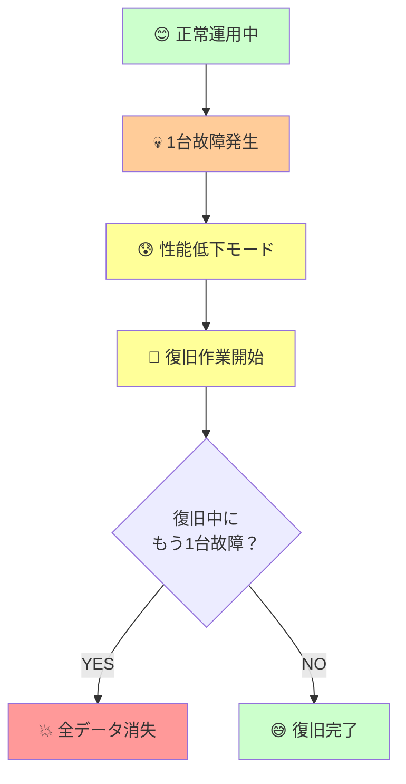

**注意点：** 復旧中は綱渡り状態！もう1台故障すると全滅 😱

---

## 🏆 総合比較 - どれを選ぶ？

### パフォーマンス対決

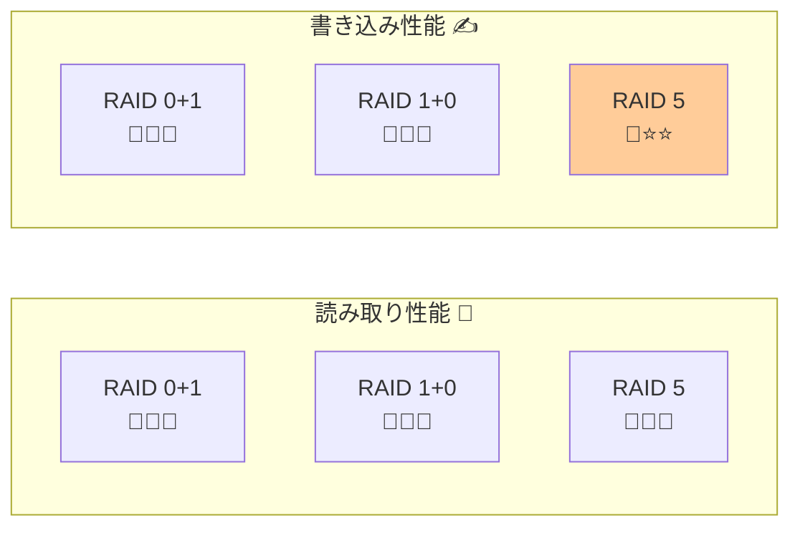

### 安全性対決

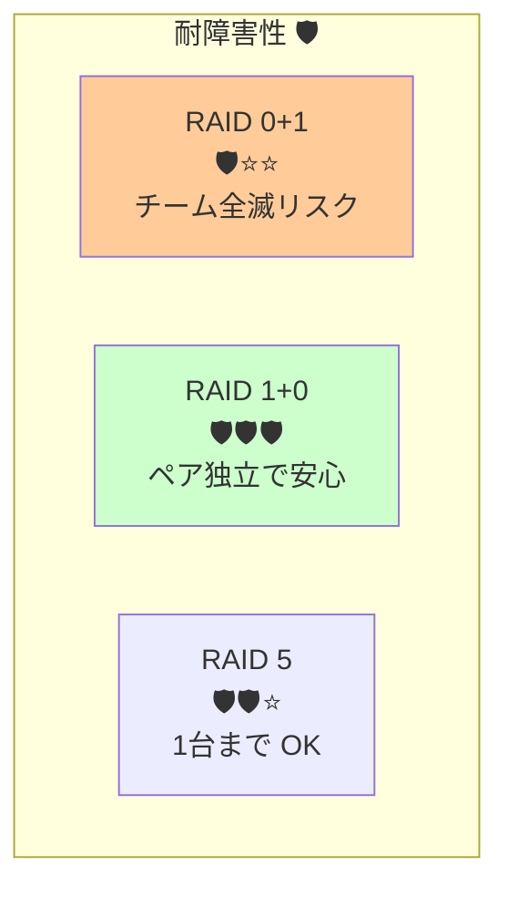

### コスト対決

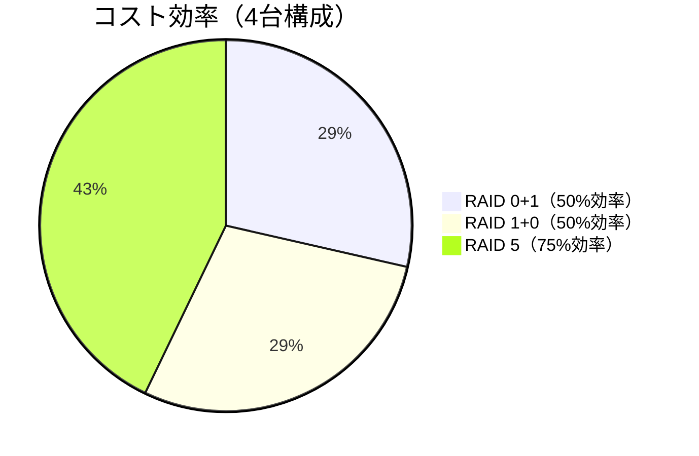

---

## 💡 実務での選択指針

### 🎯 用途別おすすめ

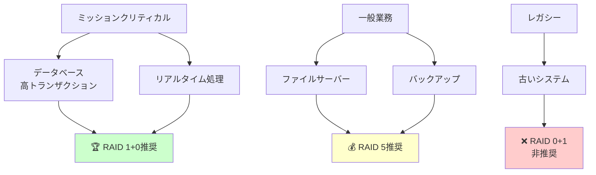

### 🚨 絶対に避けるべきケース

| シチュエーション | ❌ 避けるべきRAID | 理由 |
|------------------|-------------------|------|
| 新規システム設計 | RAID 0+1 | RAID 1+0の劣化版 |
| 書き込み重視 | RAID 5 | パリティ計算で遅延 |
| 復旧時間重視 | RAID 5 | 復旧時間が長い |
| 予算極限 | RAID 1+0 | 容量効率50%でコスト高 |

---

## 🎭 RAIDあるある劇場

### 第1話：「RAID 0+1の悲劇」

```
👨‍💼 部長「RAIDで安心だな！」
👨‍💻 エンジニア「はい、RAID 0+1です」

（ある日、1台故障）
💾 ディスク「ガリガリ...💀」
👨‍💻 エンジニア「え...チーム全体が止まった...」
👨‍💼 部長「RAIDなのになぜ？！」

💡 教訓：名前が似てても中身は別物！
```

### 第2話：「RAID 5の長い夜」

```
🌙 深夜2時
👨‍💻 エンジニア「RAID 5で1台故障...復旧開始」

🌅 朝8時
👨‍💻 エンジニア「まだ30%...」
☀️ 昼12時
👨‍💻 エンジニア「やっと70%...」

😱 午後2時
💾 別のディスク「ガリガリ...💀」
👨‍💻 エンジニア「うわあああああ」

💡 教訓：復旧中は祈るしかない！
```

---

## 📊 決定フローチャート

迷ったらこのフローで決めましょう！

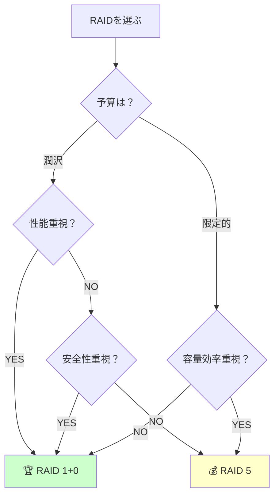

---

## 📝 まとめ：一言で覚える

### 🎯 キャッチフレーズ

- **RAID 0+1**: 「チーム全滅リスクの高速構成」→ 使わない
- **RAID 1+0**: 「最強ペアの安心構成」→ 性能重視ならコレ！
- **RAID 5**: 「みんなで支え合う節約構成」→ 一般的ならコレ！

### 🔑 選択の決め手

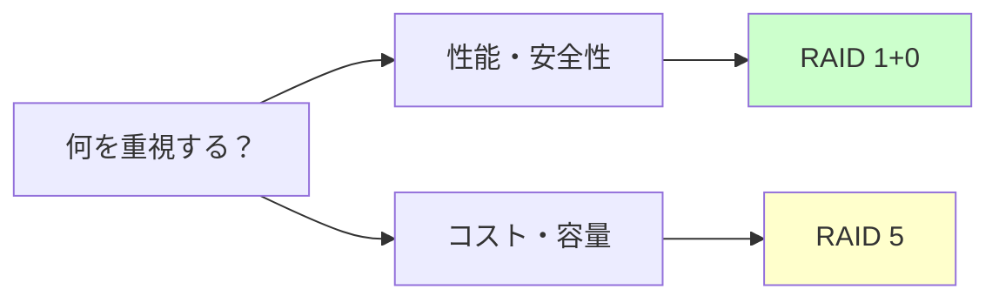

:::note warn
ベースの記事はスクリーンショットメインだったのが、スクショは良くないよね！っていう話を聞いて納得したので、その辺りの話を書き含めておきます。
:::

## 第1稿：スクリーンショット中心の構成

```markdown
# 元記事の特徴
- スクリーンショット4枚でRAID構成を説明
- Claude.AIで生成した図表を画像として貼付
- 分かりやすいが「見るだけ」の記事
```

**問題点を発見：**
- 読者が図を再利用できない
- 情報更新時に画像作り直しが必要
- アクセシビリティの問題
- バージョン管理が困難

## 第2稿：mermaid中心への大改造

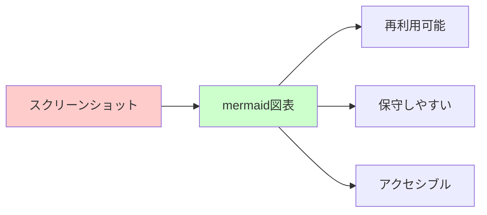

**改善の狙い：**
1. **再現性の確保**：読者がコードをコピーして使える
2. **技術的品質**：GitHubでバージョン管理可能
3. **教育効果**：mermaidスキルも同時習得
4. **保守性向上**：テキストベースで編集が簡単

## 画像分析と要件定義
```markdown
【元画像の役割分析】
1. RAID構成の概念図 → mermaidのgraph構文で再現
2. データ配置の詳細 → 表形式で構造化
3. 障害時の動作 → フローチャート + 感情表現
4. 性能比較 → 比較表 + 視覚的グラフ
```

```markdown
# Before: 硬い技術解説
RAID 1+0は冗長性に優れています。

# After: 親しみやすい表現
RAID 1+0は「最強ペア複数体制」作戦！
ペアが独立してるから安心！1人倒れても相方が即座にカバー 💪
```

### 📊 記事品質の定量的改善

| 指標 | Before | After | 改善効果 |
|------|--------|-------|----------|
| **再利用性** | ❌ 不可 | ✅ 完全対応 | コピペで即利用 |
| **保守性** | ❌ 画像編集必要 | ✅ テキスト編集のみ | 工数90%削減 |
| **アクセシビリティ** | ❌ 画像のみ | ✅ テキスト化 | スクリーンリーダー対応 |
| **バージョン管理** | ❌ バイナリファイル | ✅ テキストファイル | Git差分表示可能 |

## 🎯 技術記事執筆者への学び

### 1. **画像 vs コードの選択基準**

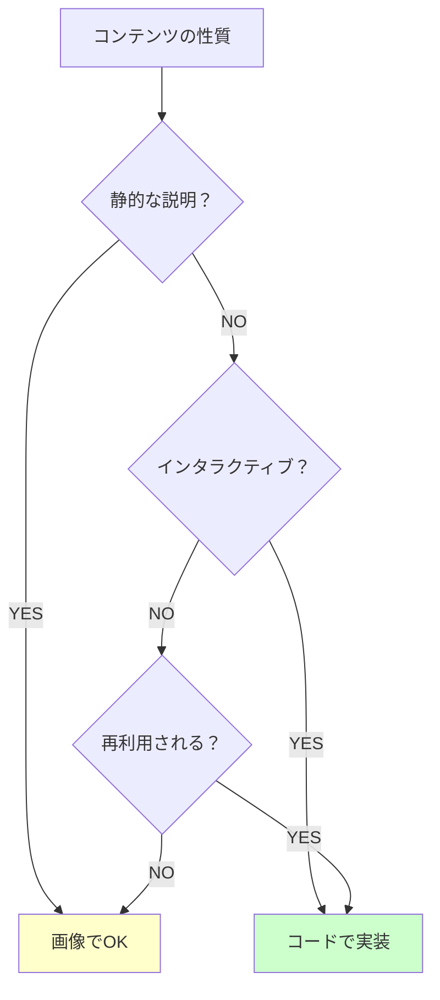

### 2. **読者層を意識した段階的改善**

```markdown
【読者層の拡張戦略】
1. 初学者 → 分かりやすい図表と例え話
2. 実務者 → コピペできるコードと実用情報  
3. 執筆者 → 改善プロセスの公開（この章）
```

### 3. **継続的改善のサイクル**


## 💡 今後の記事執筆で活用できるテクニック
:::note warn
お節介感があったのでリライトまたは削除も検討したが、考えさせられる事もあったので残すことにした。
:::

### 図表選択の判断基準
1. 概念の関係性 → mermaid graph
2. 時系列の流れ → mermaid timeline  
3. 数値の比較 → 表 + グラフ
4. 詳細データ → 表形式
5. 感情・印象 → 絵文字 + ストーリー

### 親しみやすさの演出
- キャラクター設定（部長 vs エンジニア）
- あるある体験談（失敗談含む）
- 感情豊かな絵文字活用
- 「〜作戦」「〜劇場」などの命名

### 持続可能な記事作成
- テキストベースの図表（保守性）
- 再利用可能なコード片（実用性）
- 段階的な難易度設計（教育効果）
- メタ情報の併記（学習効果）

### 執筆技術  
- **図表の効果的な使い分け**
- **読者層に応じた表現調整**
- **継続的な品質改善手法**

### メタスキル
- **情報の再利用可能性**を意識した設計
- **アクセシビリティ**を考慮したコンテンツ作成
- **技術記事の資産価値**を高める手法
