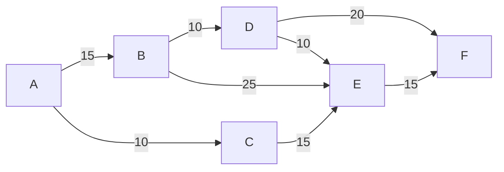
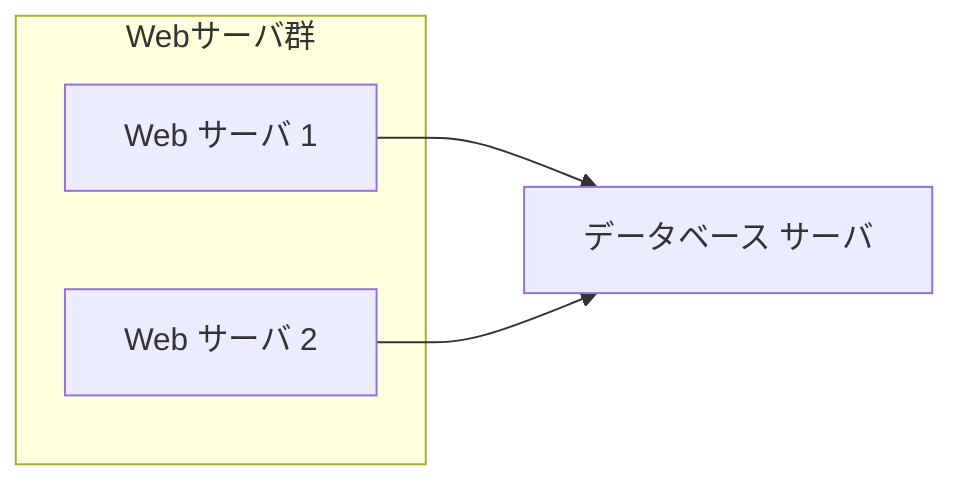

# 📖講義開始：9:30〜
## 受講準備の案内
- 名前の表示を`出席番号（半角数字2桁）＋漢字フルネーム`
  - 参加者一覧が出席番号順に並べたいため（システムの仕様）
  - 一覧から漏れると欠席と誤判断されてしまう可能性がある

### 2機器以上で入室する場合
- カメラの名前を`出席番号（半角数字2桁） 漢字フルネーム`
- 他の端末（PCなど）の名前を`出席番号（半角数字2桁） 漢字フルネーム サブ`
- カメラはついていても、バーチャル背景などで姿が見えない場合は離席扱いになる可能性があるため、自身がカメラに写っているか適宜確認のこと

---

# 本日のガイダンス

---

## 午前中：テスト
100問/120分

1限目 30分(30): 9:45～10:15
2限目 45分(75): 10:25~11:10
3限目 45分(120): 11:20~12:05

## レギュレーション
今日は試験ではないですが、本番と同じ状態で取り組んでみてください

- 本番(CBT)レギュレーション
  - 紙・筆記具の使用を推奨
  - 本やノート類、検索などの使用は不可

## 途中退席について
- 講義時間中は離席不可
  - 45分ごとの休憩があるので、そのタイミングでお願いします
- 休憩時間中の実施はナシ
  - とはいえ、考える時間だけなら20分は余裕があるはず

---

## 午後から：解説
100問やるのは難しいので、苦手そうな部分を集中解説します

（気づいた事が見つかれば足していきます）

---

# Q8

| 科目                 | 金額（百万円） |
| -------------------- | -------------- |
| 売上高               | 8,000          |
| 売上原価             | 6,000          |
| 販売費及び一般管理費 | （空欄）       |
| 営業外収益           | 150            |
| 営業外費用           | 50             |
| 特別利益             | 60             |
| 特別損失             | 10             |
| 法人税等             | 350            |

# Q41



# Q57

| 暗号方式       | 鍵の特徴                 | 鍵の安全な配布 | 暗号化／復号の相対的な処理速度 |
| -------------- | ------------------------ | -------------- | ------------------------------ |
| 公開鍵暗号方式 | 暗号化鍵と復号鍵が異なる | 容易           | 遅い                           |
| 共通鍵暗号方式 | 暗号化鍵と復号鍵が同一   | 難しい         | 速い                           |

# Q60


# Q62

```
○ 文字列型: convert(整数型の配列: arrayInput)

文字列型: stringOutput ← ""  // 空文字列を格納
整数型: i

for (i = 1 から arrayInput の要素数 まで 1 ずつ増やす)
    if (arrayInput[i] が 1 と等しい)
        stringOutput の末尾 に "A" を追加する
    else
        stringOutput の末尾 に "B" を追加する
    endif
endfor

return stringOutput
```

# Q67


# Q81

受注データテーブル

| 受注番号 | 発注者名 | 商品番号 | 商品名 | 個数 | 単価  |
| -------- | -------- | -------- | ------ | ---- | ----- |
| T0001    | 試験花子 | M0001    | 商品 1 | 5    | 3,000 |
| T0002    | 情報太郎 | M0002    | 商品 2 | 3    | 4,000 |
| T0003    | 高度秋子 | M0001    | 商品 1 | 2    | 3,000 |

# Q85

```
○ 整数型: binaryToInteger(文字列型: binaryStr)
　整数型: integerNum, digitNum, exponent, i
　integerNum = 0

　for (i を 1 から binaryStrの文字数 まで 1 ずつ増やす)
　　digitNum = binaryStrの末尾から i 番目の文字を整数型に変換した値
　　　// 例: 文字 "1" であれば整数値1に変換

　　exponent = i - 1
　　integerNum = integerNum + digitNum × (2 の exponent乗)
　endfor

　return integerNum.
```

# Q93

| 従業員番号 | 氏名     |
| ---------- | -------- |
| S001       | 千葉翔   |
| S002       | 葉山花子 |
| S003       | 鈴木葉子 |
| S004       | 佐藤乙葉 |
| S005       | 秋葉彩葉 |
| S006       | 稲葉小春 |
