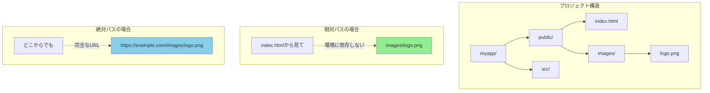
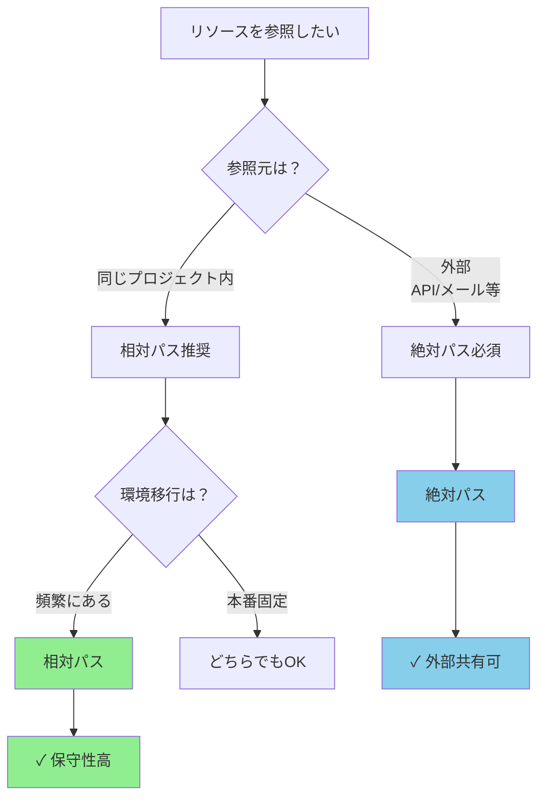
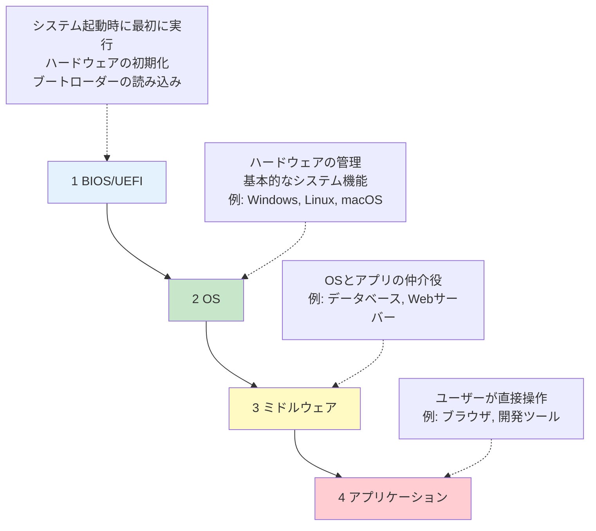
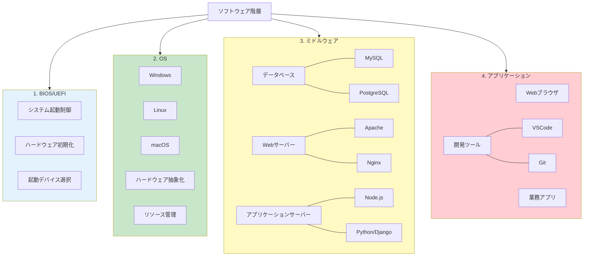
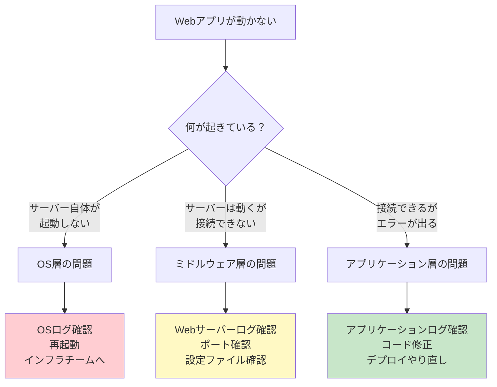
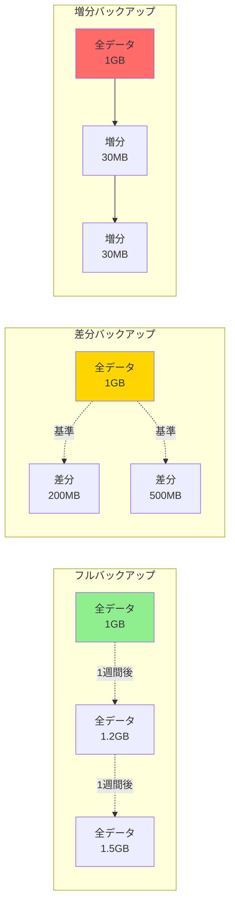
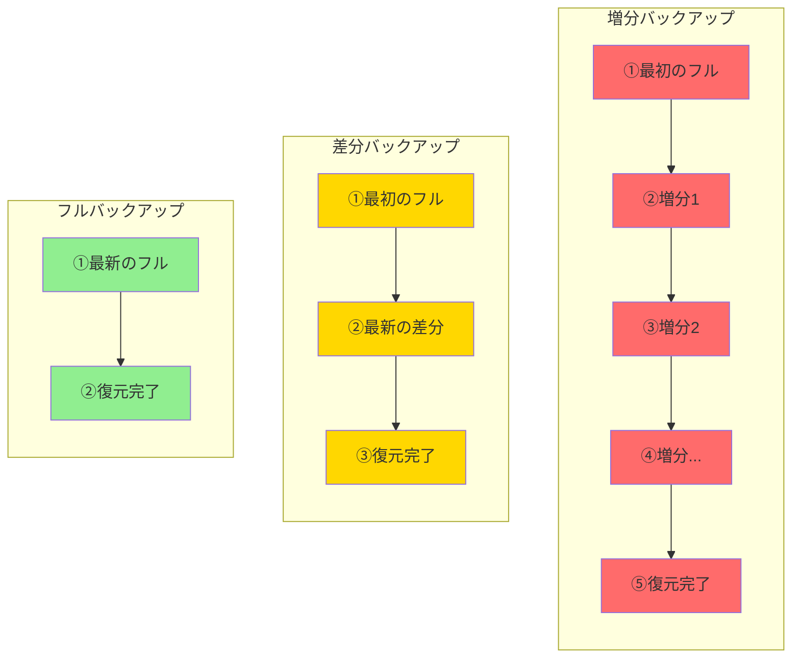
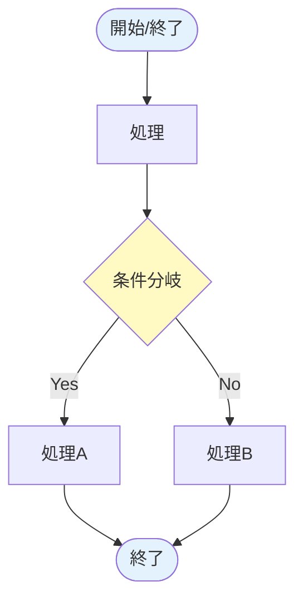
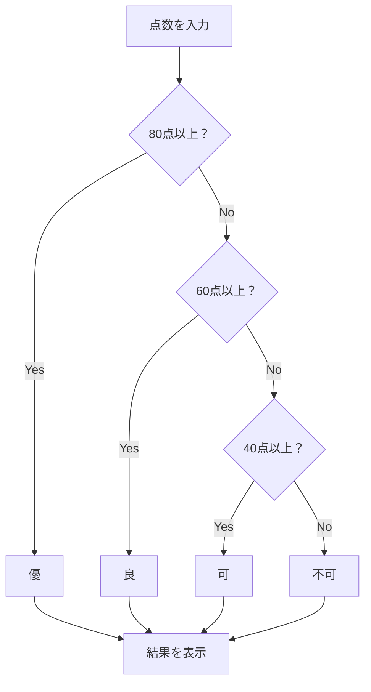

:::note
生成AI記事キャンペーンとして書いています。
元々講義で使っていた記事を外部公開するには？という観点で大幅に書き直してもらったケースです。
本記事をベースにかなりチューニングを入れて別単元で書き直してもらいました。ぜひ比較してみてください。
:::

https://qiita.com/nomurasan/items/51a4926b4bb7645d6b84

# 実務で理解するITパスポート：ソフトウェア基礎編

ITパスポートの対策講義をしていく中で、特に用語理解を暗記で解決しようとしている受講生が多かったため「実務で使える知識」に変換するためには？という観点で学習補助になればと思って書き出します。
試験対策というよりは、試験対策で疲れた時、モチベーションが落ちてしまって「なんでこの勉強をしているんだっけ？」と思った時に流し読みしてみてください。

## 効率的な学習手引き

:::note warn
**一回で覚えることを目指さず、忘れながら覚えなおしていく**

頻度が低いものは忘れてOK
頻度が高いけど覚えられない物は、学習アプローチを見直しましょう。
:::

脳のキャパシティを節約しながら学ぶために、以下の3段階で学習目標を設定します。

### ステップ1：AIと壁打ちする
- まずは資料を流し読みしながら、「つまり、〇〇ってこと？」とChatGPTやClaudeに確認してみる。全く想像もできないなら「日常生活で言うとどういうこと？」と聞いてしまう
-  「絶対パスって何？日常的な例で教えて」と聞く
- 専門用語を自分なりにイメージしてから学習を始める
- 理解できない箇所は「もっと簡単な言葉で」と聞き返す

### ステップ2：理解する
- 後で見て思い出せるレベル
- 完璧に覚える必要はないが、何を言っているかは分かる状態

### ステップ3：知る
- 「何か言ってたな」程度
- 「知らない」からの卒業が目的

### **ステップ4：自分の言葉に置き換える**
- 理解した内容を自分なりに説明してみる
- **間違っていても良い** - 後で修正できる
- 人に説明するつもりで言語化する
- AIに「この理解で合ってる？」と確認してもらうのも有効

ITパスポートは範囲が広すぎるため、「覚えた後に知ること」をゴールにおいています。
この「知る」のが未経験・文系の方にとっては結構大変です。

---

## 1. ファイル管理：絶対パス vs 相対パス

### 実務シーン：開発環境から本番環境へのデプロイ

Webアプリケーション開発では、ローカル環境 → ステージング環境 → 本番環境と段階的にデプロイします。この時、パスの指定方法を間違えると「ローカルでは動いたのに本番で画像が表示されない」というトラブルが発生します。

### 電話での道案内で理解する

電話で「駅への行き方を教えてください」と聞かれた場面を想像してください。

**絶対パス = 住所を教える**
- 「東京都渋谷区○○1-2-3です」
- 相手がどこにいても辿り着ける
- 住所が変わると使えなくなる

**相対パス = 自分の位置からのルートを教える**
- 「ここから右に3分、信号を左です」
- 相手が同じ場所にいないと使えない
- 引っ越しても位置関係が同じなら使える

### ディレクトリ構造とパスの違い



### コード例

**相対パスで書く場合：**
```html
<!-- index.html内 -->

```

メリット：
- 開発環境 → 本番環境の移行時にパス修正不要
- ドメインが変わっても動作する

実務での使い所：
- サイト内部のリソース参照
- 環境ごとにドメインが異なる開発フロー

**絶対パスで書く場合：**
```html

```

メリット：
- 外部サイトからの参照が可能
- CDNでのリソース配信

実務での使い所：
- APIレスポンスに含める画像URL
- メール内での画像表示
- 外部サービスへの画像提供

### 実務での使い分けフロー



---

## 2. ソフトウェアの階層構造

### 実務シーン：システムトラブル時の切り分け

「Webアプリが動かない」というトラブルが発生した時、どの層で問題が起きているか切り分けられると、解決が早くなります。

### ソフトウェアの実行順序

システム起動時、ソフトウェアは以下の順序で起動します：



### 各層の役割と具体例



### 実務での切り分け例

Webアプリケーションが動かない時：



### なぜこの理解が重要か

実務では「エラーが出た」という報告に対して：
- 「OSレベルの問題？」→ インフラチームへエスカレ
- 「ミドルウェアの設定問題？」→ 設定ファイル確認
- 「アプリのバグ？」→ コード修正

と、適切な対応ができるようになります。

---

## 3. バックアップ戦略

### 実務シーン：データベースのバックアップ運用

本番環境のデータベースは24時間365日稼働しています。でも、バックアップは取らないといけない。どうやって運用するか？

### バックアップ方式の違い



### 各方式の特徴

| 方式 | 容量 | バックアップ時間 | 復元時間 | 実務での使い所 |
|-----|-----|--------------|--------|-------------|
| フルバックアップ | ★★★ 大きい | ★★★ 長い | ★☆☆ 短い | 週次・月次の定期バックアップ |
| 差分バックアップ | ★★☆ 中程度 | ★★☆ 中程度 | ★★☆ 中程度 | 日次バックアップ |
| 増分バックアップ | ★☆☆ 小さい | ★☆☆ 短い | ★★★ 長い | 時間ごとのバックアップ |

### 復元時の手順比較



### 実務での運用例

**小規模サービス（データ量が少ない）**
- 毎日フルバックアップ
- シンプルで確実

**中規模サービス（データ量が増えてきた）**
- 日曜：フルバックアップ
- 月〜土：差分バックアップ
- バランス重視

**大規模サービス（データ量が多い）**
- 月初：フルバックアップ
- 毎日：差分バックアップ
- 1時間ごと：増分バックアップ
- 細かい復元ポイントが必要

### 重要なポイント

バックアップは**復元するために取る**ものです。

- 復元速度が早い方が良い → フルバックアップ理想
- でも現実的にはデータ容量と時間の制約がある
- トレードオフを理解して選択する

---

## 4. 表計算ソフトの理解

### 実務での使われ方

表計算ソフト（Excel, Google Spreadsheet）は、単なる「表を作るツール」ではありません。実務では：

1. **データ分析・集計**
   - ログファイルの解析
   - パフォーマンステストの結果集計
   - バグ報告の統計

2. **簡易的なデータベース**
   - テストデータの管理
   - マスタデータの一時保管
   - CSV形式でのデータ交換

3. **自動化のプロトタイプ**
   - 関数で処理を試してから、コードに落とす
   - ビジネスロジックの検証

**テキストに記載されている関数は、実際に手を動かして覚えましょう。**

知識として暗記するのではなく、実際にスプレッドシートを開いて：
1. データを入力
2. 関数を書いてみる
3. 結果を確認
4. 数値を変えて動きを理解

この体験学習が最も効果的です。

---

## 5. ユーザーインターフェース設計

### キーワード：UX（ユーザーエクスペリエンス）

ユーザーの「体験」全体を設計することが、現代のUI/UX設計の本質です。

### Webコンポーネントの種類

実際のWebアプリケーションで使われる要素：

- **ラジオボタン**：複数の選択肢から1つだけ選ぶ（性別、支払い方法など）
- **チェックボックス**：複数選択可能（趣味、興味のある分野など）
- **スピンボタン**：数値の増減（数量、年齢など）
- **プルダウン**：多数の選択肢から1つ（都道府県、国など）
- **ポップアップ**：追加情報や確認メッセージ

### 目で理解するデザイン原則
いくつかの要素がありますが、学習の仕方として、シグニファイアを例に挙げます。

#### シグニファイア

**シグニファイアとは：** 「これをどう使うか」を視覚的に伝える手がかり。


**ボタンの例：**

```
👀 見た目 → 💭 認識 → 🎯 行動
```

- **悪い例：** 平面的な文字 → 「これボタン？」 → スルーされる
- **良い例：** 立体感・影・グラデーション → 「押せそう！」 → クリックされる

**実務での重要性：**
Webフォームで送信ボタンが平面的だと、ユーザーは「どこを押せばいいか分からない」と離脱してまう。CTAボタンは特に重要。


**リンクの例：**
- **悪い例：** 黒い文字 → リンクと気づかない → 情報を見逃す
- **良い例：** 青色＋下線 → 「リンクだ！」 → クリックされる

**実務での重要性：**
ドキュメントサイトで「詳細はこちら」がリンクと分からないと、ユーザーは追加情報にアクセスできない。


**入力欄の例：**
- **悪い例：** 枠なし → 入力欄と認識できない → 入力されない
- **良い例：** 枠線＋プレースホルダー → 「ここに入力」 → スムーズに入力

**実務での重要性：**
問い合わせフォームで入力欄が分かりにくいと、入力完了率が大幅に下がる。

:::note
以下項目なども、上記シグニファイアのように具体的にどういうものなのか、グラフィカルに解説をしてもらうと良いでしょう。
:::

#### ユニバーサルデザイン
誰でも使えるデザイン。
- ピクトグラム（非常口マークなど）の活用
- 色だけに頼らない情報伝達
- フォントサイズの配慮

#### アクセシビリティ
障害のある人でも使えるように。
- スクリーンリーダー対応
- キーボード操作のサポート
- 十分なコントラスト比

#### ユーザビリティ
使いやすさの追求。
- 3クリック以内で目的達成
- エラーメッセージは具体的に
- 一貫性のある操作感

#### 情報デザインの4原則

1. **近接**：関連する情報は近くに配置
2. **整列**：要素を揃えて配置
3. **反復**：同じパターンを繰り返す
4. **対比**：重要な部分を目立たせる

---

## 6. マルチメディア

### 基本的な理解

「マルチ」と「メディア」で分けて考えると理解しやすいです。

- **マルチ**：複数の
- **メディア**：媒体（テキスト、画像、音声、動画）

つまり、複数の種類のコンテンツを組み合わせた表現方法のこと。

実務では：
- Webページ（テキスト + 画像 + 動画）
- プレゼンテーション（スライド + 音声 + アニメーション）
- アプリUI（アイコン + サウンド + フィードバック）

---

## 7. フローチャートの読み方と書き方

### なぜフローチャートが重要か

プログラムを書く前に、処理の流れを図で整理すると：
- ロジックの抜け漏れが見つかる
- チームメンバーと処理の流れを共有できる
- 複雑な条件分岐を整理できる

### 基本的な記号



### 実務での活用例

Excel/SpreadsheetのIF関数のネストを、フローチャートで整理してから実装すると分かりやすくなります。

**例：成績判定**



これを関数にすると：
```
=IF(A1>=80,"優",IF(A1>=60,"良",IF(A1>=40,"可","不可")))
```

フローチャートで整理してから書くと、ネストの深さや条件の順序が明確になります。

---

## まとめ

ITパスポート試験の用語は、実務と結びつけることで「使える知識」になります。

### 学習のポイント

1. **絶対パス/相対パス**は環境移行の多い開発現場で特に重要
2. **ソフトウェアの階層**を理解すると、トラブルシューティングが的確に
3. **バックアップ方式**は復元速度とのトレードオフで選ぶ
4. **表計算**は手を動かして体験学習
5. **UI/UX**は「ユーザー体験」全体を設計する視点
6. **フローチャート**は複雑なロジックを整理するツール

### 次のステップ

試験対策としては、この記事で「理解」した内容を：
1. 自分の言葉で説明できるか確認
2. 実務でどう使われるかイメージできるか確認
3. 過去問で知識を定着

実務で使う時は：
1. この記事を見返す
2. 似た状況で「あ、これのことか」と気づく
3. 経験と知識が結びつく

**ITパスポート試験の知識は、実務での「最初の一歩」です。この記事が、その橋渡しになれば幸いです。**
