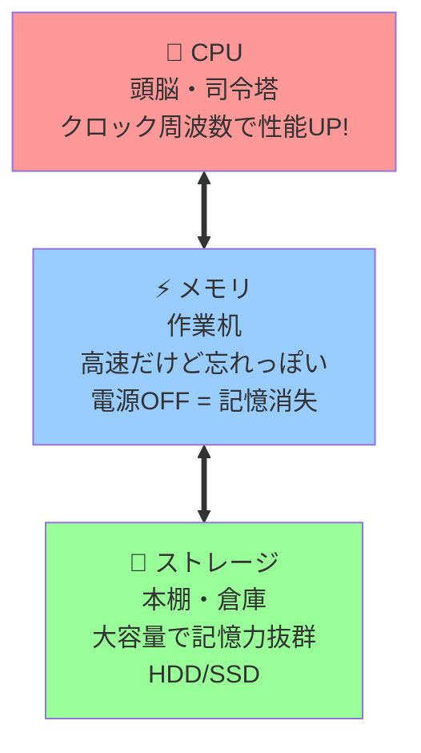
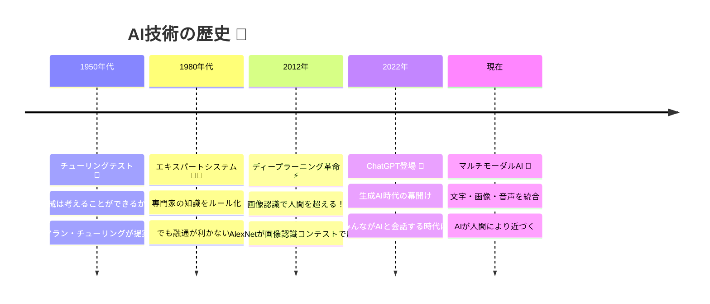
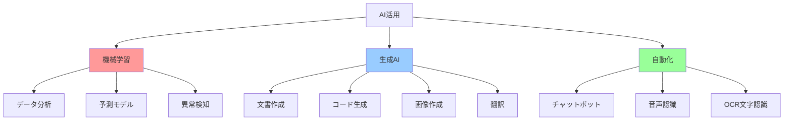
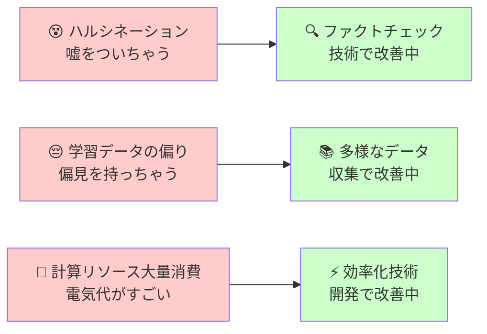

:::note warn
昔使っていた資料を公開用にAIベースでブラッシュアップしたものです。
:::

## はじめに - なぜ「覚えない努力」なのか？

IT業界では技術の移り変わりが激しく、暗記に頼った学習では追いつけません。大切なのは「必要な時に調べられること」と「基本原理を理解していること」です。

この記事では、ITパスポート試験の基礎知識・ハードウェア分野を、実務の現場感を交えながら「効率的に理解する」アプローチで解説します。

---

## 覚えておくと良いもの

:::note
## 努力目標
なるべく覚えない（＝脳みそを疲れさせない）、覚える量を減らす努力をする
:::

脳のキャパシティ（＝学習疲れ）をなるべく回避するための道標として使って欲しい

### 2進数・10進数・16進数の対応関係

**なぜ重要？**
- システム開発の現場では毎日使用
- エラーコードやメモリアドレスの理解に必須
- デバッグ時の必須スキル

変換計算は大変なので、**0~15までの対応表だけ覚えておく**のがコツです。

| 2進数 | 10進数 | 16進数 | 実務での例 |
|-------|--------|--------|------------|
| 0000  | 0      | 0      | 初期値 |
| 0001  | 1      | 1      | フラグON |
| 0010  | 2      | 2      |  |
| 0011  | 3      | 3      |  |
| 0100  | 4      | 4      |  |
| 0101  | 5      | 5      |  |
| 0110  | 6      | 6      |  |
| 0111  | 7      | 7      |  |
| 1000  | 8      | 8      |  |
| 1001  | 9      | 9      |  |
| 1010  | 10     | A      | HTMLカラーコード |
| 1011  | 11     | B      | HTMLカラーコード |
| 1100  | 12     | C      | HTMLカラーコード |
| 1101  | 13     | D      | HTMLカラーコード |
| 1110  | 14     | E      | HTMLカラーコード |
| 1111  | 15     | F      | HTMLカラーコード（最大値） |

**実務でよく見る例：**
- `#FF0000`（赤色）= `11111111 00000000 00000000`（赤成分が最大、緑・青成分が最小）
- IPアドレスのサブネットマスク：`255.255.255.0` = `0xFF.FF.FF.00`

**覚え方のコツ：**
- 16進数は2進数4桁を1桁で表現（圧縮表記）
- A～Fは「10～15」の省略形
- 現場では「A～Fの順番で大きくなる」ことが分かれば雰囲気トークは可能

---

## 理解しておきたいもの

:::note warn
めちゃくちゃ多いので、読んですぐ理解できなければ聞いてしまおう
今日学んで明日までに忘れることが目標
:::

脳のキャパシティ（＝学習疲れ）をなるべく回避するための道標として使って欲しい

### デジタルとアナログの違いをイメージで理解する

引用元: https://www.matsusada.co.jp/column/column-iot1-digital-resolution.html

**理解のポイント：**
- データを細かく取れば（容量を増やせば）より滑らかな図になっていく
- 視覚的にするために高さ（値）を表記しているが、**デジタルデータの実態は0/1の組み合わせである**

**なぜ0と1だけなのか？**
- 電気的には「電圧が高い（1）/低い（0）」で判断
- 2つの状態だけなら、ノイズに強く確実に判別できる
- 複雑な計算も、0と1の組み合わせで表現可能

**実務での応用：**
- 音楽CD：1秒間に44,100回サンプリング
- 動画：1秒間に30フレーム（静止画）を連続表示
- デジタル写真：画素数が多いほど高画質

### データの単位と大きさ（ITパスポート試験対応）

**基本単位：**
- **ビット（bit）**：0/1で表記できる1単位
- **バイト（byte）**：ビットを8桁集めた単位

**なぜバイトが8ビット？**
- 英数字1文字を表現するのに8ビットが丁度良いサイズ
- 16進数なら2桁（FF = 255）で1バイトを表現

**実務での感覚値：**
- テキスト1文字 ≈ 1バイト
- 写真1枚 ≈ 数MB
- 映画1本 ≈ 数GB

### コンピュータの構成とCPU

**パソコン本体の基本構成：**

**実務での選び方：**
- **🧠 CPU**：クロック周波数（GHz）が高いほど高速。頭の回転速度！
- **⚡ メモリ**：容量（GB）が多いほど同時作業可能。机の広さ！
- **💾 ストレージ**：SSD > HDD（速度重視ならSSD）。本棚の検索速度！

**書き込み可能性での分類：**
- **RAM**（Random Access Memory）：読み書き自由 📝
- **ROM**（Read Only Memory）：読み込み専用 📖

### AI技術の歴史と実務での位置づけ

**なぜ歴史を学ぶのが重要？**
- AI技術は急速に進化中
- 過去の問題点が現在解決されている場合がある
- 試験では最新情報も出題される

**重要な発展段階：**

**実務でのAI活用例：**

**現在の課題（改善中）：**

---

## 知っておくとよいもの

:::note
試験前には必要となるが、今は分からなくても問題ないもの
:::

### SI単位表（ITパスポート試験範囲対応）

**なぜSI単位が重要？**
- システム性能を語る時の共通言語
- 見積もりや設計書で必須
- 国際標準なので世界中で通用

| 書き方 | 読み | 大きさ | 実務での用途例 |
|--------|------|--------|----------------|
| P | ペタ | 10^15 | 大手クラウドサービスのストレージ |
| T | テラ | 10^12 | 現在のHDD/SSDの主流サイズ |
| G | ギガ | 10^9 | SDカード、CPUクロック数 |
| M | メガ | 10^6 | 写真データ、中規模ファイル |
| k | キロ | 10^3 | 一般的なドキュメントサイズ |
| - | なし | 10^0 | 基準単位 |
| m | ミリ | 10^-3 | プログラムの応答時間目標 |
| μ | マイクロ | 10^-6 | システムの1処理あたりの実行時間 |
| n | ナノ | 10^-9 | CPUが1命令を処理する時間 |
| p | ピコ | 10^-12 | 最先端の研究レベル |

**覚え方のコツ：**
- 10^3（1000倍）または10^-3（1/1000）ずつ変化
- T（テラ）、G（ギガ）、M（メガ）は日常的に使用
- μ（マイクロ）は性能測定で頻出

**実務での会話例：**
- 「このAPIの応答時間は200ms以下を目標にしよう」
- 「データベースのサイズが50GBを超えたら、アーカイブを検討」
- 「CPUは3.2GHzのものを選定」

---

## まとめ：効率的な学習のために

### 学習の優先順位
1. **まず理解**：なぜその技術が生まれたのか、どんな問題を解決するのか
2. **次に体感**：実際に触ったり使ったりしてみる
3. **最後に暗記**：試験直前に必要最小限だけ

### 実務で役立つ心構え
- **完璧を求めすぎない**：8割理解できれば十分
- **調べる力を重視**：正確な情報をすぐに見つけられることが大切
- **人に聞く勇気**：分からないことは素直に質問する

### 継続学習のコツ
- **技術ニュースを定期チェック**：ITmedia、Qiita、Zennなど
- **実際のプロジェクトで実践**：知識を実体験に変換
- **コミュニティ参加**：勉強会やオンラインイベントで情報交換

---

### 参考資料
- [SI単位詳細資料](https://www.hakko.co.jp/library/qa/qakit/html/h06010.htm)
- [デジタル・アナログ変換の詳細](https://www.matsusada.co.jp/column/column-iot1-digital-resolution.html)
