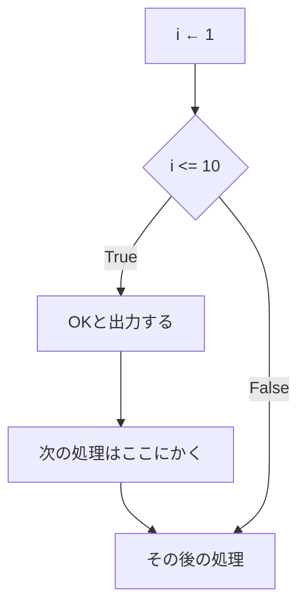
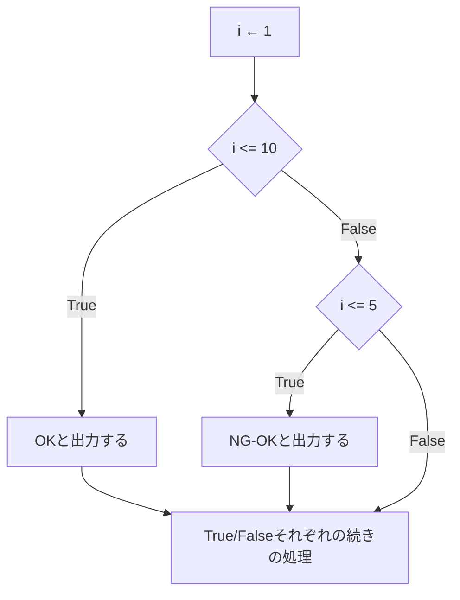
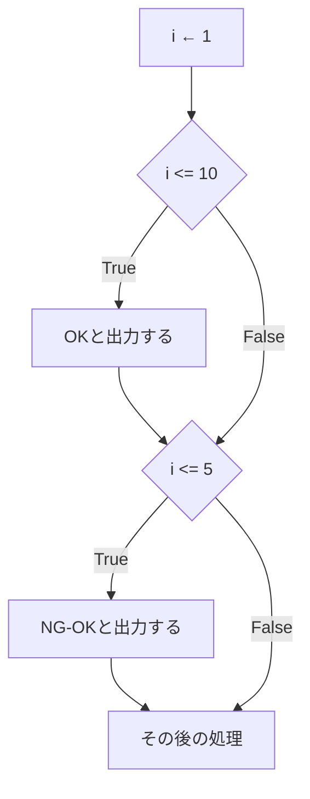
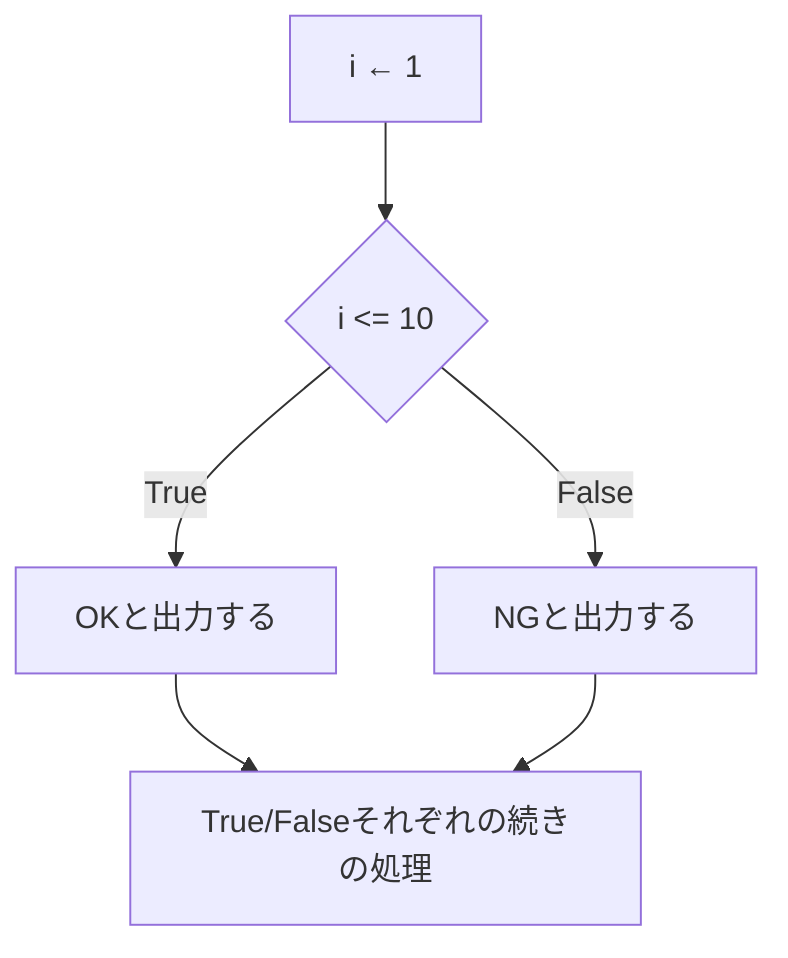
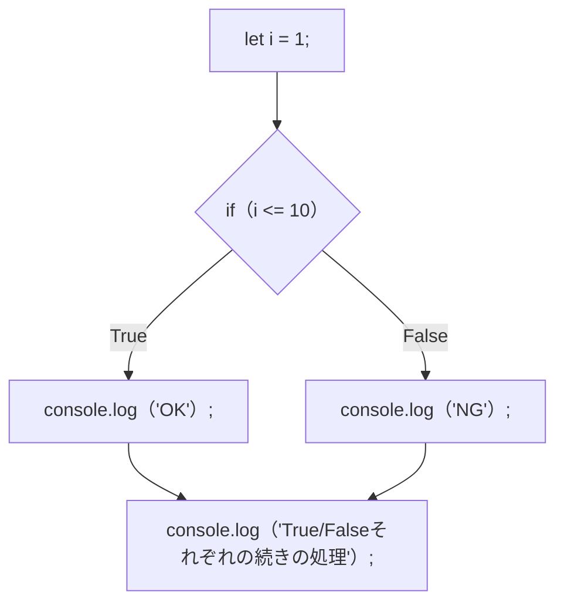

:::note
私が教材として作る際は、以下内容は必ず網羅してますよ、という話です。要するに宣伝ですが、役に立つ話なので公開します。
:::

一気に見ると大変なので、学習状況によって一つずつ見てくださいね。
一気見すると一瞬ですが、きちんと学習しようとすると、半日＋半日以上かかるつもりで読み進めてください。

## 目次[^目次]
- 条件分岐編（ここ）
- [繰り返し処理編](https://qiita.com/nomurasan/private/871f4be9410451dd9143)
- [配列・連想配列・オブジェクト編](https://qiita.com/nomurasan/private/ec01ba58ba295a4fa80f)

[^目次]: 【目次いる？】Qiitaに慣れていると右側を見ますが、想定読者は非Qiita民のため設置してます。

### if文を理解する前に、フローチャートの話からする
まずは分からないなりにコードを見てみます。
ここでは、アルゴリズム学習でよく採用するJavaScriptを例にしましたが、言語知識は不問です。

```js
let i = 1
if(i <= 10){
  console.log('OK');
  console.log('次の処理はここにかく');
}
console.log('その後の処理');
```

これを、フローチャートにします。



- ifが菱形
- ifのカッコ内｛｝に書いた処理だけやる。ここでは2つの処理を書いている
  - その後の処理も実行する
- ifの菱形の条件を満たさない場合は、その後の処理だけやる

### if-else文
説明のコツは「if文とif-else文は似ている別の処理」と指導する事です。
そうしておくと、if-elseif文のバイアスが消せます。
なお、先にif-elseifを教えてから、if-elseを教える方法も有効ですが、教材によってはそうなっていないかも。

:::note warn
個人的には「if」と「else-if」が仲間で、これらに当たらない条件全てをelseと考えてもらう方が教えやすいと思っていますが、賛否あります。
:::

```js
let i = 1
if(i <= 10){
  console.log('OK');
} else if(i <= 5)
  console.log('NG-OK');
}
console.log('その後の処理');
```



このように処理が実行されます。
この時、変数iにどのような数値を入れればNG-OKになるでしょうか？

<details>
<summary>答え</summary>

---

:::note
答えは「ない」です。
ぱっと見、`i <= 5`が見えるので、5以下を入れたくなりますが、先に`i <= 10`の条件に当たってしまいます。
そして、`i <= 10`の条件に当たらないケースは、iが10より大きいため、絶対に`i <= 5`の条件はFalseになります。
:::

このように、フローチャートを使えばこのようなミスも図を見ながら流れを追いやすくなりますので、プログラミングに慣れないうちはフローチャートを書く・読む癖をつけると良いでしょう。

---

</details>

なお、else-ifは省略できます。先ほどのコードでもエラーにならずに動いていましたね？

### else-if文からelseを外すとどうなるか？
```js
let i = 1
if(i <= 10){
  console.log('OK');
}

// else if文からelseを外してみる
if(i <= 5)
  console.log('NG-OK');
}
console.log('その後の処理');
```



NG-OKの意味が変わってしまいましたね。
このように書き直すと、`i = 1`の場合はOKとNG-OKが出力されます。
`i = 7`であれば、OKのみが出力されます。

:::note warn
「if-elseif文」のelseif文からelseを取ると、全く意味の違う図になります。
:::

### if-else文





```js
let i = 1;
if(i <= 10) {
  console.log('OK');
} else {
  console.log('NG');
}

console.log('Yes/Noそれぞれの続きの処理');
```

:::note
最初のif文と見比べてみると良いでしょう。
:::

## 次の章へ
- 条件分岐編（ここ）
- [繰り返し処理編](https://qiita.com/nomurasan/private/871f4be9410451dd9143)
- [配列・連想配列・オブジェクト編](https://qiita.com/nomurasan/private/ec01ba58ba295a4fa80f)

### 注釈
