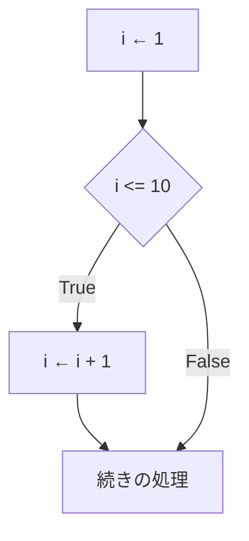
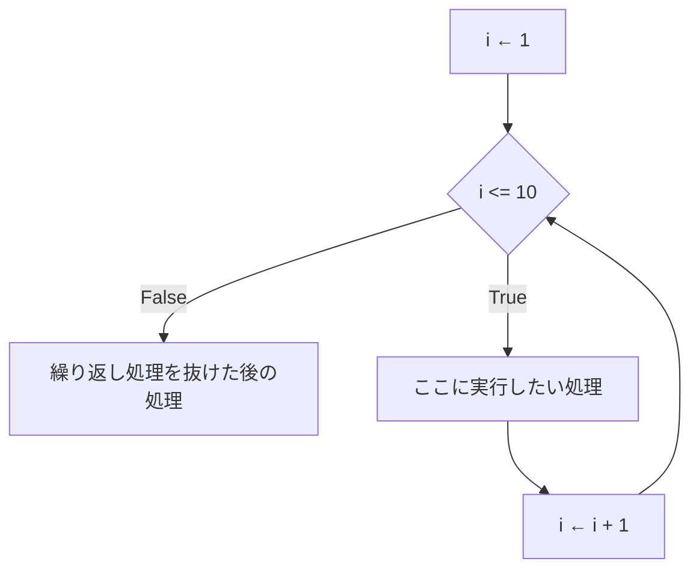
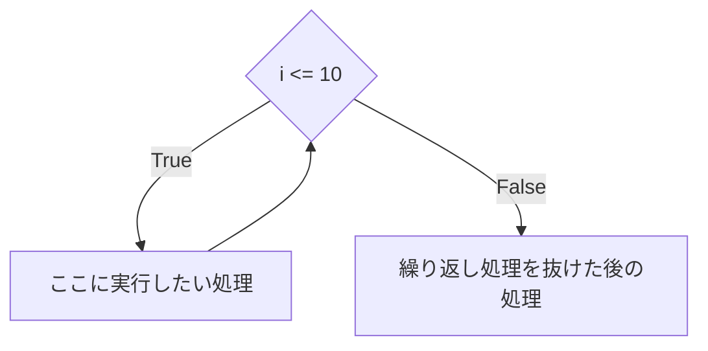
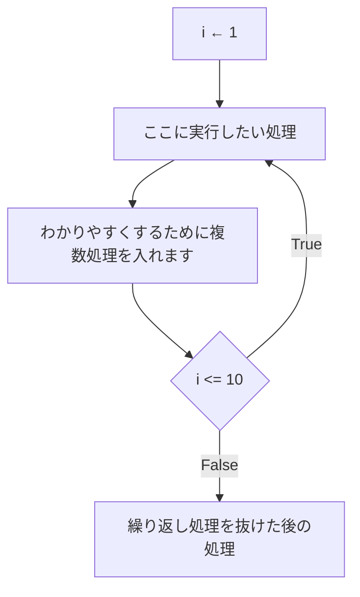

:::note
私が教材として作る際は、以下内容は必ず網羅してますよ、という話です。要するに宣伝ですが、役に立つ話なので公開します。
:::

一気に見ると大変なので、学習状況によって一つずつ見てくださいね。
一気見すると一瞬ですが、きちんと学習しようとすると、半日＋半日以上かかるつもりで読み進めてください。

## 目次
- [条件分岐編](https://qiita.com/nomurasan/private/4a40feb042bbb71cb650)
- 繰り返し処理編（ここ）
- [配列・連想配列・オブジェクト編](https://qiita.com/nomurasan/private/ec01ba58ba295a4fa80f)

### for文を理解する前に、コードを分解してからフローチャートをみよう
```js
for(i = 1; i <= 10; i++) {
  // ここに繰り返し実行したい処理
}
```

これを理解するためには、まず

```js
i = 1
if(i <= 10){
  // ここに実行したい処理
}
i++(i = i + 1)
```

をそれぞれに理解する必要があります。
分解したコードをフローチャートで書くと



となります。
これをfor文にすると



このように変わります。
（mermaidで綺麗に描けなかったので、ちょっと良くない図になってしまいました）

本質的にはif文のフローチャートの流れで、Trueの時にもう一度処理を繰り返すのだ、と理解すればわかりやすいです。

:::note alert
条件や実行処理を間違えると無限ループになる危険性があります。
:::

:::note warn
無限ループになるとシステムが止まったり落ちたりしてしまいますので、繰り返し条件は確実に満たすようにしましょう。
:::

:::note
繰り返し条件は「繰り返し処理をやめる条件」という考え方もできます。
:::

## while文とは？
for文と比較すると、

- 初期化がない
- 繰り返し処理が終了した時に毎度実施する処理がない

というのが大きな変化です。



これを念頭に置いて、コードをみます

```js
while(i <= 10) {
  // ここに実行したい処理
}
// 繰り返し処理を抜けた後の処理
```

`let i = 1;`と、`i = i + 1;`がありませんね。
そのため、for文の構造や思想を理解してから、あえてforを使わないという選択肢が持てるようになって初めて使えるものだと認識しましょう。

### do-while
```js
let i = 1;  // 繰り返しをわかりやすくするため、敢えて書きます
do {
  // ここに実行したい処理1
  // わかりやすくするために複数処理を入れます
} while(i <= 10)
```



先ほどのwhile文との違い、繰り返し処理を１回実行してから判定をしています。
do-whileとwhileの違いで比較しやすいですが、for文とdo-whileで比較できるのが理想です。

:::note
専門用語っぽく言うと、
- 前置判定: 条件分岐を「先」に書いて繰り返し処理を実施
- 後置判定: 条件分岐を「後」に書いて繰り返し処理を実施
という違いです
:::

どちらが良いのか？という表現ができるうちはforを使った方がいいです。
forで解決できないものをdo-whileで解決しましょう。

## 次の章へ
- [条件分岐編](https://qiita.com/nomurasan/private/4a40feb042bbb71cb650)
- 繰り返し処理編（ここ）
- [配列・連想配列・オブジェクト編](https://qiita.com/nomurasan/private/ec01ba58ba295a4fa80f)
