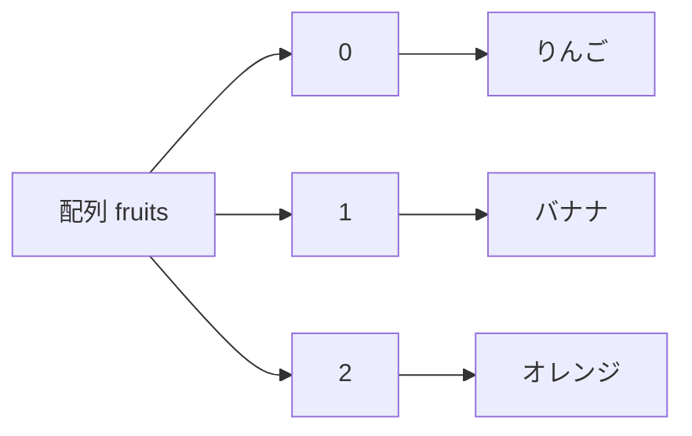
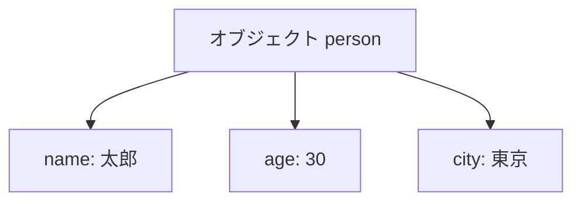
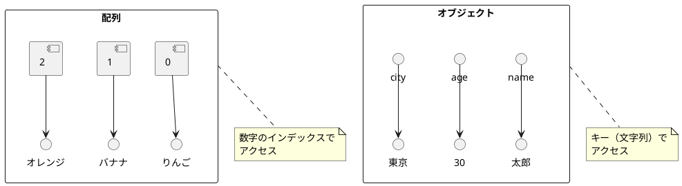
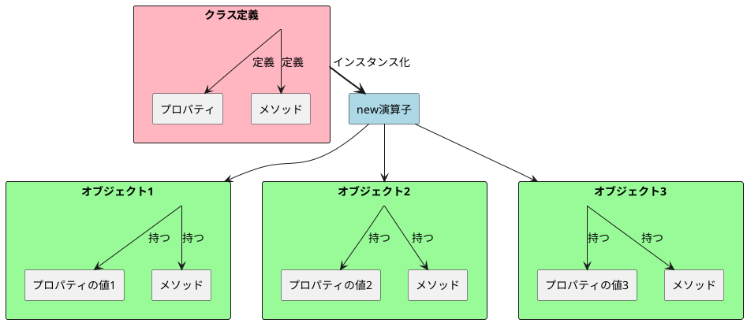
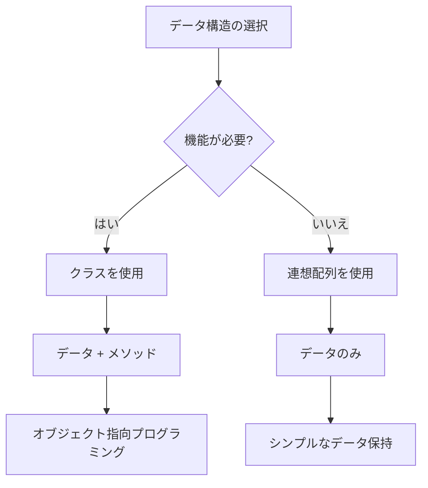
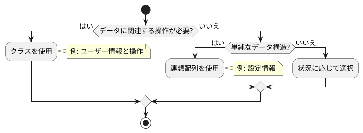

:::note
私が教材として作る際は、以下内容は必ず網羅してますよ、という話です。要するに宣伝ですが、役に立つ話なので公開します。
:::

一気に見ると大変なので、学習状況によって一つずつ見てくださいね。
一気見すると一瞬ですが、きちんと学習しようとすると、半日＋半日以上かかるつもりで読み進めてください。

## 目次
- [条件分岐編](https://qiita.com/nomurasan/private/4a40feb042bbb71cb650)
- [繰り返し処理編](https://qiita.com/nomurasan/private/871f4be9410451dd9143)
- 配列・連想配列・クラスーオブジェクト編（ここ）

## 本題１：配列と連想配列
### 配列
複数の値を **順序付けて** 格納するためのデータ構造です。

- **インデックス（添字）** を使って要素を取り出します
- インデックスは0から始まります
- 要素の順序が保持されます

```js
let fruits = ["りんご", "バナナ", "オレンジ"];
console.log(fruits[0]); // "りんご"
console.log(fruits[1]); // "バナナ"
```



### 連想配列
キーと値のペアを使ってデータを格納する構造です。

- **キー** を使って値にアクセスします
- キーは文字列（または Symbol）です
- **要素の順序は保証されません**

```js
let person = {
    name: "太郎",
    age: 30,
    city: "東京"
};
console.log(person.name); // "太郎"
console.log(person["age"]); // 30
```



:::note alert
表記の都合で上から順番に書きましたが、それぞれのキー（name, age, city）には順番の概念はありません。
:::

ポイントをまとめます。



## 本題2：連想配列とクラスーオブジェクト
### クラス（独自オブジェクト）
:::note warn
キーワードは「再利用性」です。
後ほど出てきますが、まずはここを意識しましょう。
:::

連想配列の特徴を「クラスーオブジェクトとの比較」に注目して見直します。

- キーを使って値にアクセスします
- データの保持が主な目的です
- メソッド（=function。関数）は通常含みません
  - やれなくはない、という意味であり、通常の用途としては考えません

```js
let taro = {
    name: "太郎",
    age: 30,
    city: "東京"
};
console.log(taro.name); // "太郎"
console.log(taro["age"]); // 30
```

では、本題。
クラスは、データ（プロパティ）とそれを操作するメソッド（関数）をまとめたものです。

:::note warn
※連想配列との対比にしたいので、ここではメソッドを除外しています。
:::

```js
// クラスの定義。データは入っていないのでまだ使えない
class Person {
    constructor(name, age, city) {
        this.name = name;
        this.age = age;
        this.city = city;
    }
}

// 重要なポイント！「class Person」にデータを入れて使えるようにしています（＝インスタンス化）
let taro = new Person("太郎", 30, "東京");
console.log(taro.name); // "太郎"
console.log(taro["age"]); // 30
```

### 重要ポイント：クラスを使って再利用性を高める
:::note
【重要キーワード】インスタンス化
:::

コメント内の「重要なポイント！」がめっちゃくちゃ重要です。
class Person自体には特定のデータがないので、`new Person(name="太郎", age=30, city="東京")`としてデータを格納しています。
その結果を`let taro`で受け取りました。

これにより、以下のような事ができます。
繰り返しになりますが「再利用性」がキーワードです。

```js
// classは一度作るだけでよく、インスタンス化だけする
let jiro = new Person("次郎", 35, "大阪");
console.log(jiro.name); // "次郎"
console.log(jiro["age"]); // 35

// 先ほど作った太郎さんのデータは変更されない
console.log(taro.name); // "太郎"
console.log(taro["age"]); // 30
```

では、これを連想配列で書き直してみます。

```js
let jiro = {
    name: "次郎",
    age: 35,
    city: "大阪"
};
```

これで同じ事（＝やりたい事）はできます。
が、連想配列で作った`taro`と`jiro`が必ずname, age, cityを持っていることを**誰も担保してくれません**。
対して、`new Person`で作成したオブジェクトは必ずname, age, cityを持っていることをclassが保証してくれます。

### 補足（という名の、もう一つの重要要素）：メソッド
- クラスの定義
- インスタンス化したオブジェクト

の関係をもう一度確認しておきましょう。



ここまでは連想配列との比較に注目したので、プロパティの話だけをしました。
が、クラス・オブジェクトの強みはメソッドを持たせられる事にあります。
先ほども言及した通り、クラスをnewしてインスタンス化したオブジェクトは全て同じ構造になることが担保されているため、当然メソッドも持ちます。

以下のサンプルコードで動作を確認してみましょう。
クラスもちょっとだけいじります。具体的には、メソッドを追加しました。

```js
class Person {
    constructor(name, age, city) {
        this.name = name;
        this.age = age;
        this.city = city;
    }

    // メソッドを追加
    hello() {
        console.log("私の名前は " + this.name + " です。");
    }
}

let taro = new Person("太郎", 30, "東京");
taro.hello();  // 私の名前は 太郎 です。

let jiro = new Person("次郎", 35, "大阪");
taro.hello();  // 私の名前は 次郎 です。
```

太郎さんがhelloと言うのと、次郎さんがhelloと言うのとで結果が異なりますね。
どちらもhelloと言えるよ！というのがクラスを使う事のメリットです。

### 総まとめ：連想配列とクラスの使い分け
ここまでの内容をふまえて、あらためて考えていきましょう。





ここまでです。読了お疲れ様でした。

## 次の章へ
- [条件分岐編](https://qiita.com/nomurasan/private/4a40feb042bbb71cb650)
- [繰り返し処理編](https://qiita.com/nomurasan/private/871f4be9410451dd9143)
- 配列・連想配列・クラスーオブジェクト編（ここ）

## おねがい
<details>
<summary>【閲覧注意】分かっている方はコメントの前にご一読ください。</summary>

本稿は初学者を対象としており、本稿に限っては分かっている方からの内容のご指摘は基本的にお断りするスタンスでいます。

:::note warn
理解度優先のため、内容は厳密に言うと正しくありません。
特にclass部分は「我ながら間違っていることを書いているな」と思ってます。
そのため、本稿への補足をいただける際は「筆者への意見ではなく、閲覧者＝初学者があなたのコメントを読んで理解できる内容になっているか」という基準でのご投稿をお願いします。
:::

:::note alert
本稿でのコメント欄での議論は禁止です。
発覚次第、投稿を削除する（依頼を含む）する事があります。
:::

:::note alert
議論を呼びかねない記事からのリンクをお断りします。
:::

:::note
初学者はこのような表現の方がわかりやすいのでは？と思ったご意見などは編集リクエストからお願いします。
:::

</details>
