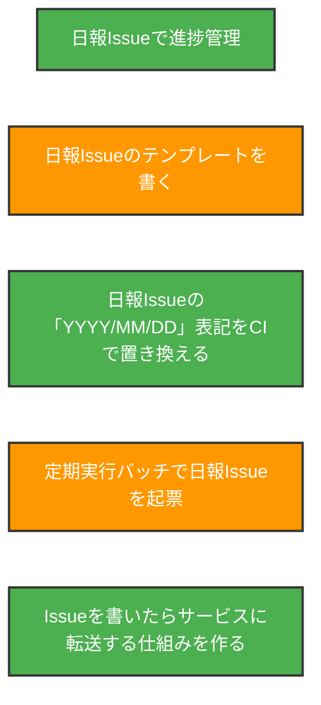
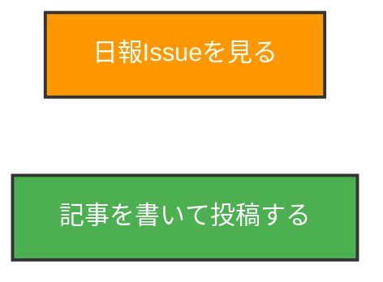
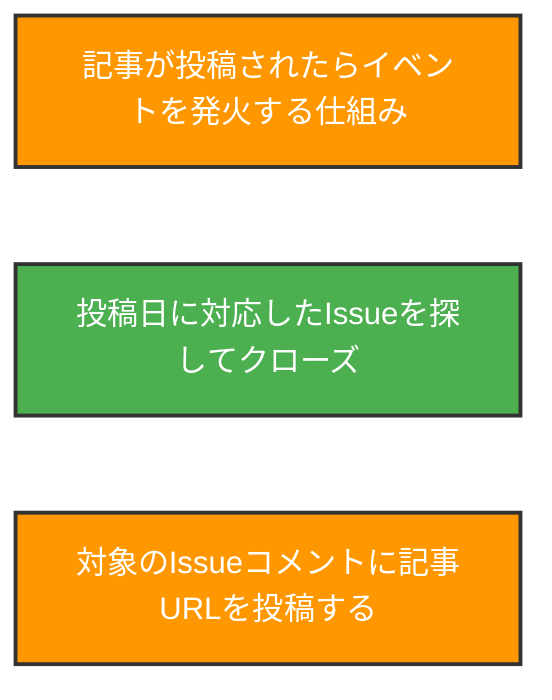

:::note warn
他記事と重複する部分があるが、本稿の目的はQiitaのシステムをうまく攻略していく方法をGitHubを駆使しながら考えていくものである。
:::

「最大の敵はウッカリ忘れてしまう」こと。
このウッカリは繰り返すと習慣化してしまい、いつしかやらなくなっていく。

:::note
アウトプットの質と量を高めた結果、ついでにもらえるもの
:::

これが重要なポイントなのかもしれない。

## Issueの書き方と運用を検討する前に、課題分析
### ウッカリ忘れないためにやること
まず、前提としてお使いのカレンダーツールに毎週・毎月必ず「Qiitaに投稿する」が入っている状態にしておく。
ただし、Qiitaに投稿するというスケジュール・タスクを入れるだけでは「今から記事の内容を考えて書かなきゃ」という状態になるため、目覚ましと同じぐらいの感覚でネタ出しをしよう。

### イベントレポートを書こう
実はかなりおすすめの方法がこれ。
イベントに参加することで記事は何かしら書けるし、勉強会なら学んだ事をメモしているはず。
特にハンズオンはスクリーンショットが簡単に用意できるので、後から操作を振り返る仕組みになるので学びの質も高まる。
少なくとも、Weeklyならこれで解決できる。

アドカレの場合は事前にネタをストックしておかないと毎日勉強会に参加して学びを得て、レポートを書いて…は大変すぎる。

### プロジェクトが炎上した時に備える
習慣化ができた頃にやってくる障害といえば、プロジェクトが炎上して執筆に手が回らなくなる頃だろう。
何かをやろうとしたときに、それを咎めるかのように起こってほしくないイベントは発生するものだ。

ここでは分かりやすくプロジェクトの炎上を挙げたが、筆者が最近これに近い状況が起こった事象は「子供の風邪、一家全員罹患、完治に２週間かかった」である。
6~7月にしても12月にしても、体調を崩したときにできていません、では格好がつかない。
（※しかし、体調不良時に記事を書く事を頑張らないでほしい。少しでも体を休めて早い復帰を目指すべきだ）

フリーランスで独立したい人や一人法人を経営されている方にはウェルビーイングだけでなく、健康管理の重要性を説く私だが、他人に偉そうに言っておきながら自分が罹ってしまうものである。

## 【本題】Issueの書き方と運用

### GitHub Projectsのタイムライン機能も活用しよう
基本的には使っているカレンダーに入れておく事で「投稿日の締め切り」を意識する事はできる。
が、先述の通り常に体調や記事の質が万全とは限らないため、投稿日までに準備をしておくことが重要だ。
そこで、Issueにマイルストーンを設定し、Projectsに登録することでタイムライン上でカレンダー相当の振る舞いと、記事自体の設計についてもIssueにメモを書くことができる。
もちろん、メモなしで直接記事を書き上げてもいい。
重要なのは「登校日当日中に記事が仕上がらない可能性を考えておくことと、事前に対応できるなら準備する」という意識ができることだ。

### Issueごとにステータスを管理する（なるべく自動で）
ここまでできれば一つのウェブアプリと言えるな、と設計していて思った。

#### 事前準備

- Issueテンプレート
- GitHub Projects
- GitHub Actions

SlackBotとかLINE Notifyとか。
Googleカレンダーとかも使えるといいよね、GAS連携すると便利

#### 運用中

- Qiita Webエディタ

#### ここまでできればベスト！

- Qiita CLI
  - 書いてないけど、バックアップもできるといいね

## 裏技
どうしてもダメなら、白紙でもいいから途中の状態でも書いて記事を投稿すると、とりあえずバッジがもらえるので、遅れてでも編集してきちんと人の目でOKがもらえる状態を作ってしまう、という方法でいったん間に合わせること自体は可能だろうと思われる。
が、普通に考えればNG要件なのでやむをえない時であり、かつ後日にでもきちんと対応できる・する前提でやるべきだろう。
裏技というだけあって限りなくアウト寄りのグレーな方法である事には違いないので、やらないに越した事はないのは言うまでもない。

実は筆者も予約投稿のつもりで途中状態の記事を間違えて全体公開してしまい、すぐに消すと言う行動を何回かやってしまっている。が、その後適切な対応を行い継続できているので、最後まで諦めずに取り組んで欲しい。
