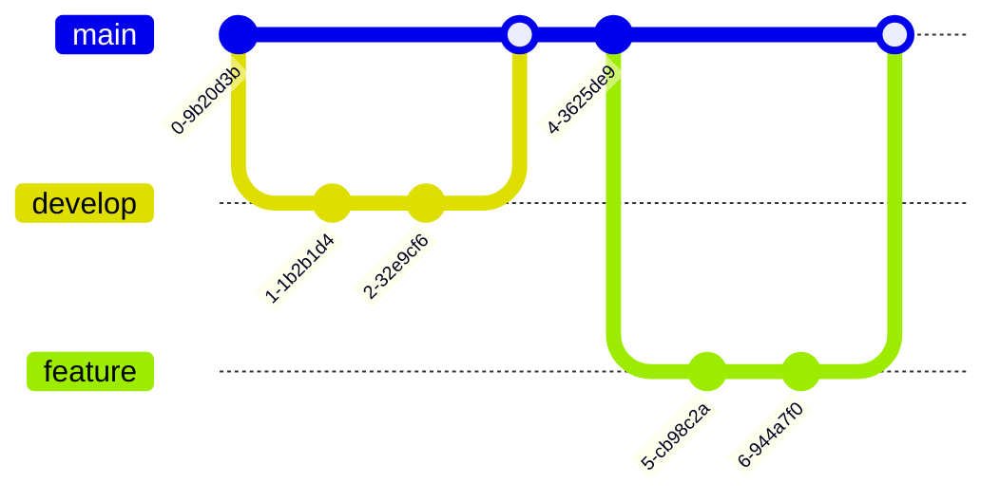

:::note warn
本稿は描画のプレビュー・書き方を一覧化する事を目的にAIを活用しているため、内容に誤りがある。（そして、それを認識している）
Qiitaでも問題なく表示がされる事だけ確認しており、内容の精査・レビューは実施していない
:::

## ✅ フローチャート（graph TD）
<details open>
<summary>【クリック・タップで開閉】</summary>

プレビュー


コード
```
¥```mermaid
graph TD
    A[開始] --> B{条件}
    B -->|はい| C[処理1]
    B -->|いいえ| D[処理2]
    C --> E[終了]
    D --> E
¥```
```

</details>

## ✅ シーケンス図（sequenceDiagram）
<details open>
<summary>【クリック・タップで開閉】</summary>

プレビュー


コード
```
¥```mermaid
sequenceDiagram
    participant A as Alice
    participant B as Bob
    A->>B: こんにちは
    B-->>A: やあ
    A->>B: 元気?
    B-->>A: 元気だよ!
¥```
```

</details>

## ✅ クラス図（classDiagram）
<details open>
<summary>【クリック・タップで開閉】</summary>

プレビュー


コード
```
¥```mermaid
classDiagram
    class Animal {
        +name: string
        +age: int
        +makeSound(): void
    }
    class Dog {
        +breed: string
        +bark(): void
    }
    Animal <|-- Dog
¥```
```

</details>

## ✅ ガントチャート（gantt）
<details open>
<summary>【クリック・タップで開閉】</summary>

プレビュー


コード
```
¥```mermaid
gantt
    title プロジェクトスケジュール
    dateFormat  YYYY-MM-DD
    section 計画
    タスク1           :a1, 2023-01-01, 30d
    タスク2           :after a1  , 20d
    section 実行
    タスク3           :2023-02-01  , 35d
    タスク4           :2023-03-01  , 20d
¥```
```

</details>

## ✅ 状態図（stateDiagram-v2）
<details open>
<summary>【クリック・タップで開閉】</summary>

プレビュー


コード
```
¥```mermaid
stateDiagram-v2
    [*] --> 待機中
    待機中 --> 処理中: 開始
    処理中 --> 完了: 終了
    処理中 --> エラー: 問題発生
    エラー --> 待機中: リセット
    完了 --> [*]
¥```
```

</details>

## ✅ ER図（erDiagram）
<details open>
<summary>【クリック・タップで開閉】</summary>

プレビュー


コード
```
¥```mermaid
erDiagram
    "Customer(顧客)" ||--o{ "Order(注文)" : places
    "Order(注文)" ||--|{ "Product(商品)" : contains
    "Customer(顧客)" {
        int id "ID/顧客番号"
        string name "名前/氏名"
        string email "Email/メールアドレス"
    }
    "Order(注文)" {
        int id "ID/注文番号"
        date order_date "注文日/購入日"
    }
    "Product(商品)" {
        int id "ID/商品番号"
        string name "名前/商品名"
        float price "価格/販売価格"
    }
¥```
```

</details>

## ✅ パイチャート（pie）
<details open>
<summary>【クリック・タップで開閉】</summary>

プレビュー


コード
```
¥```mermaid
pie title 売上比率
    "製品A" : 30
    "製品B" : 50
    "製品C" : 20
¥```
```

</details>

## ✅ ジャーニー図（journey）
<details open>
<summary>【クリック・タップで開閉】</summary>

プレビュー


コード
```
¥```mermaid
journey
    title ユーザーの購買体験
    section 商品探索
      ウェブサイト訪問: 5: ユーザー
      商品検索: 3: ユーザー
      商品詳細確認: 4: ユーザー
    section 購入
      カートに追加: 5: ユーザー
      チェックアウト: 3: ユーザー, システム
      支払い: 4: ユーザー, システム
    section フォローアップ
      注文確認メール: 5: システム
      商品配送: 4: システム
¥```
```

</details>

## ✅ Gitグラフ（gitGraph）

<details open>
<summary>【クリック・タップで開閉】</summary>

プレビュー


コード
```
¥```mermaid
gitGraph
    commit
    branch develop
    checkout develop
    commit
    commit
    checkout main
    merge develop
    commit
    branch feature
    checkout feature
    commit
    commit
    checkout main
    merge feature
¥```
```

</details>

## ❌ 要件図（requirementDiagram）

<details>
<summary>【クリック・タップで開閉】</summary>

プレビュー
```mermaid
requirementDiagram
    requirement 高性能 {
        id: 1
        text: システムは高性能である必要がある
        risk: high
        verifymethod: test
    }
    functionalRequirement 高速処理 {
        id: 1.1
        text: システムは1秒以内に応答する必要がある
    }
    performanceRequirement 大容量処理 {
        id: 1.2
        text: システムは1時間に100万件のトランザクションを処理できる必要がある
    }
    高速処理 - 高性能
    大容量処理 - 高性能
```

コード
```
¥```mermaid
requirementDiagram
    requirement 高性能 {
        id: 1
        text: システムは高性能である必要がある
        risk: high
        verifymethod: test
    }
    functionalRequirement 高速処理 {
        id: 1.1
        text: システムは1秒以内に応答する必要がある
    }
    performanceRequirement 大容量処理 {
        id: 1.2
        text: システムは1時間に100万件のトランザクションを処理できる必要がある
    }
    高速処理 - 高性能
    大容量処理 - 高性能
¥```
```

</details>

## テンプレート
```
## ✅❌ 図（接頭語）

<details open>
<summary>【クリック・タップで開閉】</summary>

プレビュー
¥```mermaid

¥```

コード
¥```
¥¥```mermaid
¥¥```
¥```

</details>
```

## 余談
<details>
<summary>発端とか書く時の心構え的な話</summary>

### 発端
せっかくなのでアドベントカレンダー向けにやってみよう！という計画でしたので、タグも残しました。
実際に書いてみた記事が以下（諸事情のため検索避け目的で限定公開にしていますが、SNSなどでの共有はOKです。）

https://qiita.com/nomurasan/private/4a40feb042bbb71cb650

https://qiita.com/nomurasan/private/871f4be9410451dd9143

mermaidの図は見やすさの点で疑問だったので、plantUMLを書いてみる

https://qiita.com/nomurasan/private/ec01ba58ba295a4fa80f

肝心のアドベントカレンダーはこちら

https://qiita.com/advent-calendar/2024/nomuraya_oreno

### 書き方（心構え）
いつものコードブロックに`mermaid`とか`plantuml`を入れて、それぞれの記法に対応する形で書くだけです。

```
¥```mermaid or plantuml
（ここにそれぞれの書き方に対応するもの）
¥```
```

よく考えたらどちらにしても、AIに描かせられる事に気づいたので、私がやることはどんなイメージ図を描きたいのか、ペイントツールか何かで叩き台を用意してあげるだけです
あるいは、賢いAIを使っているならプロンプトをうまくいじって期待通りの絵（markdownテキスト）を書かせる事ができますし、ちょっとcssが必要な場面があれば、それも丸投げできます。
ただし、後から仕様変更が入ってくると大変なので、カスタマイズのしすぎも良い案とは言いにくいところはあります。

### 所感
Qiitaの仕様の話ですが、plantumlの方が見やすい印象はありつつ、書くならmermaidの方が分かりやすい（人もいるだろうな）ので、mermaidで書いてplantumlにしてもらうという翻訳的な使い方がいいのかもしれない。これは検証してみて報告したいですね。

とはいえ、mermaidでできることとplantumlでできる事は違うよ！というのは認識しておくべきですね。
このチートシートが未来の自分の役に立つことを願って。

</details>
