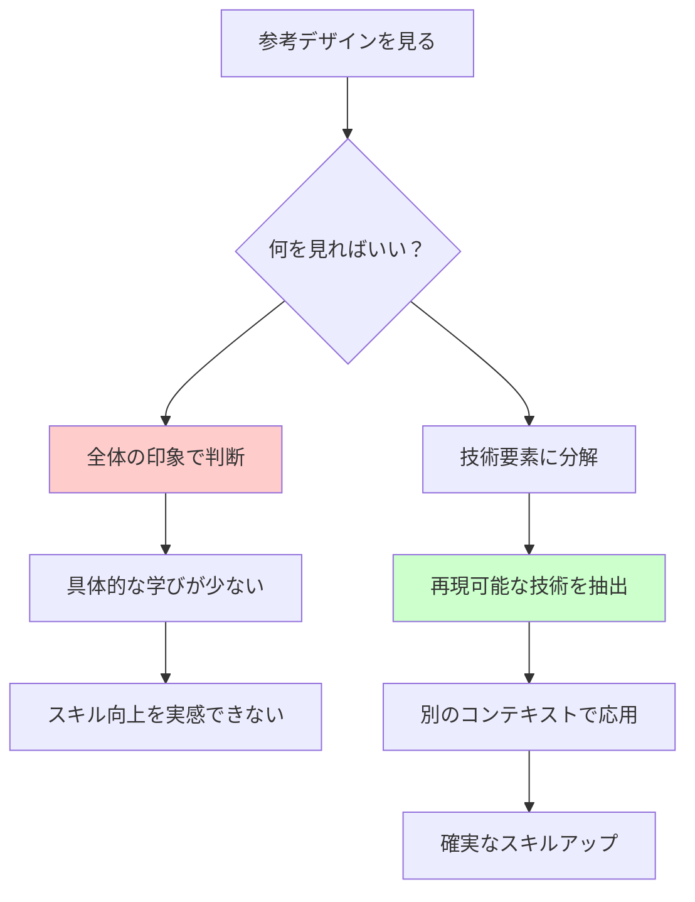

:::note warn
デザインはとてもプロとは言えないため、ガッツリとAIにプロとしてしっかり監修を入れていただいている。
が、どちらも実務経験は浅いか未経験？である事に留意されたい。
:::

## TL;DR
:::note
デザインは「センス」ではなく「技術」。エンジニアがプログラミングを学ぶのと同じ方法で習得できる。

**デザインスキル = 分解・分析力 + 視覚的操作技術 + 再構築・応用力 + 技術の蓄積・体系化**
:::

## エンジニアから見たデザイン指導の課題

フルスタックWebアプリエンジニアとして、サーバーサイドからフロントエンドまで手がけてきた。デザインについては「実装はできるが理論は分からない」状態だったが、デザインコースの講師というチャンスがあったのでつかみに行った。今も猛勉強中だが、教える技術は一定にもってはいるので技術的な話は困らなさそうだ、という所感である。知識＝座学がこわい。

そんな中、受講生から「基礎は学んだが、参考サイトを見ても具体的にどの部分をどう学べば良いか分からない」という相談を受けた時、自分も過去に同じ疑問を持ったことを思い出した。「良いデザインを見て学べ」というアドバイスを受けても、「真似ても結局よく分からなかったから相談しているんだ」と思った経験がある。

これがエンジニアリングなら技術的に説明できるのに、デザインになると感覚論になってしまう。これはきちんと体系化して答える必要がある。

## 受講生の相談を分解してみた

この相談の本質を理解したい。エンジニア的に要件を整理すると：

- **表面的な相談**: 「デザインの勉強方法を教えて」
- **本質的な課題**: 「参考デザインから学ぶ方法が分からない」

受講生は既に学習行動を取っているが、効果的な学習ができていない。これは「学習方法」の問題だ。



プログラミング学習で例えるなら：
- 悪い真似：他人のコードをコピペするだけ
- 良い真似：なぜそのアルゴリズムを選んだのか、どの部分が再利用可能なパターンなのかを理解する

**デザインでも同じはず。**

## そもそも「デザインスキル」とは何なのか？

:::note warn
これは本職の方にきちんと定義を聞いて、自分でも考えて腹落ちさせるフェーズを入れた方が良いかもしれないが、簡単のためこのようにさせていただく。
:::

まず「デザインスキル」を定義する必要がある。

私が考える「スキル」とは：
- 再現可能であること
- 論理的に説明できること  
- 応用・転用が利くこと
- 段階的に向上させられること

### デザインスキルを整理してみた（門外漢なりに）

受講生との対話を通して、「デザインスキル」を4つに分類できそうだと感じた。完全ではないが、学習の手がかりとしては使えそうだ。

:::note
ここでは、コミュニケーションやマーケティングなど他の要素を絡めたケースバイケースの例（あえて言えば総合力）はなるべく除外し、純粋にデザインスキルに注目しようとしている。
:::

#### 1. **分解・分析力**
既存デザインを技術要素に分けて理解できる力

**例:** 
- 低レベル：「このサイトオシャレだな」で終わる
- 高レベル：「左上→中央→右下のZ字視線誘導。補色でCTAに注意を向けている。タイポグラフィは3階層で情報の重要度を表現」

#### 2. **視覚的操作技術**
人間の視覚特性を理解し、意図的にコントロールできる力

**例:**
- 低レベル：「重要だから赤にしよう」
- 高レベル：「周囲との明度差を最大化し、補色関係を利用して視線を誘導。面積比30%で十分な注意時間を確保」

#### 3. **再構築・応用力**
学んだ技術パターンを、異なるコンテキストで応用できる力

**例:**
- 低レベル：気に入ったデザインをそのまま模倣するが、内容が変わると手が止まる
- 高レベル：「3分割グリッド+対角線レイアウト」の技術を抽出し、全く違うジャンルに適用

#### 4. **技術の蓄積・体系化**
学習した技術をパターン化し、再利用可能な形で保存・活用できる力

```javascript
// エンジニアならこんな感じで技術をライブラリ化したくなる
const designPatterns = {
  layout: {
    zPattern: { 
      usage: "横長コンテンツ", 
      effect: "安定感",
      eyeFlow: "左上→右上→左下→右下" 
    },
    fPattern: { 
      usage: "縦長リスト", 
      effect: "効率的スキャン",
      eyeFlow: "上から下へのスキャン" 
    }
  },
  hierarchy: {
    scale: { 
      ratio: "1.618(黄金比)", 
      levels: 3,
      example: "48px/32px/16px" 
    },
    contrast: { 
      minRatio: "4.5:1", 
      purpose: "accessibility",
      tool: "WebAIM Contrast Checker"
    }
  },
  color: {
    complementary: {
      usage: "注意喚起・CTA",
      example: "青(#1E40AF) + オレンジ(#FB923C)"
    },
    analogous: {
      usage: "統一感・調和",
      example: "青系のグラデーション"
    }
  }
};
```

## 受講生の「真似してるのに上達しない」問題を分析

この4分類から、受講生の問題を構造化してみた。

### 問題の構造化

```
「参考サイトから学べない」問題
├── 何を見るべきかわからない
│   ├── 全体印象でしか捉えられない
│   └── 技術要素に分解できない
├── どう抽出すればいいかわからない  
│   ├── 再現可能な形で抽象化できない
│   └── 応用方法が見えない
└── どう蓄積すればいいかわからない
    ├── 学んだことを体系化できない
    └── 次回に活用できない
```

### 仮説の設定

この構造分析から仮説を立てた：

**「受講生の問題は、主に1番目の『分解・分析力』が不足しているからではないか？」**

根拠：
- 「参考サイトを見ても具体的にどの部分をどう学べば良いか分からない」
- つまり、デザインを技術要素に分解する視点がない

### 検証方法の設計

仮説を検証するため、以下のアプローチを取った：

1. **技術要素での分析方法を教える**
2. **Before/Afterで変化を観察する**  
3. **結果を評価して仮説を検証する**

## 仮説検証：実際のアドバイスと結果

### 検証方法1：技術要素での分析方法を教える

「参考サイトを見るとき、まず『自分の目がどの順番で情報を読んだか』を意識してみてください。

多分、大きい文字→メイン画像→ボタン、みたいな順番で目が動いてるはずです。ユーザーの視線をデザインでひきつけます。

次に『なぜその順番で目が動いたのか』を考える。文字が大きいから？色が目立つから？位置的に目に入るから？

そして最後に、同じ『目の動き』になるように、全然違う内容で作ってみる。同じサイズ比率、同じ配置パターンで。

これで『なんとなく真似』から『技術を真似』に変わります」

**追加アドバイス：**
自分はユーザーでもあり、デザイナーでもある。ユーザーの行動に「なぜ？」を考えて、その上で自分がそのサイトのデザインが好きな点を洗い出してみましょう。

とはいえ『自分ならこうするのに」と思う部分もあるはずで、なぜそう感じるのかも分析しましょう。理論的に正しいかどうかは後で考えて良いです。

ただし、個人の好みの要素もあることを忘れずに。

### 検証結果

**Before（従来のアドバイス）:**
「良いデザインを見て学べ」「たくさん作れば上手くなる」「センスを磨け」

過去にやっていたかもしれない。改めて反省中。

**After（技術的に具体化したアドバイス）:**
「このバナーの『視線誘導の仕組み』を分析してみて。左上→中央→右下のZ字の流れは、『大きさ』と『色の対比』と『配置』の3つの技術を組み合わせて作られている。あなたも同じ3つの技術を使って、違う内容で作ってみて」

**So What?（だから何？）:**
実際に受講生とやり取りしていて分かったのは、**「真似する対象」が曖昧だった**ということ。技術要素を明示することで、学習の焦点が明確になった。

## エンジニア的思考をデザインに適用してみた結果

### 参考サイトを見る視点の変化

```diff
# 参考サイトを見た時の反応
- 「このサイトオシャレだな」で終わる
+ 「左上→中央→右下のZ字誘導、補色でCTA強調、3段階の文字サイズ」

# 真似する時の行動
- 見た目をそのままコピーしようとする
+ 「Z字誘導の技術」を抽出して別コンテンツに適用

# 学習の蓄積方法
- 「良いデザイン集」をただ保存
+ 「この技術はどんな効果を生むか」を言語化してパターン化

# 応用する時の考え方
- 新しい案件で毎回ゼロから考える
+ 「この課題には○○パターンが使えそう」と技術ライブラリから選択
```

まずはしっかりと理論をおさえて、その理論をベースに真似をしてみよう。一括コピペでは気付きにくいので、コンポーネント単位でhtml/cssを抜き出してみて考えよう。

### 技術負債ならぬ「デザイン負債」の概念

過去の作品で「なんとなく作った部分」を見つけて、技術的根拠で作り直す。

#### デザイン負債とは:

:::note
「デザイン負債」は本稿での造語である。と思っていたのだが使っている人がチラホラいたので、本稿における定義を記す。
:::

- 「なんとなく青にした」「適当に配置した」など、根拠のない制作判断
- 時間が経つと「なぜそうしたのか」を自分でも説明できない状態

#### 負債が蓄積するとどうなるか:

- 同じような案件でも毎回ゼロから考え直す羽目になる
- 過去の成功を再現できない
- クライアントに修正理由を説明できない

#### 返済方法:

```javascript
// 3ヶ月前に作ったLP を見返す
const oldDesign = {
  color: "なんとなく青っぽい色",  // ← 負債
  reason: "?"
};

// 技術的根拠で再定義
const refactoredDesign = {
  color: "#1E40AF", 
  reason: "信頼感を演出するため青をベース。CTA部分は補色のオレンジ(#FB923C)で視線誘導"
};
```

## まとめ

デザイン講師という未知の領域に入って、ロジカルシンキングでアプローチしてみた結果、いくつかのことが分かった。

### 検証結果の総括

**仮説：** 「受講生の問題は分解・分析力の不足」
**結果：** 仮説は一定程度正しそう

- 技術要素を明示したアドバイスで、受講生は納得感を持って学習に取り組むようになった
- 「なんとなく」から「技術的根拠」での制作に変化が見られた

### より大きな発見

デザインもプログラミングと同じ「技術の蓄積と応用」だ。感覚論で片付けられがちだが、再現可能な原理・原則が存在する。エンジニアの思考パターンがそのまま使える。もしかしたら使えないものもあるかもしれないが、きっかけとしてエンジニア思考でデザインを見つめるのはアリだと思った。

受講生の「参考サイトを見ても学べない」という悩みも、「技術要素の抽出方法を知らない」だけだったのではないか？

### 今後の展開

この検証は小さなサンプルサイズでの結果なので、より多くの受講生と接して良い指導を見極めたい。
また、4つの分類についても、専門家の意見を聞きながらブラッシュアップしたいところだ。デザイナーのセミナーに参加してディスカッションできればうれしい。

**門外漢でも、AIの助けを借りながらロジカルに考えれば専門分野でもそれっぽいアプローチできる**という手応えを感じている。後は実務経験を経て修正していけば現場でも通用するデザイナーに育っていくことだろう。
そうなる事を願っている。
