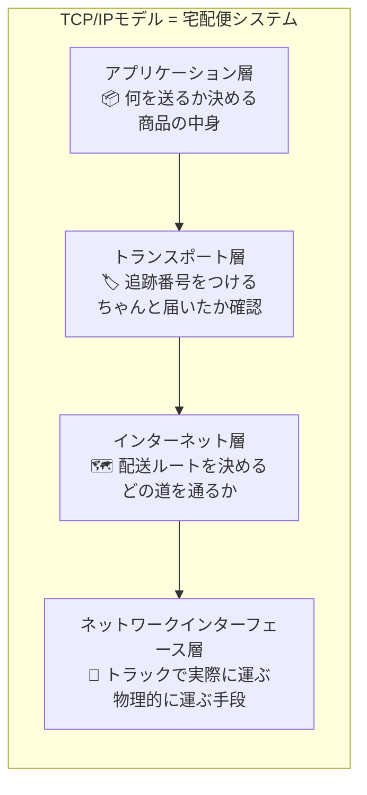
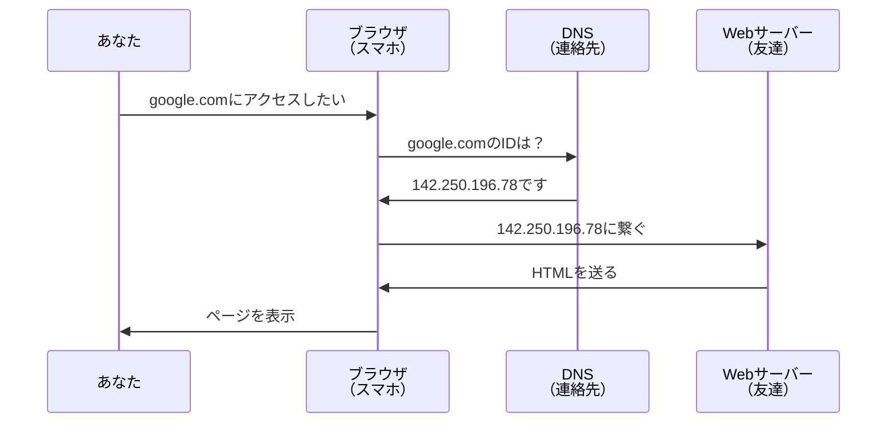
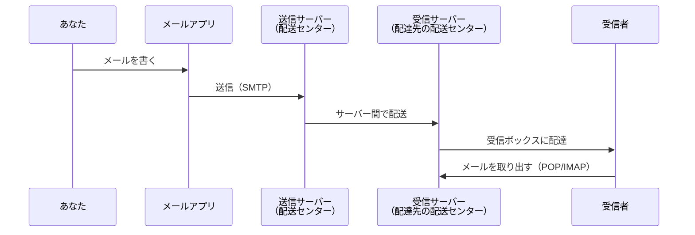

:::note warn
前記事と比較しながら見てもらうとチューニングの重要性が見えます。
:::

https://qiita.com/nomurasan/items/5a690baaaa54c524d9ad

## はじめに：ネットワークは「見えない宅配システム」

あなたがスマートフォンでWebサイトを開く時、画面の裏側では何が起きているのでしょうか？

考えてみてください。Amazonで商品を注文すると、あなたの手元に届くまでにいくつもの段階があります。倉庫から商品が取り出され、段ボールに梱包され、配送センターを経由し、配達員が最後にあなたの家のドアまで運んでくれます。追跡番号を使えば、今どこにあるのかを確認できます。

実は、インターネットでデータが届く仕組みは、この宅配便のシステムとよく似ています。

「サイトが表示されない」「メールが送れない」「動画が途中で止まる」。こうした日常的なトラブルに遭遇した時、多くの人は「ネットワークの問題かな？」と漠然と感じます。しかし、具体的に何が起きているのかを説明できる人は少ないでしょう。それは当然です。ネットワークは目に見えないからです。

だから、ITパスポート試験の中でも、ネットワーク分野は最も理解しにくい単元の一つとされています。多くの参考書では用語の定義が並び、「これを暗記しましょう」という説明になりがちです。しかし、仕組みが分からないまま暗記しても、すぐに忘れてしまいます。試験が終わった瞬間に頭から消えてしまうのは、あなたの記憶力が悪いからではありません。理解していないものを無理に覚えようとしているからです。

そこで、この記事では少し違うアプローチを取ります。ネットワークを「宅配便のシステム」や「LINEでメッセージを送る時の仕組み」に例えて理解していきます。あなたがAmazonで商品を注文してから、配達員が玄関に届けるまでの流れを思い浮かべながら読んでみてください。TCP/IPモデルやプロトコルといった抽象的な概念が、急に身近に感じられるはずです。

暗記ではなく、理解を目指しましょう。理解できれば、忘れても思い出せます。そして、実際の生活の中で「ああ、これがあの時学んだことか」と気づく瞬間が来るはずです。

---

## TCP/IPモデル：宅配便の4つの役割分担

### なぜ層に分ける必要があるのか？

もし宅配便が「一人ですべてやる」システムだったらどうでしょうか？

商品を倉庫から探して、梱包して、住所を確認して、配送ルートを考えて、トラックを運転して、最後に玄関まで届ける。これを一人でやると、どこかで失敗した時に全部やり直しになります。しかも、どの段階で失敗したのか分からなくなります。

そこで、宅配便のシステムは役割を分担しています。倉庫の担当者が商品を探し、梱包担当者が段ボールに詰め、配送センターが配送ルートを決め、ドライバーが実際に運びます。それぞれが専門の仕事に集中することで、効率が上がります。そして、何か問題が起きた時に「どの段階で失敗したか」を特定しやすくなります。

ネットワークも同じです。TCP/IPモデルは、通信を4つの役割に分けることで、問題が起きた時にどの役割で失敗したかを特定しやすくしています。

### TCP/IPモデルを宅配便で理解する



それぞれを日常生活に置き換えてみましょう。

**アプリケーション層：何を送るか決める**

これは「何を配送するか」を決める層です。本なのか、服なのか、食品なのか。内容によって梱包方法が変わります。食品なら冷蔵便、割れ物ならワレモノ注意のシールが必要です。

ネットワークでも同じです。Webページを表示するならHTTP、メールを送るならSMTP、ファイルを転送するならFTPと、目的によってプロトコルという「配送方法のルール」が変わります。

**トランスポート層：追跡番号をつける**

梱包した荷物に追跡番号をつけます。もし途中で失くなったら「追跡番号〇〇の荷物が届いていません」と問い合わせできます。Amazonのアプリで「今どこにあるか」を確認できるのも、この追跡番号のおかげです。

ネットワークでは、TCPというプロトコルがこの役割を担います。データを小分けにして番号をつけ、全部届いたか確認します。もし途中で失くなったら、再送してくれます。

ただし、YouTubeのライブ配信のように「多少データが失くなってもいいから、とにかく速く届けてほしい」場合もあります。その時は、追跡番号なしのUDPという方法を使います。多少画質が乱れても、リアルタイム性を優先するわけです。

**インターネット層：配送ルートを決める**

荷物の送り先住所を見て、どの配送センターを経由するか決めます。東京から大阪なら、名古屋の配送センターを経由するかもしれません。最短ルートを自動的に計算してくれます。

ネットワークでは、IPアドレスという「住所」を元に、どのルーター（配送センター）を経由するか決めます。あなたがWebサイトにアクセスする時、データは何台ものルーターを経由して届きます。

**ネットワークインターフェース層：トラックで実際に運ぶ**

実際にトラックで運びます。道路が封鎖されていたら（LANケーブルが抜けていたら）、そもそも運べません。Wi-Fiが切れている状態は、トラックのエンジンがかからない状態と同じです。

### トラブルが起きた時、どこで詰まっているか順番に確認する

Webサイトが表示されない時、宅配便のシステムで考えると分かりやすくなります。

まず、トラックは動いているか確認します。これが「ネットワークインターフェース層」のチェックです。Wi-Fiに繋がっているか、LANケーブルは挿さっているか。スマホの画面右上に、Wi-Fiや4Gのマークが出ていますか？もし出ていなければ、そもそも物理的に繋がっていません。これは、トラックのエンジンがかかっていない状態です。

次に、住所は正しいか確認します。これが「インターネット層」のチェックです。IPアドレスが間違っていないか、ルーターは正しく動作しているか。宅配便で言えば、送り先の住所が存在するか、配送センターが営業しているかを確認する作業です。

それから、荷物は届いているか確認します。これが「トランスポート層」のチェックです。ポート番号（後で説明します）が開いているか、通信が遮断されていないか。宅配便で言えば、マンションの入り口は開いているか、警備員に止められていないかを確認する作業です。

最後に、中身は正しいか確認します。これが「アプリケーション層」のチェックです。Webサーバーは動いているか、正しいHTMLを返しているか。宅配便で言えば、届いた箱の中に注文した商品が入っているかを確認する作業です。

この順序で調べることで、効率的に原因を特定できます。下の層から順番に確認していけば、どこで詰まっているかが分かります。

---

## IPアドレス：住所がないと届けられない

### なぜIPアドレスが必要なのか？

もし宅配便に住所がなかったら、どうやって荷物を届けますか？

「田中さんに届けて」だけでは、どこの田中さんか分かりません。全国の田中さんの家を順番に回る？それは非現実的です。だから、住所という仕組みがあります。「東京都〇〇区〇〇1-2-3」と書けば、配達員は迷わず届けられます。

ネットワークも同じです。「Googleのサーバーにアクセスしたい」だけでは、インターネット上のどのコンピューターか特定できません。世界中に何億台ものコンピューターがあるのに、どうやって目的地を見つけるのでしょうか？だから、IPアドレスという「住所」が必要なのです。

### 開発環境で出会う3つの「住所」

スマホでWebサイトを開く時、あなたは「google.com」のような分かりやすい名前を入力します。しかし、実際には裏側でIPアドレスという数字の住所に変換されています。

たとえば、プログラミングを学び始めると、こんな住所に出会います。

```
http://localhost:3000
http://192.168.1.10:3000
http://203.0.113.45:3000
```

これらは、それぞれ違う場所を指しています。宅配便の住所で例えると、こうなります。

`127.0.0.1`または`localhost`は、「自分の家」です。あなたが自分のパソコンで作ったWebサイトを、自分のパソコンで開く時に使います。宅配便で言えば、家の中で荷物を別の部屋に運ぶようなものです。外からは届けられません。

`192.168.1.x`は、「同じマンション内の他の部屋」です。あなたのパソコンとスマホが同じWi-Fiに繋がっている時、スマホからパソコンで作ったWebサイトを開けます。宅配便で言えば、マンションの101号室から201号室に荷物を届けるイメージです。マンションの外からは届けられません。

`203.0.113.x`のような数字は、「別の町の住所」です。インターネット上のどこからでもアクセスできます。これがグローバルIPアドレスと呼ばれるものです。宅配便で言えば、全国どこからでも届けられる正式な住所です。

実際に使い分けを考えてみましょう。あなたがパソコンで作ったWebサイトを、スマホで動作確認したいとします。この時、`localhost`を使うとどうなるでしょうか？スマホのブラウザは「スマホ自身の家」を探してしまうので、パソコンで作ったサイトにアクセスできません。だから、`192.168.1.10`のように、パソコンのマンション内住所を使う必要があります。ただし、パソコンとスマホが同じWi-Fiに繋がっていることが前提です。

### IPアドレスが足りなくなった理由

IPアドレスは`192.168.1.1`のように、4つの数字で構成されます。それぞれの数字は0から255までなので、理論上は約43億個の住所が作れます。

しかし考えてみてください。世界人口は80億人を超えています。しかも、一人あたり何台のデバイスを持っているでしょうか？スマートフォン、パソコン、タブレット、スマートウォッチ。さらに、家にはスマートスピーカー、スマートテレビ、ゲーム機もあります。冷蔵庫やエアコンがインターネットに繋がる時代です。一人で5台、10台のデバイスを持つのは珍しくありません。

明らかに43億個では足りません。だから、IPv6という新しい住所システムが登場しました。

IPv6は128ビットという桁数で、約340澗個（かん＝兆の1兆倍の1兆倍）の住所が作れます。これは、地球上の全ての砂粒に住所を割り当てても余るほどの数です。事実上、無限と言っていいでしょう。

```
http://[::1]/
http://[fe80::1]:8080/
```

ただし、実際には普及が進んでいません。なぜでしょうか？

まず、住所が長すぎて覚えられません。宅配便で言えば、郵便番号が100桁あるようなものです。配達員も困ります。それから、既存のシステムが古い住所システム（IPv4）前提で作られています。急に新しい住所システムに切り替えると、古いシステムと通信できなくなります。新旧の住所が混在して、かえって複雑になっているのが現状です。

---

## ポート番号：マンションの部屋番号

### なぜポート番号が必要なのか？

宅配便で荷物を送る時、住所だけではマンションまでしか届きません。「〇〇マンション101号室」のように、部屋番号が必要です。

ネットワークも同じです。一台のサーバー（マンション）で、Webサーバー（101号室）とメールサーバー（201号室）を両方動かしたい場合があります。IPアドレスだけでは、どちらのサービスに繋げばいいか分かりません。だから、ポート番号という「部屋番号」で区別します。

```
http://example.com:80    → Webサーバー（80番の部屋）
http://example.com:443   → HTTPSサーバー（443番の部屋）
http://example.com:3000  → 開発中のアプリ（3000番の部屋）
```

実際には、Webブラウザでサイトを開く時、ポート番号を入力していませんよね？それは、HTTPなら80番、HTTPSなら443番という部屋番号が自動的に使われるからです。`https://example.com`と書けば、自動的に443番の部屋に繋がります。

しかし、プログラミングを学び始めると、開発用のサーバーを`localhost:3000`で起動することがあります。これは、開発中のアプリ専用に3000番の部屋を用意したということです。本番環境では、通常の443番（HTTPS）に配置します。

実務でよく使われるポート番号を、マンションの部屋に例えると理解しやすくなります。80番と443番は、マンションの管理室のようなものです。誰でも入れる、公式の入り口です。22番は、管理人専用の裏口です。サーバー管理者だけが使う、SSH接続用の入り口です。3000番から8000番あたりは、工事中の部屋です。開発者が動作確認に使う、一時的な入り口です。

---

## DNS：LINEの連絡先がないとアカウントを調べられない

### なぜDNSが必要なのか？

LINEで友達にメッセージを送る時、相手のアカウントIDを暗記していますか？していませんよね。連絡先に登録された名前を見て、タップするだけです。

もしLINEに連絡先機能がなかったら、どうなるでしょうか？友達全員のアカウントID（ランダムな英数字の羅列）を覚える必要があります。しかも、友達がアカウントを作り直したら、IDが変わります。そのたびに、新しいIDを聞いて、メモして、覚え直す必要があります。

DNSは、インターネット上の連絡先アプリのようなものです。



あなたが「google.com」と入力すると、ブラウザは裏側でDNSに問い合わせます。「google.comのIPアドレスは何番ですか？」DNSが「142.250.196.78です」と答えます。ブラウザはその番号に接続して、Webページを表示します。

この仕組みのおかげで、私たちは覚えやすい名前でWebサイトにアクセスできます。

### DNSがないとどうなるか？

もしDNSがなかったら、`https://google.com`ではなく、`https://142.250.196.78`のように、毎回IPアドレスを覚えて入力する必要があります。数字の羅列は覚えにくいですし、間違えやすいです。

しかも、Googleがサーバーを引っ越したら、IPアドレスが変わります。友達全員がLINEアカウントを作り直してIDが変わるようなものです。そのたびに、新しいIPアドレスを調べて、ブックマークを更新して...考えただけで大変です。

DNSがあるおかげで、私たちは「google.com」という名前だけ覚えていればいいのです。裏側でIPアドレスが変わっても、DNSが自動的に新しい番号を教えてくれます。

### トラブル：反映に時間がかかる

新しいWebサイトを作って、ドメインを取得したとします。DNS設定を済ませて、さあアクセスしようとしたら...「サイトが見つかりません」というエラーが出ました。よくあるトラブルです。

これは、LINEで新しい友達を追加した時のことを思い浮かべると分かります。あなたのスマホには新しい友達が追加されましたが、友達のスマホにあなたの情報が表示されるまで、少し時間がかかることがあります。

DNSの場合、世界中のサーバーに情報が広がるまで、最大48時間かかることがあります。これはTTLという仕組みによるもので、古い情報がキャッシュとして残っているからです。あなたのパソコンは新しいIPアドレスを知っているけど、他の人のパソコンはまだ古いIPアドレスを覚えている状態です。

だから、ドメインを設定した直後にサイトが表示されなくても、慌てる必要はありません。時間が経てば、自然に解決します。

## プロトコル：LINEとInstagramでは会話のルールが違う

### なぜプロトコルが必要なのか？

日本語しか話せない人と、英語しか話せない人が会話できますか？できません。お互いに理解できる共通の言語が必要です。

SNSも同じです。あなたがLINEでメッセージを送ろうとしているのに、相手がInstagramしか使っていなかったら、やり取りできません。お互いに同じアプリ、同じルールを使う必要があります。

ネットワークも同じです。Webページを表示するのと、メールを送るのでは、全く違うルールが必要です。だから、目的ごとに「プロトコル」という共通のルールが決まっています。プロトコルとは、通信のための約束事です。

### 実務で遭遇するプロトコルを日常で例えると

HTTPとHTTPSは、Webページを表示するためのプロトコルです。あなたがブラウザでサイトを開く時、HTTPまたはHTTPSというルールで通信しています。HTTPSは、暗号化されたHTTPです。LINEで例えるなら、普通のメッセージと、Letter Sealingで暗号化されたメッセージの違いです。HTTPSを使うと、途中で誰かに盗み見られても、内容が読めません。

SMTPは、メールを送信するためのプロトコルです。お問い合わせフォームから送信ボタンを押した時、裏側でSMTPというルールでメールサーバーに送られます。Amazonで注文確定ボタンを押して、配送センターに荷物の情報が送られるイメージです。

POP3とIMAPは、メールを受信するためのプロトコルです。メールサーバーから自分のメールアプリにメールをダウンロードします。配送センターから自宅に荷物が届くイメージです。

FTPとSFTPは、ファイルを転送するためのプロトコルです。Webサイトを作った後、サーバーにファイルをアップロードする時に使います。大きなファイルを宅配便で送るイメージです。SFTPは、暗号化されたFTPです。

SSHは、サーバーに遠隔操作で接続するためのプロトコルです。自宅から会社のパソコンをリモート操作する時のような、遠隔接続です。

DNSは、ドメイン名をIPアドレスに変換するためのプロトコルです。先ほど説明した、LINEの連絡先のような役割です。

### TCPとUDP：追跡ありの宅配便と、追跡なしの配送

トランスポート層には、TCPとUDPという2つの主要なプロトコルがあります。どちらもデータを運ぶという点では同じですが、運び方が全く違います。

TCPは、追跡番号つきの宅配便です。荷物を送った後、配送状況を追跡できます。荷物が届いたかどうか確認できます。もし届かなければ、再送してくれます。確実に届けたいデータには、TCPを使います。Webページ、メール、ファイル転送などです。データが一部でも欠けると困るからです。

ただし、確認作業がある分、時間がかかります。荷物を送るたびに「届きましたか？」「届きました」というやり取りが発生します。

UDPは、追跡番号なしの配送です。届いたかどうか確認しません。もし途中で失くなっても、再送しません。その代わり、確認作業がない分、速いです。

どんな時にUDPを使うのでしょうか？YouTubeのライブ配信やオンラインゲームです。これらは「多少データが失くなってもいいから、とにかく速く届けてほしい」という要求があります。ライブ配信で一瞬画質が乱れても、次のフレームがすぐに来れば問題ありません。再送を待っていたら、リアルタイム性が失われます。オンラインゲームで、一瞬前のキャラクターの位置情報が届いても意味がありません。今の位置情報が速く届く方が重要です。

判断基準は簡単です。データが欠けると困る場合はTCP、多少欠けても速度優先の場合はUDPです。

---

## NAT：マンションの宅配ロッカーの仕組み

### なぜNATが必要なのか？

大型マンションに宅配便が届く時のことを考えてみてください。配達員は、マンションの入り口にある宅配ロッカーに荷物を入れます。住民は、自分の部屋番号を入力して、荷物を取り出します。

配達員から見ると、マンション全体が一つの住所です。しかし、マンションの中には何十戸、何百戸もの部屋があります。宅配ロッカーが、どの荷物をどの部屋に届けるか振り分けてくれます。

NATは、この宅配ロッカーの仕組みと同じです。

あなたの自宅のWi-Fiに、パソコン、スマホ、タブレットが繋がっています。それぞれ`192.168.1.10`、`192.168.1.11`、`192.168.1.12`という部屋番号を持っています。これがプライベートIPアドレスです。

しかし、インターネットから見ると、すべて同じマンション（グローバルIPアドレス）に見えます。ルーター（宅配ロッカー）が、どのデバイスから来た通信か管理して、返信を正しい部屋番号に戻します。

### NATがないとどうなるか？

もしNATがなかったら、マンションの住民全員が、それぞれ個別の住所を持つ必要があります。100世帯いたら、100個の住所が必要です。これは非現実的です。

IPアドレスは有限です。世界中の人がデバイスを何台も持っているのに、一台ごとにグローバルIPアドレスを割り当てていたら、すぐに枯渇します。

NATがあることで、一つのグローバルIPアドレスを複数のデバイスで共有できます。家庭のWi-Fiルーターは、必ずNAT機能を持っています。だから、あなたの家に何台デバイスがあっても、外から見ると一つのグローバルIPアドレスで済みます。

---

## Webページの仕組み：URLは宅配便の伝票

### なぜURLがこんなに長いのか？

```
https://api.example.com:8080/v1/users/123?sort=name#profile
```

一見複雑ですが、これは宅配便の伝票を詳しく書いているだけです。それぞれの部分が、配送に必要な情報を表しています。

`https://`は、「追跡番号つきの宅配便で、しかも内容を暗号化して送ってください」という指示です。HTTPSのSは、Secureの頭文字で、暗号化を意味します。

`api.example.com`は、配送先の住所です。正確には、DNSで変換される前の「覚えやすい名前」です。

`:8080`は、マンションの部屋番号です。80番や443番ではなく、8080番の部屋に届けてくださいという指示です。

`/v1/users/123`は、マンション内での経路です。建物に入って、1階のユーザー管理室に行って、123番の棚を見てくださいという指示です。

`?sort=name`は、追加の指示です。データを名前順に並べて渡してくださいという注文です。

`#profile`は、書類の特定箇所を指定しています。プロフィール欄だけ見せてくださいという指示です。

### 相対パスと絶対パスの使い分け

WebサイトでCSSやJavaScriptを読み込む時、パスの書き方で迷うことがあります。

```html
<!-- 絶対パス：完全な住所 -->
<link href="https://example.com/css/style.css">

<!-- ルート相対パス：同じマンション内の別の部屋 -->
<link href="/css/style.css">

<!-- 相対パス：隣の部屋 -->
<link href="../css/style.css">
```

絶対パスは、完全な住所を書く方法です。「東京都千代田区千代田1-1 カフェA」のように、どこから見ても一意に場所が特定できます。CDNという外部のサーバーからファイルを読み込む時に使います。

ルート相対パスは、「千代田マンションの1階カフェ」のように、同じ建物内の場所を指定します。自分のWebサイト内のファイルを読み込む時に使います。サーバーを引っ越ししても、相対的な位置関係が変わらないので、パスを書き換える必要がありません。

相対パスは、「隣の建物」のように、今いる場所から見た相対的な位置を指定します。ファイルを移動すると、相対的な位置関係が変わるので、パスが壊れやすいです。なるべく避けた方が無難です。

実務では、自サイト内のファイルはルート相対パス、外部のライブラリは絶対パスという使い分けが一般的です。

---

## 電子メール：InstagramのDMとの違い

### メール送信の仕組み：配送センターを経由して届く

メールを送る時、あなたは送信ボタンを押すだけです。しかし、裏側では宅配便のような仕組みでメールが届けられています。



あなたがメールを書いて送信ボタンを押すと、メールアプリがSMTPというプロトコルで送信サーバーに送ります。これは、Amazonで注文確定ボタンを押して、配送センターに荷物の情報が送られるイメージです。

送信サーバーは、宛先のメールアドレスを見て、相手の受信サーバーに配送します。これは、配送センター間でトラックが荷物を運ぶイメージです。

相手の受信サーバーに届いたメールは、受信ボックスに保管されます。これは、配達先の配送センターに荷物が到着した状態です。

受信者がメールアプリを開くと、POP3やIMAPというプロトコルで受信サーバーからメールを取り出します。これは、配送センターから自宅に荷物が届くイメージです。

### InstagramのDMとの違い

InstagramのDMは、リアルタイムで直接届きます。あなたが送信ボタンを押すと、相手のスマホにすぐに表示されます。これは、LINEでメッセージを送るのと同じです。

しかし、メールは違います。メールは、配送センター（サーバー）を必ず経由します。だから、送信してから相手に届くまで、数秒から数分かかることがあります。InstagramのDMのようなリアルタイム性はありません。

なぜこんな複雑な仕組みになっているのでしょうか？それは、メールが古い技術だからです。メールが発明された時代、インターネットは今ほど速くありませんでした。だから、サーバーに一時保管して、相手が受け取れる時に配送するという仕組みが必要だったのです。

今では、LINEやInstagram DMのようなリアルタイムメッセージアプリが主流になりました。しかし、ビジネスの世界では、まだメールが広く使われています。

### POP3とIMAPの違い：ダウンロードか、サーバー参照か

POP3は、メールをパソコンにダウンロードする方法です。メールをダウンロードすると、サーバーからは削除されます。配送センターから自宅に荷物を持ち帰って、配送センターの荷物置き場は空になるイメージです。

メリットは、ダウンロードしたメールはオフラインでも読めることです。インターネットに繋がっていなくても、過去のメールを確認できます。デメリットは、別のデバイス（スマホ）から見られないことです。パソコンにダウンロードしたメールは、パソコンにしかありません。

IMAPは、メールをサーバーに残したまま見る方法です。あなたのメールアプリは、サーバーのメールを参照しているだけです。配送センターの荷物置き場に荷物を置いたまま、スマホで写真を見るイメージです。

メリットは、どのデバイスからでも同じメールを見られることです。自宅のパソコンで読んだメールを、スマホでも既読として表示できます。デメリットは、オフラインでは読めないことと、サーバーの容量に制限があることです。

現代では、複数のデバイスでメールを確認するのが普通なので、IMAPが主流になっています。

### To/Cc/Bccの使い分け


Toは、直接届けたい人です。「田中さん宛」と配送伝票に書くイメージです。この人に返信してほしい、この人が主な宛先だという意思表示です。

Ccは、参考までに見ておいてほしい人です。「佐藤さん（参考）」と配送伝票に書くイメージです。全員に見えます。「この人にも共有しておきたいけど、返信は求めていない」という時に使います。


Bccは、他の人に知られたくない宛先です。「山田さん（秘密）」と書きますが、他の受信者には見えません。複数の人にメールを送る時、お互いのメールアドレスを見せたくない場合に使います。

ただし、実務での注意点があります。役職者や取引先に送ったメールは、想像以上に読まれていません。Cc機能が気軽に使われすぎて、一日に数百通のメールが届く人もいます。重要な連絡は、メールだけでなく、LINEやSlackなどのメッセージアプリでフォローするのが現実的です。

---

## DHCP：ホテルのWi-Fiに繋ぐだけで使える理由

### なぜDHCPが必要なのか？

ホテルにチェックインして、Wi-Fiに接続しようとします。パスワードを入力すると、すぐにインターネットが使えるようになります。あなたは、こんな設定をしましたか？

「IPアドレスを192.168.1.45に設定」「サブネットマスクを255.255.255.0に設定」「デフォルトゲートウェイを192.168.1.1に設定」

していませんよね。Wi-Fiに接続するだけで、自動的にインターネットが使えます。これがDHCPの役割です。

DHCPは、ホテルのフロント係のようなものです。あなたがチェックインすると、空いている部屋番号を自動的に割り当ててくれます。もしDHCPがなかったら、自分で「私は301号室に泊まります」と決めなければなりません。しかし、その部屋にすでに他の人が泊まっていたらどうしますか？部屋番号が重複してしまいます。

DHCPは、空いているIPアドレス（部屋番号）を自動的に割り当てて、他のデバイスと重複しないように管理してくれます。だから、あなたは難しい設定をせずに、Wi-Fiに接続するだけでインターネットが使えるのです。

### DHCPがないとどうなるか？

ネットワークに接続するたびに、手動で設定が必要になります。しかも、他のデバイスと番号が重複しないように、ネットワーク全体を把握しながら管理する必要があります。

ホテルで例えるなら、チェックインのたびに、全客室の宿泊状況を確認して、空いている部屋を自分で探さなければならないということです。非現実的ですよね。

---

## 通信サービス：高速道路と一般道の違い

### ブロードバンド：光ファイバーの速さ

FTTHという言葉を聞いたことがあるでしょうか。Fiber To The Homeの略で、光ファイバーケーブルを家まで引き込む方式です。

光ファイバーは、光の信号でデータを送ります。電気信号よりも遥かに速く、大量のデータを運べます。宅配便で例えるなら、高速道路です。障害物がなく、直線的に、大量の荷物を高速で運べます。

実務では、オフィスや在宅勤務の標準です。Zoom会議、Googleドライブ、大容量ファイルの送受信など、現代の業務には欠かせません。

CATVは、ケーブルテレビの配線を使った通信方式です。既存のインフラを活用できるので、導入しやすいという利点があります。速度は光ファイバーに劣りますが、通常の用途には十分です。宅配便で例えるなら、一般道です。高速道路ほどではありませんが、実用的な速度で運べます。

### モバイル通信：4Gと5Gの違い

4G/LTEは、広い範囲をカバーし、安定している通信方式です。Webサイトの閲覧、LINE、YouTube視聴など、通常の用途には十分です。宅配便で例えるなら、普通の道路です。全国どこでも使える、標準的な配送ルートです。

5Gは、超高速で、遅延が極端に少ない通信方式です。IoTデバイス、自動運転、遠隔医療など、リアルタイム性が求められる用途に向いています。宅配便で例えるなら、新幹線です。圧倒的な速さで、大量の荷物を運べます。

ただし、実務での判断としては、Webアプリを作る時は4Gでも快適に動作するように設計することが重要です。画像を圧縮する、遅延読み込みを使う、データ量を減らすなどの工夫です。5Gはまだ普及途上なので、「あればラッキー」程度に考えます。

### その他の技術

テザリングは、スマホをWi-Fiルーターとして使う機能です。外出先でノートパソコンをインターネットに繋ぎたい時に便利です。スマホのモバイル通信を、パソコンと共有できます。

MVNOは、格安SIMと呼ばれるサービスです。大手キャリアの回線を借りて、低価格で通信サービスを提供します。コスト削減や、IoTデバイスの通信に使われます。

eSIMは、物理的なSIMカードを使わない方式です。スマホに内蔵されたチップに、通信契約の情報を書き込みます。海外旅行の時に、現地のeSIMを追加すれば、SIMカードを差し替えずにデータ通信できます。

---

## 効率的な学習手引き

ここまでの内容を読んで「覚えきれない」と感じた方へ。それは当然です。ネットワークは範囲が広く、専門用語も多いため、一度に全部理解するのは困難です。
重要なのは、一回で覚えることを目指さず、忘れながら覚えなおしていくことです。頻度が低いものは忘れてOKです。頻度が高いけど覚えられない物は、学習アプローチを見直しましょう。

脳のキャパシティを節約しながら学ぶために、以下の4段階で学習目標を設定します。

### ステップ1：イメージを固める

まずは覚えることを目指します。細かい中身は後のステップでやります。
どこまで覚えるか？は「この1分間だけ」です。

資料を流し読みしながら、「つまり、〇〇ってこと？」とChatGPTやClaudeに確認してみましょう。全く想像もできないなら「日常生活で言うとどういうこと？」と聞いてしまいます。

たとえば、こんな質問です。「TCP/IPモデルって何？宅配便で例えたらどういうこと？」「DNSの仕組みを、LINEの連絡先で例えるとどうなる？」「プロトコルって何？SNSアプリの違いで例えられる？」

専門用語を自分なりにイメージしてから学習を始めます。理解できない箇所は「もっと簡単な言葉で」と聞き返しましょう。AIは何度でも答えてくれます。遠慮する必要はありません。

### ステップ2：理解する

後で見て思い出せるレベルを目指します。ステップ1で覚えたものを忘れた後に見た時に、覚えていないけど何を言っているかは分かる状態にします。

たとえば、「TCP/IPモデル」という言葉を聞いた時に、「ああ、宅配便の仕組みを4つに分けたやつだ」と思い出せればOKです。4つの層の名前を正確に言えなくても構いません。詳細は、必要な時に調べればいいのです。

### ステップ3：自分の言葉に置き換える

理解した内容を自分なりに説明してみましょう。

たとえば、「TCP/IPモデルは、宅配便を4つの役割に分けたもの。下から順に、トラックで運ぶ、配送ルートを決める、追跡番号をつける、何を送るか決める。これが分かれていると、どこで失敗したか切り分けやすい」

間違っていても良いです。後で修正できます。人に説明するつもりで言語化してみましょう。AIに「この理解で合ってる？」と確認してもらうのも有効です。AIは間違いを優しく指摘してくれます。

### ステップ4：知る

:::note
ステップ2で理解したものを忘れた後がスタートです
:::

「何か言ってたな」程度で十分です。「知らない」からの卒業が目的です。

ネットワーク分野は範囲が広いため、すべてを理解しようとすると挫折します。試験で頻出の項目だけ理解し、残りは「聞いたことがある」レベルで十分です。試験問題を見た時に、「ああ、これ読んだことがある」と思い出せれば、選択肢を絞り込めます。

このように、ITパスポートは範囲が広すぎるため、「覚えた後に理解して、忘れても内容は知っている状態」をゴールにおいています。この「知る」のが未経験・文系の方にとっては結構大変です。重要なのは忘れる前提で学習を進めることです。知識を詰め込むような覚え方は非推奨です。

---

## 要約

ネットワークは「見えない宅配システム」です。Amazonで商品を注文してから届くまでの流れと、データがインターネットを通じて届く流れは、驚くほど似ています。

覚えておきたいポイントは、以下の通りです。

TCP/IPモデルは、宅配便を4つの役割に分けたものです。何を送るか決める（アプリケーション層）、追跡番号をつける（トランスポート層）、配送ルートを決める（インターネット層）、トラックで運ぶ（ネットワークインターフェース層）。問題が起きた時に、どの役割で失敗したかを切り分けられます。

IPアドレスは、住所です。`localhost`は自分の家、`192.168.1.x`は同じマンション内、グローバルIPは全国どこからでも届けられる正式な住所です。

ポート番号は、マンションの部屋番号です。一台のサーバーで複数のサービスを動かす時、どのサービスに繋ぐか区別します。

DNSは、LINEの連絡先です。覚えにくいIPアドレスを、覚えやすいドメイン名に変換します。「google.com」と入力すると、裏側でIPアドレスに変換されて接続されます。

プロトコルは、SNSアプリのルールです。HTTPはWebページ、SMTPはメール送信、SSHはリモート接続と、目的ごとにルールが変わります。LINEとInstagramで会話のルールが違うのと同じです。

TCPは追跡番号つきの宅配便、UDPは追跡なしの配送です。データが欠けると困る場合はTCP、多少欠けても速度優先の場合はUDPを使います。

NATは、マンションの宅配ロッカーです。複数のデバイスが一つのグローバルIPを共有できます。家庭のWi-Fiルーターは、必ずNAT機能を持っています。

すべてを暗記する必要はありません。「実務で困った時に、どこを調べればいいか分かる」状態を目指しましょう。宅配便やLINEの仕組みを思い浮かべれば、ネットワークの抽象的な概念も、急に身近に感じられるはずです。

ITパスポート試験対策としては、この記事の内容を「理解する」レベルにしておけば、後は過去問演習で十分です。理解できれば、忘れても思い出せます。そして、実際の生活の中で「ああ、これがあの時学んだことか」と気づく瞬間が来るはずです。
