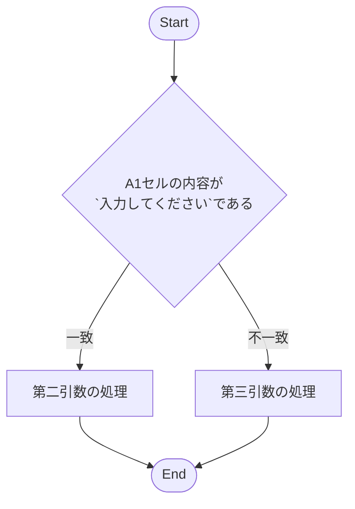
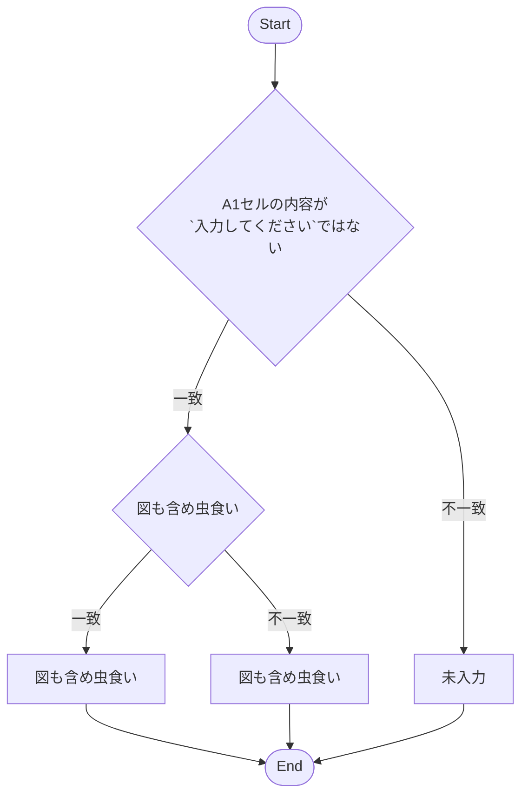
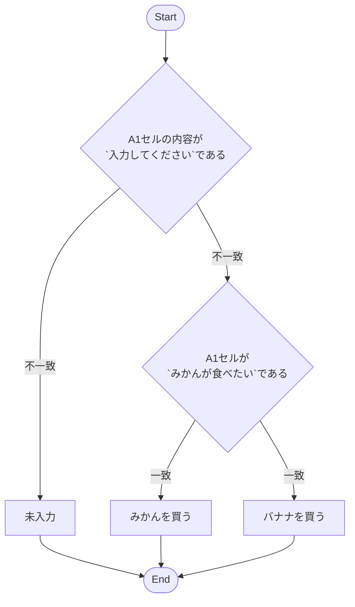

## ごあいさつ
コーチングサービス用の情報提供も兼ねて、toC向けの環境でどういう指導をしているのかとかで参考にしていただくと良いかもしれない。
実際に指導した内容を基に解説する。

## 対象者
- 学校などで情報系を指導されている教諭
- プログラミングスクール・情報系の専門学校講師
- （一部）Excel関数とアルゴリズムが結びつかない方

今回は実践の話がメインなので、現役向けのアドバイスとなる。

## 話さないこと
- 教材を作成する目的
- 良い教材の作り方

既に過去のアドベントカレンダーで紹介済みであるため、本稿では教材作成のコツについて取り上げていきたい。
本稿では主に指導方針や指導の狙いになるが、教材はあくまで指導を補助するためのツールであり、教材から指示を受けて講義を組み立てるものではないとご認識いただきたい。

### 教材開発の話
https://qiita.com/nomurasan/items/5a1d4a85ea96c70fb405

## 今回のカリキュラム設計
受講者ペルソナも教材開発の時と同じく30代の方で社内リスキリングを目的とし、特にExcelのVLOOKUP関数に苦手意識があり解決されたいとする。
そこで、ゴールプランニング部分を以下のように設定した。

1. 【初回講義】VLOOKUPの概要
2. 業務でよく使うIF関数とパターン（AND・ORの組み合わせ）
3. IF関数の拡張（IFS、SUMIF、◯◯IFS系）
4. LOOKUP関数シリーズ（V,H,XLOOKUP）
5. LOOKUP関数とアルゴリズム
6. XLOOKUP関数の代替
7. LOOKUP関数で複数の条件や出力を扱う方法

大きく分けると上記の通り。
基本的にステップアップ式でやっている事も同じ（ゴールや単元が変わったぐらい）なので、ここでは初回講義体験から２回目の講義までの流れを中心にフォーカスしてみていく。

## 毎時間伝えたこと
当日に解説する関数は覚えるものではない。忘れてしまっても思い出せる（調べて理解できる）ことが重要である。
これを常に伝え続け、実際に「忘れてしまいました」という声に対して「過去に勉強したノートを開いてほしい」と伝えた上で、当時の振り返りを行った。

---

以下、教材を作っていく過程の話。

- 前提として、受講者には「次回の講義はこれをやりましょう」という事を決めた上で教材を作成している
- テーマとして７つ取り上げているが、実際は終了期限を決めておらず、都度受講者のレベルを見極めながら設定している
- 本稿で取り上げている教材はヒアリング後に作った特注教材である

## VLOOKUPの概要 → 業務でよく使うIF関数とパターン
思った以上に記事が長引いたので、この

初回講義でご要望のVLOOKUPについて解説したが、そもそもVLOOKUP関数とは？また、関数とは？という根本的な話を理解していなかったため、関数の仕組みについての解説を中心とした講義を組み立てた。
この時、VLOOKUPは初学者の解説に不向きであるため、動作がわかりやすいIF関数を採用している。
この時の目標は「アルゴリズムを体感してもらう」こととした。

### アルゴリズムの重要性
普段からQiitaやZennなどを利用している諸兄諸姉にとっては釈迦に説法で恐縮だが、付き合っていただきたい。

別現場にて、学校で情報の授業を学んでいる普通科高校生に相談を受けた事があった。
その際にExcelの関数を使っており、アルゴリズムやフローチャートについては授業で学んだが、どうやって使うのか全くイメージができておらず、勉強はしたが何のためにあるのかというところから理解していないような言動があった。
学校で学んでいるレベルですらこういった認識であるため、学校で学ぶ機会すらなかった方がいきなりアルゴリズムの話をされても理解できるはずがない。

とはいえ、Excelに限らずプログラミングライクな作業をする上でアルゴリズムは切っても切れない重要な概念である。
そのため、今後また新しい関数を理解する際に受講者がアルゴリズムを理解していないと、他の関数を学ぶ際に絶対に障壁を感じてしまうであろう事を筆者は確信していた。
カリキュラム内にVLOOKUPの復習と、LOOKUPを実際に活用していく応用例も含めているが、こういった実践的なケースに対応できないと感じたからだ。

### フローチャートを書こう
まずはコードを図で想像するという訓練を課した。
たとえば、IF関数を図にすると

`=IF(A1="入力してください","第二引数","第三引数")`

```
IF(A1="入力してください") {
    "第二引数"
} ELSE {
    "第三引数"
}
```



と書く事ができる。
これは普通のフローチャートである。

おそらく、体系的な研修を受けている多くの場合がIF条件処理をする前にアルゴリズム／フローチャートを学ぶだろうが、実際に関数や引数を見てこの図を描けるようになるまではある程度の慣れと訓練が必要になる。
慣れてくれば図を描かなくても頭で理解できている状態になるだろう。

重要なのは書く事ではなく、イメージができるかどうか。
慣れないうちはイメージすらも出来ないので、ここは理解できるまで図解する。

ただし、この図が分かるようになったからと言って、理解度に問題なしと判断するのは早計だ。
次の例を見てみよう。

`=IF(AI<>"入力してください", IF(A1="みかんが食べたい","みかんを買う","バナナを買う"),"未入力")`

```
=IF(AI<>"入力してください") {
    IF(A1="みかんが食べたい") {
        "みかんを買う"
    } ELSE {
        "バナナを買う"
    }
} ELSE {
    "未入力"
}
```

ポイントは「図も含め虫食い」の部分で、受講生に質問する形式で考えてもらうようにする。



いわゆるネストの問題だ。
Excel関数の状態で解説しても分かりにくい場合は、プログラムコードの形式で虫食いにし、どちらにIFが入っているかを問うのも良いだろう。
IFのフローチャートを書けると言った受講生も、このようなケースになると上手くいかない事がある。
IFの構文とフローチャートを「暗記」した場合によく起こる問題だ。

同じように、



`=IF(？)` と出題して、IF関数の内容を書いてもらう。
出力結果を変えずにTRUE/FALSEを入れ替えただけであるが、やはりこれも暗記だと上手くいかない。
高校情報でこういった問題が出るかは不明だが、これが理解できるようになると他の関数も値を入れる順番や意味を認識しやすくなってくる。

### IFが分かれば同じ要領で解いてもらう
関数をIFからIF拡張系（IFS、xxIFS関数）やAND/ORの組み合わせをやってみたり。
NOTは取り扱わないのでド・モルガンの話はしない。

この時にルールとして「模範解答は見ても良い。解答以外の回答も模索してみる」という前提で問題に取り組んでもらう事で習得・イメージできたフローチャートが正しいか確認をさせてみる。
アルゴリズムの基礎がしっかりと固まっていれば、学んだ関数以外にも応用できる事を体験してもらう。
先述のIF問題の仕組みが分かっていればアルゴリズム面の課題は徐々に解決できるので、次は関数自体になんとなく慣れてもらっていくことにしよう。
特にSUMIFやCOUNTIFはよく使われる割には何気に難しいので、ステップアップにはもってこいである。

なお、実習時はこちらもIF関数同様にフローチャートで書いてみせるようにしよう。
たとえばSUMIFのポイントは「SUMとSUMIFのフローチャートの違いを比較させる」とよい。
先にIF関数の基礎を固めておくことで、こういった応用の関数の習得が早く正確にできるようになる。

## 本題：VLOOKUP（２回目）
初回講義でやったVLOOKUPだが、ここで改めて解説する。
アルゴリズムを正しく認識していなかった段階と見え方が違うはずだ。
もちろん、初回で理解している・覚えている場合はそのまま使えるし、アルゴリズムを理解した上で関数を見てみると、それぞれの引数を日本語で説明できるレベルになっているのではないだろうか？
いきなりは難しいので、VLOOKUPを軸に類似するHLOOKUPや便利なXLOOKUPも取り上げて比較してもらおう。
また、ハイレベルな問題としてLOOKUP関数の条件部分に関数を使って半自動化ができる事を説明しても良い。

### XLOOKUPがなかった頃の複数条件による入出力
本稿では取り上げないが、INDEX関数とMATCH関数の組み合わせがよく使われていたようだ。
XLOOKUPの登場で簡易になったので徐々に陳腐化していくだろうが、ExcelのバージョンによってはXLOOKUPが使えない事があるので、XLOOKUPに慣れた頃に解説しておくのが良いだろう。

なお、複数の出力を一つのセルに集約したい場合は文字列結合をすれば良い。

---

### Tips: 教材の選び方
:::note
ここでは、上記のフローチャート図（本稿ではmermaid記法で作成）の部分がほしい教材だが、ピンポイントに図を書いている教材があればそちらを、なければ作るしかない。
本稿では教材を探さずにサクッと書いてしまったが、指導時は以下も注意されたい。
:::

まずはいきなり自作するのではなく、市販やWebサイトで使って良いものなどを探してみる。
特にWebサイトから引用する場合は著作権の問題があるため、商用利用が可能かどうかはしっかりと確認しよう。
最も確実なのは市販だが、市販の場合は講師分は当然として受講者も同じ教材を購入する必要があるため、追加費用がかかる事は別途確認しておきたい。

どうしても見つからない場合は自作（ChatGPTによる生成も含む）も検討する。
その際は１から１０まで全部作るのではなく、つまづきやすいポイントに限定する方が良い。
というのも、情報が多くなればなるほど一単元ごとの密度がなくなっていくので、必要な部分だけをシンプルに書いてある教材の方が分かりやすいのだ。
今回のポイント解説ぐらいシンプルに書き出す事を一つの目安としていただくのも良いだろう。

同じように、市販教材もおよそ200〜300ページぐらいの厚みがあるものもあるが、指導時は本の内容全てを伝えるのではなく、たとえば見開きで2ページ分の内容から必要なポイントだけ抜き出して掘り下げ解説をしたり、別のページに詳しく解説があるなら当該部分の近くに付箋を貼ったりなどでページの関連を気付きやすくする。
Webサイト（Qiitaを例にする）などであれば注釈記法などでポップアップ解説が使える[^1]ので、教材作成時はこういった機能も使ってほしい。

### 注釈
[^1]: 【ポップアップ解説】PDF教材でも対応していない事が多いのが残念。紙（本）だとリンク機能がそもそも使えないので自ら対応が必要になる。
