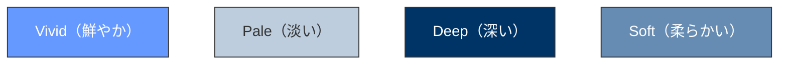
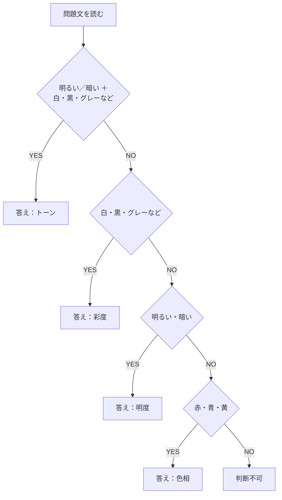

:::note warn
- 本稿はAIに筆者をヒアリングした結果を記事に書き出してもらっています
- 執筆はAIが行い、私が内容を調べながら、また検証しながら学習した内容になります
- ただし、監修者は色彩の専門家ではないため、誤りがあるかもしれません
:::

## まず触ってみよう

<p class="codepen" data-height="300" data-default-tab="html,result" data-slug-hash="ZYGgwvb" data-pen-title="色相・彩度・明度プレビュー" data-user="nomuraya" style="height: 300px; box-sizing: border-box; display: flex; align-items: center; justify-content: center; border: 2px solid; margin: 1em 0; padding: 1em;">
  <span>See the Pen <a href="https://codepen.io/nomuraya/pen/ZYGgwvb">
  色相・彩度・明度プレビュー</a> by nomura (<a href="https://codepen.io/nomuraya">@nomuraya</a>)
  on <a href="https://codepen.io">CodePen</a>.</span>
</p>
<script async src="https://public.codepenassets.com/embed/index.js"></script>

### デモの使い方
1. **彩度スライダー**で「派手→地味」の変化を体感
2. **明度スライダー**で「明るい→暗い」を確認
3. **色相スライダー**で色の種類変化を見る
4. トーンサンプルで「明度×彩度」の組み合わせを理解

## はじめに

色彩の試験ではないのですが、関連する試験の学習中、色彩理論の問題で躓きました。
普段RGB/HEXばかり使っているエンジニアにとって、「彩度」「明度」「色相」「トーン」といった概念は意外と盲点です。
簡単、というかわかりやすい表現なら解けるのですが、出題表現を捻ってきたり専門度が高まってくると怪しくなってきます。

実際の問題例：
> これの高い色は、派手・華やかといったイメージを与え、低い色は、地味・上品といったイメージを与えるとされる。最も段階が高いものは純色といわれ、**白、黒、グレーを加えることで段階が下がっていく**。

この問題、私は「明度」を選んで不正解でした😅
白・黒・グレーだから明るさかな？といううすーい理解で臨んだからでした。
ちなみに、このキーワードは明度ではなく彩度のキーワードです。

## エンジニアが知らない（事が多いであろう）色彩理論の基本

### 実務 vs 理論のギャップ

**実務でよく使う記法**
```css
color: #ff0000;           /* HEX値（主流） */
color: rgb(255, 0, 0);    /* RGB値 */
color: rgba(255, 0, 0, 0.8); /* 透明度付き */
```

**色彩理論で重要な記法**
```css
color: hsl(0, 100%, 50%); /* HSL記法 */
/* H=色相, S=彩度, L=明度 */
```

### なぜHSLを使わないのか？

1. **デザインツールがRGB/HEX出力**（Figma、Adobe XDなど）
2. **既存コードベースの慣習**
3. **直感的な理解**（#ffffffが白、など）

でも試験では色彩理論の理解が必要です。

## 4つの基本概念

### 1. 色相（Hue）
**色の種類**そのもの
- 赤、青、黄、緑など
- HSLの H部分（0-360°）

```css
hsl(0, 100%, 50%)   /* 赤 */
hsl(120, 100%, 50%) /* 緑 */
hsl(240, 100%, 50%) /* 青 */
```

### 2. 彩度（Saturation）
**色の鮮やかさ**
- 高い：派手、華やか
- 低い：地味、上品
- **白・黒・グレーを加えると下がる**← 試験重要ポイント

```css
hsl(0, 100%, 50%) /* 鮮やかな赤 */
hsl(0, 50%, 50%)  /* くすんだ赤 */
hsl(0, 0%, 50%)   /* グレー */
```

### 3. 明度（Lightness）
**色の明るさ**
- 高い：明るい
- 低い：暗い

```css
hsl(0, 100%, 75%) /* 明るい赤 */
hsl(0, 100%, 25%) /* 暗い赤 */
```

### 4. トーン
**明度 + 彩度の組み合わせ**による色調分類
- Vivid（高明度+高彩度）= 鮮やか
- Pale（高明度+低彩度）= 淡い
- Deep（低明度+高彩度）= 深い

## 実装で理解する色彩理論

### デザインシステムでの活用例（プレビューは類似色をRGBに置換）


```scss
// ベース色
$primary: hsl(220, 100%, 50%);

// トーン別バリエーション
$primary-vivid: hsl(220, 100%, 60%);  // 鮮やか
$primary-pale:  hsl(220, 30%, 80%);   // 淡い
$primary-deep:  hsl(220, 100%, 30%);  // 深い
$primary-soft:  hsl(220, 40%, 60%);   // 柔らかい
```

:::note warn
HSLとRGBの変換は理論上可能ですが、使い勝手や視認性、既存のカラーパレットとの親和性を重視して「近似色」が採用されることが多いです。
:::

### 試験対策：判断イメージ


## 体験デモで理解を深める

理論だけでは理解しにくいので、インタラクティブなデモを作成しました：
一番上においておきます。

## 試験でよく出るパターン

### パターン1：彩度の問題
> 「白、黒、グレーを加えることで段階が下がる」
→ **彩度**

### パターン2：明度の問題
> 「明るさの度合い」「さわやか・爽快」vs「重厚・落ち着き」
→ **明度**

### パターン3：色相の問題
> 「暖色系」「寒色系」「赤、橙、黄」
→ **色相**

### パターン4：トーンの問題
> 「色調」「明度と彩度の組み合わせ」
→ **トーン**

## まとめ

エンジニアとして普段RGB/HEXに慣れ親しんでいても、マーケティング分野では色彩理論の基礎知識が求められます。

**覚えるべきキーワード**：
- 彩度：「白・黒・グレー追加」「派手↔地味」
- 明度：「明るい↔暗い」
- 色相：「赤・青・黄」色の種類
- トーン：明度+彩度の組み合わせ

HSL記法を意識的に使ってみると、色彩理論への理解が深まります。デザイナーとのコミュニケーションにも役立つので、一石二鳥ですね！
私も頑張ります。

## 参考資料
- [MDN - CSS色の指定](https://developer.mozilla.org/ja/docs/Web/CSS/color_value)
