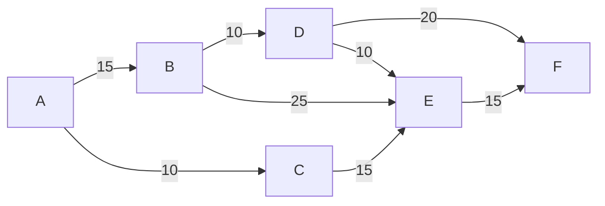
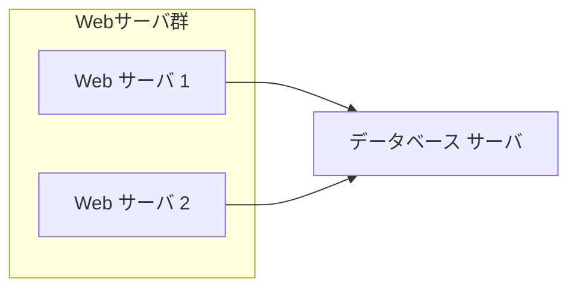

:::note
生成AIによる記事生成ですが、原文を最後においておきます
こんな使い方もできるよ、ということでナレッジ共有です
:::

## はじめに

研修講師をやっていると、理解度確認のために試験を実施する機会が多いのですが、毎回試験問題を作って採点するのは結構な負担です。特に選択式の問題なら自動採点できるはずなのに、手作業でやっているのはもったいない。

そこで今回、IPAが公開しているITパスポート試験の問題を使って、Googleフォームでの試験実施から結果分析までを半自動化してみました。完全自動化とはいかなかったものの、かなり効率化できたので、その過程と工夫したポイントをまとめます。

## やったこと

### 1. 問題を作る or 探す

今回はIPAが公開しているPDFを使用しました。

https://www3.jitec.ipa.go.jp/JitesCbt/html/openinfo/questions.html

PDFから問題を抽出する際は、**とりあえずOCRに掛けて構造化テキスト（CSVやTSVがおすすめ）にしておく**とだいぶ作りやすくなります。後でGoogleフォームに流し込むことを考えると、最初からデータベース的な形にしておくのが吉です。

:::note
フォームに乗りきらない問題（図表が複雑、計算式が多いなど)は、この時点で別資料化を検討しておくと後が楽です。詳しくは後述の「課題」セクションで説明します。
:::

### 2. 回答フォームを作成する

GoogleスプレッドシートとGAS（Google Apps Script）を使えば、かなり簡単にフォームが作れます。

作った問題をCSVなどで流し込んでデータベースを作っておき、「このスプレッドシートから試験回答フォームを作成して」とAIに指示すれば、それっぽいコードが生成されます。

:::note
AIに指示すれば簡単に作成されるため、具体的なコード例は省略します。GASの基本的な書き方がわかれば、あとはAIとの対話で調整できます。
:::

### 3. 受講生に配布

フォームの共有設定をしておくだけです。

Googleフォームを使う場合、**PCで回答してもらうよりはスマホで回答してもらった方がスムーズ**なので、QRコードを作っておくと捗ります。

QRコード作成サービスも色々あるので、こだわりがなければ無料サービスで問題ありません。試験が終わったらURLは破棄（共有を停止）しておくとセキュリティ的にも安心です。

#### 講義で早く終わった受講生の対応

試験作成時に「フォームに入りきらない」などの理由で削った問題は、**消さずにとっておくと追加問題として使えます**。

計算問題のある試験なら類似問題を即席で作りやすいので、作問プロンプトを保管しておくと便利です。「この問題と同じ形式で、数値を変えた類似問題を3つ作って」とAIに投げれば、すぐに対応できます。

### 4. 回答分析

これもGASでやってしまうのが楽です。

欲しいデータ（正答率、間違いやすい問題、受講生ごとの傾向など）があれば、最初のプロンプトに組み込んでおくと、後から「やっぱりこのデータも欲しい」となって手戻りせずに済みます。

## 課題と対策

:::note warn
完全自動化は難しく、配布用資料のようなものを作る必要がありました。
:::

### テスト回答フォームの限界

ここではGoogleフォームのようなものを想定して話します。

Mermaidで出題できる部分（フローチャートやグラフなど）は問題ないのですが、**複雑な図表や表組みをフォーム内で再現するのは難しい**です。あくまで実施するのは受講生なので、「書ければいい」というものではありません。

たとえばQ41（下記の配布資料参照）も、結果だけ見ると単純なネットワーク図なのですが、フォーム内で見せるには工夫が必要でした。

### 配布用資料の必要性

結局、**フォームに入りきらない問題は別資料として配布**し、「資料のQ8を参照して回答してください」という形にしました。

以下、実際に配布した資料の抜粋です（クリック・タップで展開できます）。

---

<details><summary>【クリック・タップで展開】配布用資料の実例</summary>

## Q8

| 科目                 | 金額（百万円） |
| -------------------- | -------------- |
| 売上高               | 8,000          |
| 売上原価             | 6,000          |
| 販売費及び一般管理費 | （空欄）       |
| 営業外収益           | 150            |
| 営業外費用           | 50             |
| 特別利益             | 60             |
| 特別損失             | 10             |
| 法人税等             | 350            |

## Q41



## Q57

| 暗号方式 | 鍵の特徴                 | 鍵の安全な配布 | 暗号化／復号の相対的な処理速度 |
| -------- | ------------------------ | -------------- | ------------------------------ |
| [a]      | 暗号化鍵と復号鍵が異なる | 容易           | [c]                            |
| [b]      | 暗号化鍵と復号鍵が同一   | 難しい         | [d]                            |

## Q60


## Q62

```
○ 文字列型: convert(整数型の配列: arrayInput)

文字列型: stringOutput ← ""  // 空文字列を格納
整数型: i

for (i = 1 から arrayInput の要素数 まで 1 ずつ増やす)
    if (arrayInput[i] が 1 と等しい)
        stringOutput の末尾 に "A" を追加する
    else
        stringOutput の末尾 に "B" を追加する
    endif
endfor

return stringOutput
```

## Q67



## Q81

受注データテーブル

| 受注番号 | 発注者名 | 商品番号 | 商品名 | 個数 | 単価  |
| -------- | -------- | -------- | ------ | ---- | ----- |
| T0001    | 試験花子 | M0001    | 商品 1 | 5    | 3,000 |
| T0002    | 情報太郎 | M0002    | 商品 2 | 3    | 4,000 |
| T0003    | 高度秋子 | M0001    | 商品 1 | 2    | 3,000 |

## Q85

```
○ 整数型: binaryToInteger(文字列型: binaryStr)
　整数型: integerNum, digitNum, exponent, i
　integerNum = 0

　for (i を 1 から binaryStrの文字数 まで 1 ずつ増やす)
　　digitNum = binaryStrの末尾から i 番目の文字を整数型に変換した値
　　　// 例: 文字 "1" であれば整数値1に変換

　　exponent = [a]
　　integerNum = [b]
　endfor

　return integerNum.
```

## Q93

| 従業員番号 | 氏名     |
| ---------- | -------- |
| S001       | 千葉翔   |
| S002       | 葉山花子 |
| S003       | 鈴木葉子 |
| S004       | 佐藤乙葉 |
| S005       | 秋葉彩葉 |
| S006       | 稲葉小春 |

</details>

---

## まとめ

完全自動化とはいかなかったものの、以下の点でかなり効率化できました。

- **問題の構造化**：OCRとCSV化で再利用しやすい形に整理
- **フォーム作成の自動化**：GASとAIの組み合わせで短時間で作成
- **配布と回答の効率化**：QRコードとスマホ対応で受講生の負担軽減
- **結果分析の自動化**：GASで集計・分析を自動化

一方で、**複雑な図表や表組みはフォームに入りきらない**という限界もあったため、別資料を用意する必要がありました。これは手間ではありますが、受講生が回答しやすい環境を作るためには必要なコストだと感じています。
今後のAIの発展に期待します。

---

# バックアップ（原文）

<details><summary>【クリップ・タップで展開】原文</summary>

## やったこと
### 1. 問題を作る or 探す
今回はIPAが公開しているPDFを使用

https://www3.jitec.ipa.go.jp/JitesCbt/html/openinfo/questions.html

PDFの場合、とりあえずOCRに掛けて構造化テキスト（CSVやTSVがおすすめ）にしておくとだいぶ作りやすくなる。
※後にform化するので、formに乗りきらない問題は別資料化を推奨。後述

### 2. 回答フォームを作成する
googleスプレッドシートとかならGASで作れる。
作った問題をCSVなりで流し込んでデータベースを作っておき、テスト回答フォームをスプレッドシートから作るように指示するとそれっぽいコードが生成される。
（AIに指示すれば簡単に作成されるため、コード例は省略する）

### 3. 受講生に配布
formの共有をしておくぐらい。
googleフォームを使う場合、PCで回答してもらうよりはスマホで回答してもらった方が良さそうなのでQRコードを作っておくと捗る。

QRコード作成サービスも色々あるので、こだわりがなければ無料サービスでも問題なし
試験が終わったらURLは破棄（共有を停止したり）しておくと安心

### 講義で早く終わった受講生の対応
試験作成で削った問題は消さずにとっておくと、こういう時に使える。
計算問題のある試験なら即席で作りやすいので、類似問題を生成しやすいように作問プロンプトを保管しておくと良い。

### 回答分析
これもGASでやってしまうのがよさそう。
欲しいデータがあればプロンプトに組み込んでおくのが吉。

## 課題
:::note warn
完全自動化は難しく、配布用資料のようなものを作る必要がある。
:::

### テスト回答フォームの限界と対策
ここではgoogleフォームのようなものを想定

mermaidで出題できる部分は問題ないが、難しい部分もある。
あくまで実施するのは受講生なので、書ければいいというものではない。
Q41も結果だけ見ると大したことはないのだが、見せ方をだいぶ頑張っている（頑張る必要がある）

#### 配布用資料
多いのでアコーディオンにしておく。

（記事と同じのため割愛）

</details>
